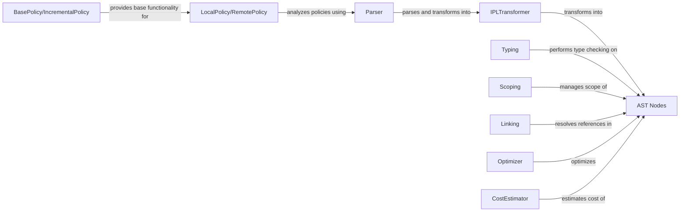

## Component Details

The Policy Engine orchestrates the lifecycle of policies within the Invariant Analyzer. It begins with parsing policies written in IPL, transforming them into an Abstract Syntax Tree (AST). The AST undergoes type checking, scoping, and linking to ensure correctness. Subsequently, the AST is optimized for efficient evaluation. The engine supports both local and remote policy analysis, providing flexibility in how policies are analyzed and managed. The core components work together to provide a robust and reliable policy analysis framework.

### Parser
The Parser component is responsible for parsing IPL code and converting it into an initial parse tree. It uses the IPLTransformer to transform this parse tree into an Abstract Syntax Tree (AST), which serves as the foundation for subsequent analysis and optimization steps. The parser provides methods for parsing from strings or files.
- **Related Classes/Methods**: `invariant.analyzer.language.parser:parse`, `invariant.analyzer.language.parser:parse_file`, `invariant.analyzer.language.parser:transform`

### IPLTransformer
The IPLTransformer component transforms the parse tree generated by the Parser into an Abstract Syntax Tree (AST). It defines the transformation rules for various language constructs, such as imports, declarations, expressions, and statements. The AST represents the structure of the policy in a way that is suitable for further analysis and optimization.
- **Related Classes/Methods**: `invariant.analyzer.language.parser.IPLTransformer`

### AST Nodes
The AST Nodes component represents the structure of the policy language code. They include nodes for policy roots, raise policies, declarations, expressions, and other language constructs. These nodes are the building blocks of the Abstract Syntax Tree (AST) and are used by the parser, typing, and optimization modules.
- **Related Classes/Methods**: `invariant.analyzer.language.ast.PolicyRoot`, `invariant.analyzer.language.ast.RaisePolicy`, `invariant.analyzer.language.ast.Declaration`, `invariant.analyzer.language.ast.Expression`, `invariant.analyzer.language.ast.FunctionCall`, `invariant.analyzer.language.ast.ListComprehension`, `invariant.analyzer.language.ast.TypedIdentifier`

### Typing
The Typing component performs type checking on the Abstract Syntax Tree (AST). It infers the types of variables and expressions, and ensures that the policy is type-safe. This component helps to catch errors early in the analysis process and ensures that the policy is well-formed.
- **Related Classes/Methods**: `invariant.analyzer.language.typing:typing`

### Scoping
The Scoping component manages the scope of variables and functions within the policy language. It tracks the visibility of identifiers and resolves references to variables and functions. This component ensures that variables and functions are used correctly within their defined scopes.
- **Related Classes/Methods**: `invariant.analyzer.language.typing.Scoping`

### Linking
The Linking component resolves references between different parts of the policy, such as references to variables and functions defined in other modules. It ensures that all references are valid and that the policy is properly linked. This component is crucial for ensuring that the policy can be executed correctly.
- **Related Classes/Methods**: `invariant.analyzer.language.linking:link`

### Optimizer
The Optimizer component optimizes the Abstract Syntax Tree (AST) to improve performance. It applies various optimization techniques, such as constant folding and dead code elimination. This component helps to reduce the execution time of the policy and improve its overall efficiency.
- **Related Classes/Methods**: `invariant.analyzer.language.optimizer:optimize`, `invariant.analyzer.language.optimizer:optimize_RaisePolicy`

### CostEstimator
The CostEstimator component estimates the cost of evaluating different parts of the policy. This information can be used by the optimizer to make better decisions about how to optimize the policy. By estimating the cost of different operations, the optimizer can make informed choices about which optimizations to apply.
- **Related Classes/Methods**: `invariant.analyzer.language.optimizer.CostEstimator`

### BasePolicy/IncrementalPolicy
BasePolicy provides the foundation for policy analysis, while IncrementalPolicy extends it to support incremental analysis. Incremental analysis allows for analyzing only the changes in a policy or trace, rather than re-analyzing the entire policy from scratch. It interacts with the trace data to filter results.
- **Related Classes/Methods**: `invariant.analyzer.base_policy.BasePolicy`, `invariant.analyzer.base_policy.IncrementalPolicy`

### LocalPolicy/RemotePolicy
LocalPolicy handles policy analysis locally, loading policies from files or strings and performing analysis directly. RemotePolicy handles policy analysis by communicating with a remote server, offloading the analysis task. Both components provide an interface for loading and analyzing policies, but differ in how the analysis is performed.
- **Related Classes/Methods**: `invariant.analyzer.policy.LocalPolicy`, `invariant.analyzer.remote_policy.RemotePolicy`, `invariant.analyzer.remote_policy:handle_error_response`
