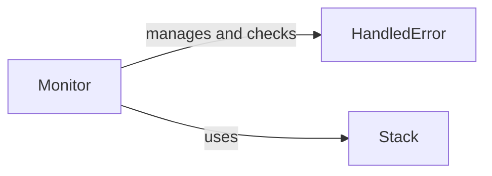

## Component Details

The Policy Monitor component is responsible for overseeing the execution of policies and handling any errors that occur during the process. It provides functionalities for resetting the monitor, running validated operations, and checking for violations, ensuring the integrity and reliability of policy enforcement. The monitor uses a stack to keep track of the execution and handles errors that may arise during policy evaluation. It interacts with the system's state to validate invariants and ensure that policies are correctly enforced, maintaining the stability and security of the system.

### Monitor
The `Monitor` class is the central component responsible for managing and checking invariants. It can load invariants, validate them, and execute checks against the system's state. It provides methods for running the invariant checks and resetting the monitor's state.
- **Related Classes/Methods**: `invariant.analyzer.monitor.Monitor`

### HandledError
The `HandledError` class represents specific errors encountered during invariant checking. It provides a way to handle and represent these errors, potentially including information about the error's context and how it was handled.
- **Related Classes/Methods**: `invariant.analyzer.monitor.HandledError`

### Stack
The `Stack` module provides utilities for managing the execution stack during the analysis. This includes functions for creating and manipulating stacks, which are used to track the execution flow and manage the state of the policy evaluation.
- **Related Classes/Methods**: `invariant.analyzer.monitor.stack`
