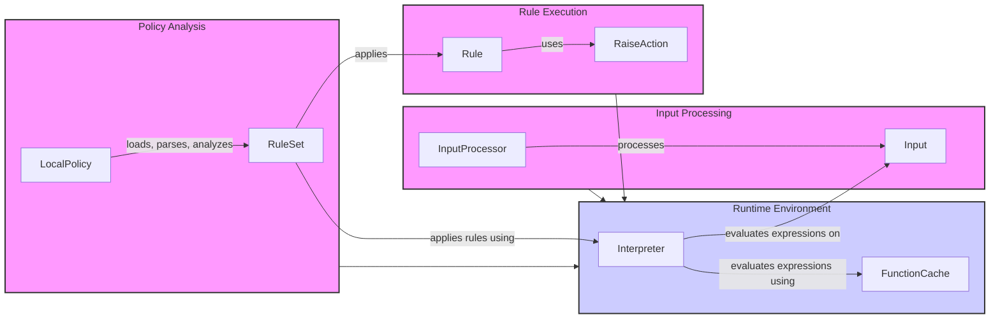

## Runtime Environment Overview

The Runtime Environment provides the necessary components for evaluating policy rules against input data. It encompasses the interpreter, rule management, and function caching mechanisms.

### Component Descriptions:

**1. Policy Analysis**
   - *Description*: Handles the loading, parsing, and analysis of policies. It orchestrates the analysis process by using the parser, rule set, and input data.
   - *Interaction*: Loads policies and creates a `RuleSet` for the Runtime Environment.
   - *Source Files*: `repos.invariant.invariant.analyzer.policy.LocalPolicy`

**2. Input Processing**
   - *Description*: Processes the input data by parsing and visiting nodes. It prepares the input for analysis by converting it into a structured format.
   - *Interaction*: Transforms raw input into an `Input` object, which is used by the Runtime Environment.
   - *Source Files*: `repos.invariant.invariant.analyzer.runtime.input.InputProcessor`, `repos.invariant.invariant.analyzer.runtime.input.Input`

**3. Runtime Environment**
   - *Description*: Provides the environment for evaluating policy rules against input data. It includes the interpreter, rule management, and function caching.
   - *Interaction*: Receives the `RuleSet` from Policy Analysis and the `Input` from Input Processing. It uses the `Interpreter` to evaluate rules, leveraging the `FunctionCache` for performance.
   - *Source Files*: `repos.invariant.invariant.analyzer.runtime.evaluation.Interpreter`, `repos.invariant.invariant.analyzer.runtime.rule.RuleSet`, `repos.invariant.invariant.analyzer.runtime.function_cache.FunctionCache`

**4. Rule Execution**
   - *Description*: Applies the rules defined in the policy to the input data. It uses an interpreter to evaluate the rules and determine if any violations occur.
   - *Interaction*: Applies rules from the `RuleSet` to the `Input` using the `Interpreter`. If a rule is violated, a `RaiseAction` is triggered.
   - *Source Files*: `repos.invariant.invariant.analyzer.runtime.rule.RuleSet`, `repos.invariant.invariant.analyzer.runtime.rule.Rule`, `repos.invariant.invariant.analyzer.runtime.rule.RaiseAction`
