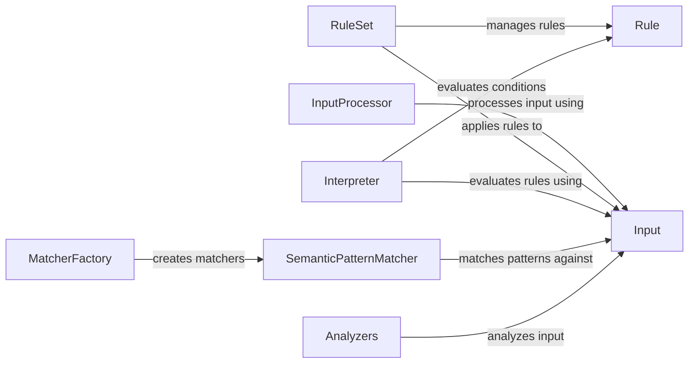

## Component Details

The Runtime Environment processes input data against a set of rules to identify potential issues or enforce policies. It involves parsing the input, transforming it into a structured representation, and then using an interpreter to evaluate the rules against this representation. The environment also incorporates semantic pattern matching and various analyzers to detect specific types of content, such as secrets, PII, or prompt injections. The core flow involves the InputProcessor transforming raw input into a structured Input object. The RuleSet then applies a collection of Rule objects to the Input, using the Interpreter to evaluate conditions and trigger actions. Analyzers are used to pre-process the input and identify potential issues.

### InputProcessor
The InputProcessor is responsible for parsing and transforming raw input into a structured Input object that can be easily analyzed. It handles different input formats and converts them into a tree-like structure representing the input's content and relationships.
- **Related Classes/Methods**: `invariant.analyzer.runtime.input.InputProcessor`

### Input
The Input class represents the structured data after processing by the InputProcessor. It provides methods for navigating the input structure and accessing specific elements, enabling rule evaluation and pattern matching.
- **Related Classes/Methods**: `invariant.analyzer.runtime.input.Input`

### RuleSet
The RuleSet manages a collection of rules and applies them to the input data. It iterates through the rules, using the Interpreter to evaluate the conditions and execute the corresponding actions if a rule is violated.
- **Related Classes/Methods**: `invariant.analyzer.runtime.rule.RuleSet`

### Rule
The Rule class represents a single rule with a condition and an action. The condition is evaluated by the Interpreter, and if it's met, the associated action (e.g., raising an alert) is executed.
- **Related Classes/Methods**: `invariant.analyzer.runtime.rule.Rule`

### Interpreter
The Interpreter evaluates expressions and conditions within the rules against the input data. It supports various operations and manages the evaluation context, including variable assignments and function calls.
- **Related Classes/Methods**: `invariant.analyzer.runtime.evaluation.Interpreter`

### SemanticPatternMatcher
The SemanticPatternMatcher is responsible for matching semantic patterns against the structured input. It uses the MatcherFactory to create specific matchers for different pattern types.
- **Related Classes/Methods**: `invariant.analyzer.runtime.patterns.SemanticPatternMatcher`

### MatcherFactory
The MatcherFactory creates concrete matcher objects based on the semantic patterns defined in the rules. It supports various pattern types, such as object literals, array literals, and wildcards.
- **Related Classes/Methods**: `invariant.analyzer.runtime.patterns.MatcherFactory`

### Analyzers
A collection of analyzers that detect specific types of content or issues within the input data. This includes analyzers for secrets, PII, prompt injections, moderation, and code-related issues.
- **Related Classes/Methods**: `invariant.analyzer.runtime.utils.secrets.SecretsAnalyzer`, `invariant.analyzer.runtime.utils.pii.PII_Analyzer`, `invariant.analyzer.runtime.utils.prompt_injections.PromptInjectionAnalyzer`, `invariant.analyzer.runtime.utils.moderation.ModerationAnalyzer`, `invariant.analyzer.runtime.utils.code.PythonCodeDetector`, `invariant.analyzer.runtime.utils.code.SemgrepDetector`
