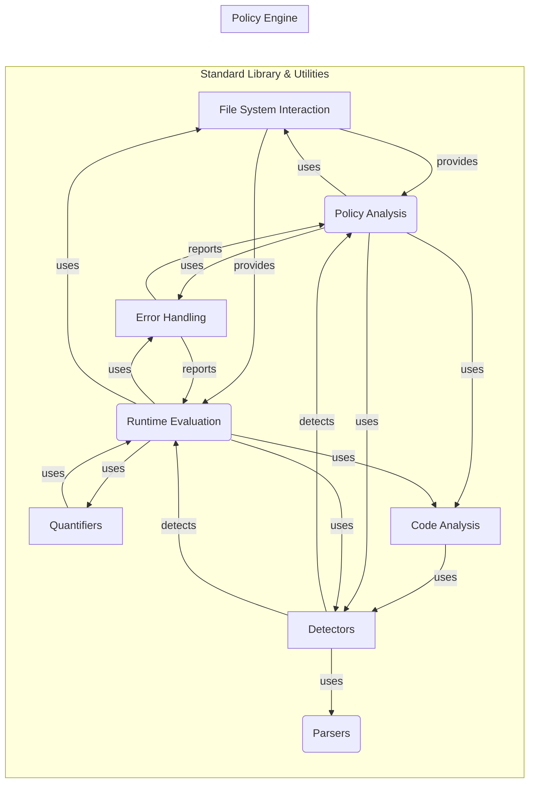

## Standard Library & Utilities Overview

This component provides a collection of standard functions, utilities, and data detectors that are used throughout the policy language for various tasks such as file system interaction, error handling, data detection (PII, prompt injection, etc.), and code analysis. It serves as a toolbox for the policy engine, offering reusable functionalities to simplify policy creation and analysis.

### Component Descriptions:

**1. File System Interaction**
   - *Description*: Provides functions for interacting with the file system, such as getting files, their contents, and checking for sensitive files/directories. It abstracts file system operations and provides utilities for identifying potentially sensitive files.
   - *Interaction*: Policy Analysis and Runtime Evaluation components use this to access and inspect files within the agent's workspace.
   - *Source Files*: `invariant.analyzer.stdlib.invariant.files`

**2. Error Handling**
   - *Description*: Defines various error types and structures for reporting analysis results and policy violations. It provides a standardized way to represent errors encountered during policy loading, analysis, and runtime evaluation.
   - *Interaction*: Policy Analysis and Runtime Evaluation components use this to report errors and violations encountered during policy processing.
   - *Source Files*: `invariant.analyzer.stdlib.invariant.errors`

**3. Detectors**
   - *Description*: Implements various detectors for identifying potential issues like PII, prompt injection, moderation violations, and code snippets. These detectors provide specific functionalities to identify security and compliance concerns within the analyzed content.
   - *Interaction*: Policy Analysis and Runtime Evaluation components use these detectors to identify potential issues in the analyzed data. It uses Parsers to extract data from different file types.
   - *Source Files*: `invariant.analyzer.stdlib.invariant.detectors`, `repos.invariant.invariant.analyzer.runtime.utils.prompt_injections`, `repos.invariant.invariant.analyzer.runtime.utils.moderation`

**4. Parsers**
   - *Description*: Provides parsing functionalities for different file types, including HTML and OCR. These parsers extract relevant information from various file formats to enable further analysis.
   - *Interaction*: Detectors component uses this to parse different file types.
   - *Source Files*: `invariant.analyzer.stdlib.invariant.parsers.html`, `invariant.analyzer.stdlib.invariant.parsers.ocr`

**5. Quantifiers**
   - *Description*: Implements quantifiers like 'forall' and 'count' for invariant evaluation. These quantifiers allow policies to express conditions that apply to multiple elements or a certain number of elements.
   - *Interaction*: Runtime Evaluation component uses this to evaluate conditions that apply to multiple elements.
   - *Source Files*: `invariant.analyzer.stdlib.invariant.quantifiers`

**6. Code Analysis**
   - *Description*: Provides utilities for analyzing code snippets, such as detecting imports, built-in functions, and syntax errors. It leverages AST parsing and Semgrep for static code analysis.
   - *Interaction*: Policy Analysis and Runtime Evaluation components use this to analyze code snippets for potential security vulnerabilities and compliance issues. It uses Detectors to detect code issues.
   - *Source Files*: `repos.invariant.invariant.analyzer.runtime.utils.code`
