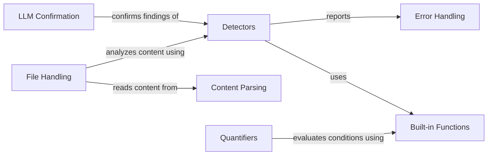

## Component Details

The Standard Library provides a suite of tools for policy evaluation, encompassing file handling, content parsing, various detectors (prompt injection, PII, code, similarity, fuzzy matching, moderation), LLM confirmation, and quantifiers. It enables policies to analyze content, detect potential issues, and make decisions based on predefined rules and conditions. The library's functions are designed to simplify common tasks and improve the overall expressiveness of the policy language.

### File Handling
This component is responsible for retrieving and managing files, including reading their content. It provides functions to get files from a directory tree and read file contents.
- **Related Classes/Methods**: `invariant.analyzer.stdlib.invariant.files:get_files`, `invariant.analyzer.stdlib.invariant.files:get_tree_files`, `invariant.analyzer.stdlib.invariant.files:get_file_content`, `invariant.analyzer.stdlib.invariant.files:get_file_contents`

### Content Parsing
This component focuses on parsing content to extract relevant information, such as hidden data and links from HTML, and text from images using OCR.
- **Related Classes/Methods**: `invariant.analyzer.stdlib.invariant.parsers.html.HiddenHTMLData:__invariant_attribute__`, `invariant.analyzer.stdlib.invariant.parsers.html.HiddenDataParser:parse`, `invariant.analyzer.stdlib.invariant.parsers.html:html_code`, `invariant.analyzer.stdlib.invariant.parsers.html:links`, `invariant.analyzer.stdlib.invariant.parsers.ocr:ocr`

### Detectors
This component includes various detectors for identifying potential issues such as prompt injection attacks, PII, code snippets, sentence similarity, fuzzy matches, and inappropriate content.
- **Related Classes/Methods**: `invariant.analyzer.stdlib.invariant.detectors.prompt_injection:prompt_injection`, `invariant.analyzer.stdlib.invariant.detectors.prompt_injection:unicode`, `invariant.analyzer.stdlib.invariant.detectors.pii:pii`, `invariant.analyzer.stdlib.invariant.detectors.code:ipython_code`, `invariant.analyzer.stdlib.invariant.detectors.sentence_similarity:embedding_similarity`, `invariant.analyzer.stdlib.invariant.detectors.sentence_similarity:is_similar`, `invariant.analyzer.stdlib.invariant.detectors.fuzzy_matching:fuzzy_contains`, `invariant.analyzer.stdlib.invariant.detectors.moderation:moderated`

### LLM Confirmation
This component leverages Large Language Models (LLMs) to confirm or validate findings from other detectors, providing a higher level of analysis and verification.
- **Related Classes/Methods**: `invariant.analyzer.stdlib.invariant.llm:llm_confirm`

### Quantifiers
This component provides functionalities for evaluating quantifiers like 'forall' and 'count' within invariants, allowing for expressing conditions that must hold for all or a certain number of elements.
- **Related Classes/Methods**: `invariant.analyzer.stdlib.invariant.quantifiers.forall:eval`, `invariant.analyzer.stdlib.invariant.quantifiers.count:eval`

### Error Handling
This component defines the structure for representing errors, violations, and analysis results, storing information about errors encountered during the analysis process.
- **Related Classes/Methods**: `invariant.analyzer.stdlib.invariant.errors.ErrorInformation:from_dict`, `invariant.analyzer.stdlib.invariant.errors:Violation`, `invariant.analyzer.stdlib.invariant.errors:PolicyViolation`, `invariant.analyzer.stdlib.invariant.errors.AnalysisResult:__repr__`

### Built-in Functions
This component provides a set of built-in functions that are used throughout the analysis process, including utilities for checking if a collection is empty and finding elements within a collection.
- **Related Classes/Methods**: `invariant.analyzer.stdlib.invariant.builtins:empty`, `invariant.analyzer.stdlib.invariant.builtins:find`
