## Invariant Project Overview

Invariant is a policy-as-code engine that allows users to define and enforce policies on various types of data, including code, text, and other structured data. It provides a flexible and extensible framework for analyzing data against defined policies, identifying violations, and triggering appropriate actions. The engine supports both local and remote policy analysis, a standard library of functions and utilities, and a web-based explorer for visualizing analysis results.

## Data Flow Diagram

```mermaid
graph LR
    A["Main Interface"] -- Receives Input --> B("Policy Engine")
    B -- Loads Policy --> C["Language Processing"]
    C -- Generates AST --> B
    B -- Analyzes Data --> D["Runtime Environment"]
    E["Input Processing"] -- Prepares Input --> D
    D -- Evaluates Rules --> F["Standard Library & Utilities"]
    F -- Provides Functions --> D
    D -- Detects Violations --> G("Monitor")
    G -- Reports Violations --> H["Invariant Explorer"]
    style A fill:#f9f,stroke:#333,stroke-width:2px
    style B fill:#ccf,stroke:#333,stroke-width:2px
    style C fill:#ccf,stroke:#333,stroke-width:2px
    style D fill:#ccf,stroke:#333,stroke-width:2px
    style E fill:#ccf,stroke:#333,stroke-width:2px
    style F fill:#ccf,stroke:#333,stroke-width:2px
    style G fill:#f9f,stroke:#333,stroke-width:2px
    style H fill:#f9f,stroke:#333,stroke-width:2px

click A href "https://github.com/CodeBoarding/GeneratedOnBoardings/blob/main/invariant//Main%20Interface.md"
click B href "https://github.com/CodeBoarding/GeneratedOnBoardings/blob/main/invariant//Policy%20Engine.md"
click C href "https://github.com/CodeBoarding/GeneratedOnBoardings/blob/main/invariant//Language%20Processing.md"
click D href "https://github.com/CodeBoarding/GeneratedOnBoardings/blob/main/invariant//Runtime%20Environment.md"
click E href "https://github.com/CodeBoarding/GeneratedOnBoardings/blob/main/invariant//Input%20Processing.md"
click F href "https://github.com/CodeBoarding/GeneratedOnBoardings/blob/main/invariant//Standard%20Library%20&%20Utilities.md"
click G href "https://github.com/CodeBoarding/GeneratedOnBoardings/blob/main/invariant//Monitor.md"
click H href "https://github.com/CodeBoarding/GeneratedOnBoardings/blob/main/invariant//Invariant%20Explorer.md"
```

## Component Descriptions

**Main Interface:** This component serves as the entry point for the Invariant engine. It receives user input, such as policy files or data to be analyzed, and passes it to the Policy Engine. It also handles launching the Invariant Explorer and managing extras. It relates to the Policy Engine by sending the initial data and commands.

**Policy Engine:** The core component responsible for loading, parsing, and analyzing policies against input data. It orchestrates the Language Processing, Runtime Environment, and Input Processing components. It receives policies from the Main Interface, uses Language Processing to parse them, and then analyzes data within the Runtime Environment. It sends detected violations to the Monitor.

**Language Processing:** This component handles the parsing of the policy language into an abstract syntax tree (AST). It receives policy code from the Policy Engine and generates an AST, which is then used by the Policy Engine for analysis. It relates to the Policy Engine by providing the parsed representation of the policies.

**Runtime Environment:** This component provides the environment for evaluating policy rules against input data. It includes the interpreter, rule management, and function caching. It receives the AST from the Policy Engine and input data from Input Processing. It uses the Standard Library & Utilities for function calls during evaluation. It sends detected violations to the Monitor.

**Input Processing:** This component processes the input data for analysis, including parsing and locating ranges. It prepares the input data for the Runtime Environment. It relates to the Runtime Environment by providing the data to be analyzed.

**Standard Library & Utilities:** This component provides standard functions, utilities, and data detectors for the policy language. It is used by the Runtime Environment during policy evaluation. It relates to the Runtime Environment by providing functions and utilities needed for the evaluation process.

**Monitor:** This component monitors the system and checks for violations based on defined policies. It receives violation reports from the Runtime Environment and reports them to the Invariant Explorer. It relates to the Runtime Environment by receiving violation reports and to the Invariant Explorer by sending the reports for visualization.

**Invariant Explorer:** This component launches a web-based explorer for visualizing and interacting with the analysis results. It receives violation reports from the Monitor and presents them in a user-friendly interface. It relates to the Monitor by receiving violation reports for visualization.
