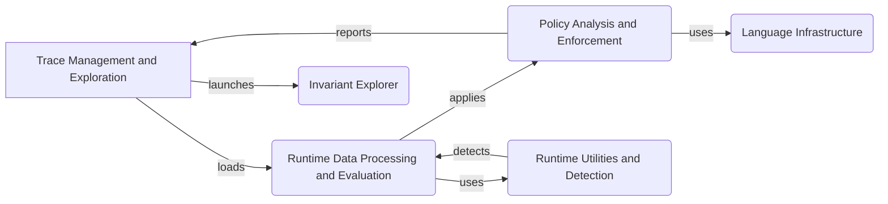

Okay, I will generate an onboarding document for the `invariant` project based on the provided information.

**1. Project Description**

The `invariant` project is a system designed for analyzing and enforcing policies on runtime data, particularly in the context of AI agents and applications. It allows users to define policies using a custom language, which are then applied to execution traces to detect violations and potential risks such as prompt injections, PII leaks, and code vulnerabilities. The system provides tools for managing traces, exploring policy violations, and launching an interactive explorer for in-depth analysis.

**2. Flow Diagram (Mermaid Format)**

**3. Component Descriptions**

*   **Trace Management and Exploration:** This component is responsible for loading, formatting, and filtering execution traces from various sources. It also provides the functionality to launch the Invariant Explorer, a tool for visualizing and interacting with the traces and policy violations.

*   **Runtime Data Processing and Evaluation:** This component takes the loaded traces and processes the runtime data, representing it in a structured format suitable for policy evaluation. It interprets expressions, manages variable assignments, and executes functions to prepare the data for analysis.

*   **Policy Analysis and Enforcement:** This component is the core of the system, responsible for parsing, analyzing, and enforcing policies against the processed runtime data. It loads policies from different sources, analyzes them for potential violations, and applies them to the data to identify any breaches.

*   **Language Infrastructure:** This component provides the necessary infrastructure for parsing the policy language and transforming the Abstract Syntax Tree (AST). It includes lexical analysis, parsing, typing, and optimization to ensure efficient policy evaluation.

*   **Runtime Utilities and Detection:** This component offers a suite of utilities used during runtime, including detectors for PII, prompt injections, moderation issues, and code analysis. These utilities enhance the system's ability to identify and mitigate potential risks within the runtime data.

*   **Invariant Explorer:** This component provides a user interface for visualizing and interacting with the traces and policy violations.