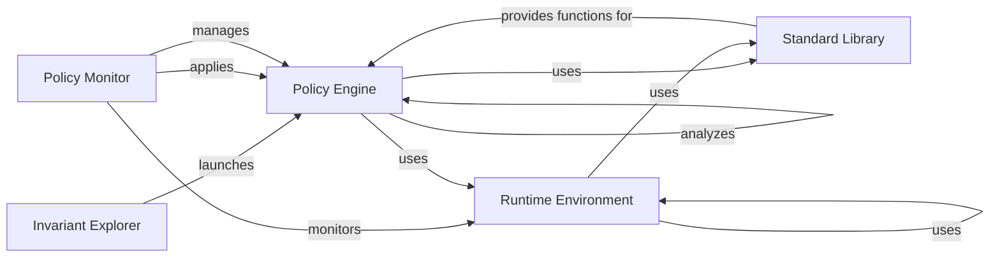

## Component Details

The Invariant Analyzer project provides a robust framework for defining, managing, and enforcing policies using the Invariant Policy Language (IPL). It encompasses a policy engine for parsing and optimizing policies, a runtime environment for evaluating policies against input data, a policy monitor for overseeing policy execution, a standard library for providing built-in functions, and an explorer for visualizing and interacting with the system. The core functionality revolves around defining policies, processing input data, evaluating rules, and monitoring the entire process to ensure policy enforcement and error handling.

### Policy Engine
The Policy Engine is the heart of the Invariant Analyzer, responsible for handling the entire lifecycle of policies. It parses policies written in the Invariant Policy Language (IPL), optimizes them for efficient evaluation, and manages their storage and retrieval. It also provides language analysis capabilities, such as typing, linking, and scoping, to ensure the correctness and consistency of policies.
- **Related Classes/Methods**: `invariant.analyzer.policy.LocalPolicy`, `invariant.analyzer.remote_policy.RemotePolicy`, `invariant.analyzer.base_policy.BasePolicy`, `invariant.analyzer.language.parser`, `invariant.analyzer.language.ast`, `invariant.analyzer.language.optimizer`, `invariant.analyzer.language.typing`, `invariant.analyzer.language.linking`, `invariant.analyzer.language.scope`

### Runtime Environment
The Runtime Environment is responsible for processing input data and evaluating policies against it. It parses the input, creates a data flow representation, and uses an interpreter to execute the rules defined in the policies. It also includes functionalities for semantic pattern matching and working with invariant attributes, allowing for flexible and powerful policy enforcement.
- **Related Classes/Methods**: `invariant.analyzer.runtime.input.Input`, `invariant.analyzer.runtime.input.InputProcessor`, `invariant.analyzer.runtime.input.RangeLocator`, `invariant.analyzer.runtime.rule.Rule`, `invariant.analyzer.runtime.rule.RuleSet`, `invariant.analyzer.runtime.evaluation.Interpreter`, `invariant.analyzer.runtime.patterns.SemanticPatternMatcher`, `invariant.analyzer.runtime.patterns.MatcherFactory`, `invariant.analyzer.runtime.patterns.ConstantMatcher`, `invariant.analyzer.runtime.nodes`, `invariant.analyzer.runtime.utils.invariant_attributes`

### Policy Monitor
The Policy Monitor oversees the execution of policies and handles any errors that occur during the process. It provides functionalities for resetting the monitor, running validated operations, and checking for violations, ensuring the integrity and reliability of policy enforcement. It plays a crucial role in maintaining the stability and security of the system.
- **Related Classes/Methods**: `invariant.analyzer.monitor.Monitor`, `invariant.analyzer.monitor.HandledError`

### Standard Library
The Standard Library offers a collection of built-in functions and utilities that can be utilized within policies. It includes functions for file manipulation, prompt injection detection, and PII analysis, providing a set of tools to enhance the capabilities and flexibility of policy definitions. These functions are designed to simplify common tasks and improve the overall expressiveness of the policy language.
- **Related Classes/Methods**: `invariant.analyzer.stdlib.invariant`

### Invariant Explorer
The Invariant Explorer serves as a visualization and interaction tool for the system. It facilitates the launching of the explorer, environment setup, and database readiness, providing a user-friendly interface for exploring and interacting with the policies and runtime data. It allows users to gain insights into the system's behavior and verify the effectiveness of the policies.
- **Related Classes/Methods**: `invariant.explorer.launch`