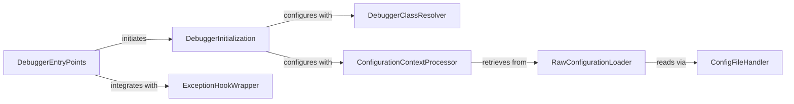

## Details

The ipdb subsystem is structured around a set of DebuggerEntryPoints that serve as the primary user interface for initiating debugging sessions. These entry points orchestrate the debugging process by delegating to the DebuggerInitialization component, which is responsible for instantiating and configuring the debugger. The DebuggerInitialization component dynamically selects the appropriate debugger class through the DebuggerClassResolver and applies user-defined settings managed by the ConfigurationContextProcessor. Configuration data is loaded by the RawConfigurationLoader, which interacts with the ConfigFileHandler for file-level operations. Furthermore, the ExceptionHookWrapper component ensures seamless post-mortem debugging by intercepting unhandled exceptions, providing a robust debugging experience.

### DebuggerEntryPoints
The primary interface for users to initiate debugging sessions. This component includes all public functions (set_trace, post_mortem, main, pm, run, runcall, runeval, launch_ipdb_on_exception) that directly invoke or integrate ipdb into Python code, orchestrating the initial debugger setup.

**Related Classes/Methods**:

- <a href="https://github.com/gotcha/ipdb/blob/master/ipdb/__main__.py#L72-L80" target="_blank" rel="noopener noreferrer">`ipdb.__main__.set_trace`:72-80</a>
- <a href="https://github.com/gotcha/ipdb/blob/master/ipdb/__main__.py#L205-L214" target="_blank" rel="noopener noreferrer">`ipdb.__main__.post_mortem`:205-214</a>
- <a href="https://github.com/gotcha/ipdb/blob/master/ipdb/__main__.py#L270-L353" target="_blank" rel="noopener noreferrer">`ipdb.__main__.main`:270-353</a>
- <a href="https://github.com/gotcha/ipdb/blob/master/ipdb/__main__.py#L217-L218" target="_blank" rel="noopener noreferrer">`ipdb.__main__.pm`:217-218</a>
- <a href="https://github.com/gotcha/ipdb/blob/master/ipdb/__main__.py#L221-L222" target="_blank" rel="noopener noreferrer">`ipdb.__main__.run`:221-222</a>
- <a href="https://github.com/gotcha/ipdb/blob/master/ipdb/__main__.py#L225-L226" target="_blank" rel="noopener noreferrer">`ipdb.__main__.runcall`:225-226</a>
- <a href="https://github.com/gotcha/ipdb/blob/master/ipdb/__main__.py#L229-L230" target="_blank" rel="noopener noreferrer">`ipdb.__main__.runeval`:229-230</a>
- <a href="https://github.com/gotcha/ipdb/blob/master/ipdb/__main__.py#L233-L242" target="_blank" rel="noopener noreferrer">`ipdb.__main__.launch_ipdb_on_exception`:233-242</a>

### DebuggerInitialization
Responsible for instantiating and performing the initial configuration of the debugger object. It acts as a factory, ensuring the correct debugger class is used and set up based on the environment and user settings.

**Related Classes/Methods**:

- <a href="https://github.com/gotcha/ipdb/blob/master/ipdb/__main__.py#L52-L61" target="_blank" rel="noopener noreferrer">`ipdb.__main__._init_pdb`:52-61</a>

### DebuggerClassResolver
Dynamically determines and returns the appropriate debugger class (e.g., IPython.terminal.debugger.TerminalPdb for IPython integration or pdb.Pdb for standard Python debugging). This component is crucial for ipdb's adaptability to different execution environments.

**Related Classes/Methods**:

- <a href="https://github.com/gotcha/ipdb/blob/master/ipdb/__main__.py#L26-L49" target="_blank" rel="noopener noreferrer">`ipdb.__main__._get_debugger_cls`:26-49</a>

### ConfigurationContextProcessor
Retrieves and processes configuration settings (such as prompt and history file path) that define the debugger's operational context. It translates raw configuration data into usable parameters for the debugger.

**Related Classes/Methods**:

- <a href="https://github.com/gotcha/ipdb/blob/master/ipdb/__main__.py#L83-L94" target="_blank" rel="noopener noreferrer">`ipdb.__main__.get_context_from_config`:83-94</a>

### RawConfigurationLoader
Handles the direct loading of raw configuration data for ipdb, typically from a configuration file. It serves as the immediate interface to the configuration source.

**Related Classes/Methods**:

- <a href="https://github.com/gotcha/ipdb/blob/master/ipdb/__main__.py#L133-L202" target="_blank" rel="noopener noreferrer">`ipdb.__main__.get_config`:133-202</a>

### ConfigFileHandler
Encapsulates the logic for locating, reading, and parsing ipdb's configuration files. This component manages the low-level file operations and data extraction from configuration sources.

**Related Classes/Methods**:

- <a href="https://github.com/gotcha/ipdb/blob/master/ipdb/__main__.py#L97-L130" target="_blank" rel="noopener noreferrer">`ipdb.__main__.ConfigFile`:97-130</a>

### ExceptionHookWrapper
Modifies the system's default exception handling mechanism (sys.excepthook) to intercept unhandled exceptions. This allows ipdb to automatically launch for post-mortem analysis, acting as a critical hook for debugging.

**Related Classes/Methods**:

- <a href="https://github.com/gotcha/ipdb/blob/master/ipdb/__main__.py#L64-L69" target="_blank" rel="noopener noreferrer">`ipdb.__main__.wrap_sys_excepthook`:64-69</a>

### [FAQ](https://github.com/CodeBoarding/GeneratedOnBoardings/tree/main?tab=readme-ov-file#faq)