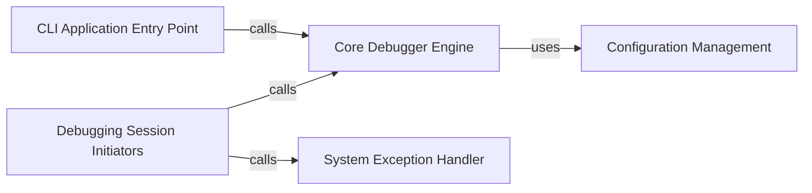

## Details

The ipdb debugger's architecture is centered around a Core Debugger Engine that manages the debugging environment. The CLI Application Entry Point serves as the primary interface for command-line usage, orchestrating the debugging session. Various Debugging Session Initiators provide flexible ways to start and control debugging, including post-mortem analysis via the System Exception Handler. Configuration settings are managed by the Configuration Management component, which is integrated within the __init__.py module and provides essential settings to the Core Debugger Engine. This design ensures a modular yet cohesive system for interactive debugging.

### Core Debugger Engine
Encapsulates the fundamental logic for creating and managing the ipdb debugger instance. This includes selecting the appropriate debugger class (e.g., Ipdb, Pdb) and applying initial configuration settings, thereby establishing the core debugging environment.

**Related Classes/Methods**:

- <a href="https://github.com/gotcha/ipdb/blob/master/ipdb/__init__.py" target="_blank" rel="noopener noreferrer">`ipdb.__init__._init_pdb`</a>
- <a href="https://github.com/gotcha/ipdb/blob/master/ipdb/__init__.py" target="_blank" rel="noopener noreferrer">`ipdb.__init__._get_debugger_cls`</a>
- <a href="https://github.com/gotcha/ipdb/blob/master/ipdb/__init__.py" target="_blank" rel="noopener noreferrer">`ipdb.__init__.get_context_from_config`</a>

### CLI Application Entry Point
The primary entry point for ipdb when invoked as a command-line tool. It is responsible for parsing command-line arguments, setting up the execution environment, and orchestrating the main debugging loop, including handling program restarts and post-mortem debugging on exceptions.

**Related Classes/Methods**:

- <a href="https://github.com/gotcha/ipdb/blob/master/ipdb/__main__.py#L270-L353" target="_blank" rel="noopener noreferrer">`ipdb.__main__.main`:270-353</a>

### Debugging Session Initiators
Provides various mechanisms to initiate and control debugging sessions at different points in a program's execution. This includes setting trace points, launching post-mortem debugging after an exception, and executing arbitrary code or functions under debugger control.

**Related Classes/Methods**:

- <a href="https://github.com/gotcha/ipdb/blob/master/ipdb/__init__.py" target="_blank" rel="noopener noreferrer">`ipdb.__init__.set_trace`</a>
- <a href="https://github.com/gotcha/ipdb/blob/master/ipdb/__init__.py" target="_blank" rel="noopener noreferrer">`ipdb.__init__.post_mortem`</a>
- <a href="https://github.com/gotcha/ipdb/blob/master/ipdb/__init__.py" target="_blank" rel="noopener noreferrer">`ipdb.__init__.pm`</a>
- <a href="https://github.com/gotcha/ipdb/blob/master/ipdb/__init__.py" target="_blank" rel="noopener noreferrer">`ipdb.__init__.run`</a>
- <a href="https://github.com/gotcha/ipdb/blob/master/ipdb/__init__.py" target="_blank" rel="noopener noreferrer">`ipdb.__init__.runcall`</a>
- <a href="https://github.com/gotcha/ipdb/blob/master/ipdb/__init__.py" target="_blank" rel="noopener noreferrer">`ipdb.__init__.runeval`</a>

### Configuration Management
Manages the loading, parsing, and unified access of ipdb's configuration settings, primarily through the get_context_from_config function. It handles reading configuration and providing these settings to other components.

**Related Classes/Methods**:

- <a href="https://github.com/gotcha/ipdb/blob/master/ipdb/__init__.py" target="_blank" rel="noopener noreferrer">`ipdb.__init__.get_context_from_config`</a>

### System Exception Handler
Integrates ipdb with Python's system-wide exception handling mechanism. This allows the debugger to be automatically invoked when an unhandled exception occurs, facilitating post-mortem analysis.

**Related Classes/Methods**:

- <a href="https://github.com/gotcha/ipdb/blob/master/ipdb/__init__.py" target="_blank" rel="noopener noreferrer">`ipdb.__init__.wrap_sys_excepthook`</a>

### [FAQ](https://github.com/CodeBoarding/GeneratedOnBoardings/tree/main?tab=readme-ov-file#faq)