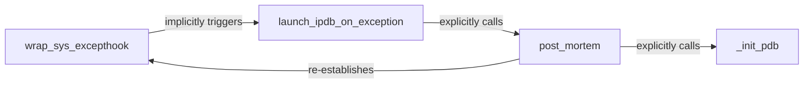

## Details

The `System Exception Hook Manager` subsystem is responsible for intercepting unhandled system-level exceptions and automatically launching the `ipdb` debugger for post-mortem analysis. Its boundaries are defined by the `ipdb.__main__` module, specifically focusing on the functions that manage the `sys.excepthook` and initiate the debugging session. This forms a clear chain of command for handling exceptions and launching the debugger, embodying the Hook/Interceptor and Execution Flow Control patterns.

### wrap_sys_excepthook
Implements the "Hook/Interceptor Pattern" by replacing the default `sys.excepthook`. Its primary responsibility is to ensure that all unhandled exceptions are redirected to `ipdb`'s custom handler, acting as the initial interception point for system exceptions.

**Related Classes/Methods**:

- <a href="https://github.com/gotcha/ipdb/blob/master/ipdb/__main__.py#L64-L69" target="_blank" rel="noopener noreferrer">`wrap_sys_excepthook`:64-69</a>

### launch_ipdb_on_exception
Serves as the custom exception handler invoked by `wrap_sys_excepthook`. This component is the primary dispatcher for `ipdb`'s exception handling, responsible for initiating the debugging process when an unhandled exception is intercepted. It embodies the "Execution Flow Control" pattern for debugger activation.

**Related Classes/Methods**:

- <a href="https://github.com/gotcha/ipdb/blob/master/ipdb/stdout.py#L30-L39" target="_blank" rel="noopener noreferrer">`launch_ipdb_on_exception`:30-39</a>

### post_mortem
Manages the core logic of the post-mortem debugging session. This component orchestrates the steps required to allow inspection of the program state after an exception has been raised and caught by the exception hook, providing the interactive debugging environment. It is central to the "Core Debugger Logic."

**Related Classes/Methods**:

- <a href="https://github.com/gotcha/ipdb/blob/master/ipdb/stdout.py#L21-L23" target="_blank" rel="noopener noreferrer">`post_mortem`:21-23</a>

### _init_pdb
Handles the initialization and configuration of the `ipdb` debugger instance. This includes setting up the debugger's environment, potentially loading user-defined settings, and preparing it for interactive use. It is a foundational part of the "Core Debugger Logic" within the subsystem.

**Related Classes/Methods**:

- <a href="https://github.com/gotcha/ipdb/blob/master/ipdb/__main__.py#L52-L61" target="_blank" rel="noopener noreferrer">`_init_pdb`:52-61</a>

### [FAQ](https://github.com/CodeBoarding/GeneratedOnBoardings/tree/main?tab=readme-ov-file#faq)