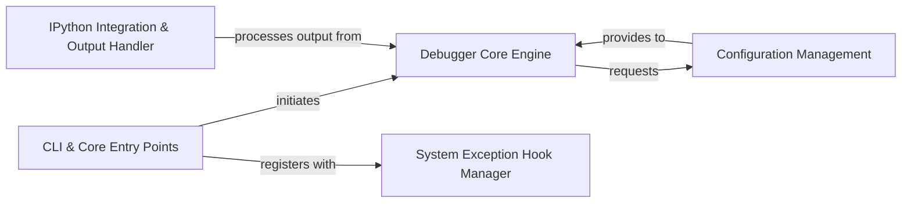

## Details

The `ipdb` debugger's architecture centers around the `CLI & Core Entry Points`, which serves as the primary user interface for initiating debugging sessions. This component orchestrates the setup by initiating the `Debugger Core Engine`, the core logic responsible for managing the debugging environment. The `Debugger Core Engine` relies on `Configuration Management` to retrieve and apply settings that dictate debugger behavior. For robust error handling, the `CLI & Core Entry Points` registers with the `System Exception Hook Manager` to enable post-mortem debugging. Within the IPython environment, the `IPython Integration & Output Handler` plays a crucial role by processing output generated by the `Debugger Core Engine`, ensuring proper display and interaction specific to IPython.

### CLI & Core Entry Points [[Expand]](./CLI_Core_Entry_Points.md)
The primary interface for users to start debugging sessions, handling direct invocations and orchestrating initial debugger setup.

**Related Classes/Methods**:

- <a href="https://github.com/gotcha/ipdb/blob/master/ipdb/__main__.py" target="_blank" rel="noopener noreferrer">`ipdb.__main__`</a>

### Debugger Core Engine [[Expand]](./Debugger_Core_Engine.md)
Encapsulates the fundamental logic for creating and managing the `ipdb` debugger instance, responsible for setting up the debugging environment.

**Related Classes/Methods**:

- <a href="https://github.com/gotcha/ipdb/blob/master/ipdb/__main__.py" target="_blank" rel="noopener noreferrer">`ipdb.__main__`</a>

### Configuration Management
Manages the loading, parsing, and provision of `ipdb`'s configuration settings, dictating debugger behavior and context.

**Related Classes/Methods**:

- <a href="https://github.com/gotcha/ipdb/blob/master/ipdb/__main__.py" target="_blank" rel="noopener noreferrer">`ipdb.__main__`</a>

### IPython Integration & Output Handler
Manages `ipdb`'s specific adaptations and interactions within the IPython environment, including standard output redirection and IPython-specific entry points.

**Related Classes/Methods**:

- <a href="https://github.com/gotcha/ipdb/blob/master/ipdb/stdout.py" target="_blank" rel="noopener noreferrer">`ipdb.stdout`</a>

### System Exception Hook Manager [[Expand]](./System_Exception_Hook_Manager.md)
Responsible for intercepting system-level exceptions to automatically launch the debugger, ensuring unhandled errors can be debugged post-mortem.

**Related Classes/Methods**:

- <a href="https://github.com/gotcha/ipdb/blob/master/ipdb/__main__.py" target="_blank" rel="noopener noreferrer">`ipdb.__main__`</a>

### [FAQ](https://github.com/CodeBoarding/GeneratedOnBoardings/tree/main?tab=readme-ov-file#faq)