```mermaid
graph LR
    iris_cube_Cube["iris.cube.Cube"]
    iris_coords_Coord["iris.coords.Coord"]
    iris_coords_DimCoord["iris.coords.DimCoord"]
    iris_coords_AuxCoord["iris.coords.AuxCoord"]
    iris_coords_CellMethod["iris.coords.CellMethod"]
    iris_mesh_components_Mesh["iris.mesh.components.Mesh"]
    iris_mesh_components_MeshCoord["iris.mesh.components.MeshCoord"]
    iris_mesh_components_Connectivity["iris.mesh.components.Connectivity"]
    iris_common_metadata_BaseMetadata["iris.common.metadata.BaseMetadata"]
    iris_coord_systems_CoordSystem["iris.coord_systems.CoordSystem"]
    iris_cube_Cube -- "contains" --> iris_coords_DimCoord
    iris_cube_Cube -- "contains" --> iris_coords_AuxCoord
    iris_cube_Cube -- "contains" --> iris_coords_CellMethod
    iris_cube_Cube -- "can be associated with" --> iris_mesh_components_Mesh
    iris_cube_Cube -- "is described by" --> iris_common_metadata_BaseMetadata
    iris_coords_Coord -- "is inherited by" --> iris_coords_DimCoord
    iris_coords_Coord -- "is inherited by" --> iris_coords_AuxCoord
    iris_coords_Coord -- "is associated with" --> iris_coord_systems_CoordSystem
    iris_coords_Coord -- "is described by" --> iris_common_metadata_BaseMetadata
    iris_coords_DimCoord -- "inherits from" --> iris_coords_Coord
    iris_coords_DimCoord -- "is contained within" --> iris_cube_Cube
    iris_coords_AuxCoord -- "inherits from" --> iris_coords_Coord
    iris_coords_AuxCoord -- "is contained within" --> iris_cube_Cube
    iris_coords_CellMethod -- "is contained within" --> iris_cube_Cube
    iris_mesh_components_Mesh -- "contains" --> iris_mesh_components_MeshCoord
    iris_mesh_components_Mesh -- "contains" --> iris_mesh_components_Connectivity
    iris_mesh_components_Mesh -- "is described by" --> iris_common_metadata_BaseMetadata
    iris_mesh_components_MeshCoord -- "inherits from" --> iris_coords_AuxCoord
    iris_mesh_components_MeshCoord -- "is contained within" --> iris_mesh_components_Mesh
    iris_mesh_components_Connectivity -- "is contained within" --> iris_mesh_components_Mesh
    iris_mesh_components_Connectivity -- "is described by" --> iris_common_metadata_BaseMetadata
    iris_common_metadata_BaseMetadata -- "describes" --> iris_cube_Cube
    iris_common_metadata_BaseMetadata -- "describes" --> iris_coords_Coord
    iris_common_metadata_BaseMetadata -- "describes" --> iris_mesh_components_Mesh
    iris_coord_systems_CoordSystem -- "is associated with" --> iris_coords_Coord
```

## Details

This is the foundational component of Iris, defining the canonical representation of scientific data. It encompasses n-dimensional data arrays, their associated metadata, and various types of coordinates (dimensional, auxiliary, cell methods) that describe the data's physical context. It also includes the representation of unstructured meshes, which are an extension of the core data model for handling irregular grids. This component is central to all data operations within Iris, from I/O to analysis and visualization.

### iris.cube.Cube
The primary and most fundamental data structure in Iris. It represents a multi-dimensional array of scientific data (e.g., temperature, pressure) along with all its associated metadata, coordinates, and cell methods. It acts as the central container for all data operations.

**Related Classes/Methods**:

- <a href="https://github.com/SciTools/iris/blob/main/lib/iris/cube.py#L1079-L5108" target="_blank" rel="noopener noreferrer">`iris.cube.Cube` (1079:5108)</a>

### iris.coords.Coord
The abstract base class for all coordinate objects in Iris. It defines the common interface and fundamental properties (e.g., name, units, coordinate system) for both dimensional and auxiliary coordinates, providing a consistent way to describe the physical context of data.

**Related Classes/Methods**:

- <a href="https://github.com/SciTools/iris/blob/main/lib/iris/coords.py#L1440-L2557" target="_blank" rel="noopener noreferrer">`iris.coords.Coord` (1440:2557)</a>

### iris.coords.DimCoord
Represents a coordinate that directly corresponds to a specific dimension of the `Cube`'s data array. These coordinates define the primary axes of the data, such as time, latitude, or longitude for a regular grid.

**Related Classes/Methods**:

- <a href="https://github.com/SciTools/iris/blob/main/lib/iris/coords.py#L2564-L2953" target="_blank" rel="noopener noreferrer">`iris.coords.DimCoord` (2564:2953)</a>

### iris.coords.AuxCoord
Represents a coordinate that provides additional contextual information about the data but does not necessarily correspond to a direct dimension of the `Cube`'s data array. Examples include latitude/longitude values for an unstructured grid, or a depth coordinate that varies across horizontal dimensions.

**Related Classes/Methods**:

- <a href="https://github.com/SciTools/iris/blob/main/lib/iris/coords.py#L2956-L3001" target="_blank" rel="noopener noreferrer">`iris.coords.AuxCoord` (2956:3001)</a>

### iris.coords.CellMethod
Describes the statistical processing or aggregation that has been applied to a `Cube`'s data. This includes information like the method (e.g., "mean", "maximum", "sum") and the dimensions over which it was applied.

**Related Classes/Methods**:

- <a href="https://github.com/SciTools/iris/blob/main/lib/iris/coords.py#L3011-L3141" target="_blank" rel="noopener noreferrer">`iris.coords.CellMethod` (3011:3141)</a>

### iris.mesh.components.Mesh
The abstract base class for representing unstructured meshes. This component extends the core data model to handle data defined on irregular grids, which are common in many scientific models. It defines the fundamental properties and topology of a mesh.

**Related Classes/Methods**:

- <a href="https://github.com/SciTools/iris/blob/main/lib/iris/mesh/components.py#L581-L613" target="_blank" rel="noopener noreferrer">`iris.mesh.components.Mesh` (581:613)</a>

### iris.mesh.components.MeshCoord
A specialized coordinate type specifically designed to describe the spatial location of elements (e.g., nodes, faces) within an unstructured mesh. It inherits functionality from `AuxCoord`.

**Related Classes/Methods**:

- <a href="https://github.com/SciTools/iris/blob/main/lib/iris/mesh/components.py#L2651-L3079" target="_blank" rel="noopener noreferrer">`iris.mesh.components.MeshCoord` (2651:3079)</a>

### iris.mesh.components.Connectivity
Defines the topological relationships between different elements of an unstructured mesh. For example, it describes how nodes are connected to form edges or faces, enabling traversal and analysis of the mesh structure.

**Related Classes/Methods**:

- <a href="https://github.com/SciTools/iris/blob/main/lib/iris/mesh/components.py#L90-L578" target="_blank" rel="noopener noreferrer">`iris.mesh.components.Connectivity` (90:578)</a>

### iris.common.metadata.BaseMetadata
The foundational class for all metadata objects within Iris. It provides common attributes and methods for managing descriptive metadata (e.g., standard name, long name, attributes) associated with `Cube`, `Coord`, and `Mesh` objects, ensuring consistency across the data model.

**Related Classes/Methods**:

- <a href="https://github.com/SciTools/iris/blob/main/lib/iris/common/metadata.py#L146-L760" target="_blank" rel="noopener noreferrer">`iris.common.metadata.BaseMetadata` (146:760)</a>

### iris.coord_systems.CoordSystem
The base class for all geographical and projected coordinate system definitions in Iris. These systems provide the mathematical framework for interpreting the spatial coordinates of a `Cube`, enabling transformations between different projections.

**Related Classes/Methods**:

- <a href="https://github.com/SciTools/iris/blob/main/lib/iris/coord_systems.py#L48-L130" target="_blank" rel="noopener noreferrer">`iris.coord_systems.CoordSystem` (48:130)</a>

### [FAQ](https://github.com/CodeBoarding/GeneratedOnBoardings/tree/main?tab=readme-ov-file#faq)