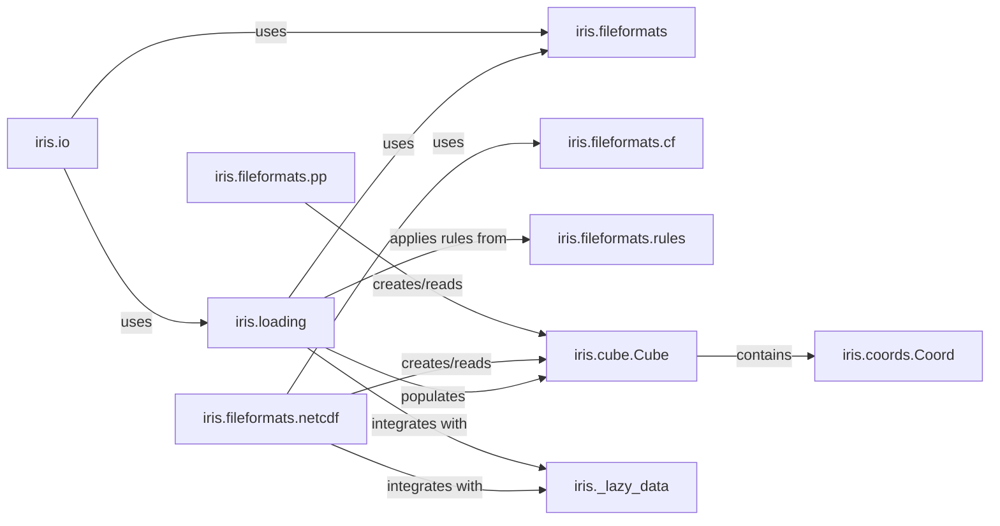

## Details

The `Data I/O` component in Iris is a critical subsystem responsible for the seamless translation of scientific data between various external file formats and Iris's internal `Cube` data model. It embodies a layered architecture, with high-level interfaces abstracting the complexities of format-specific parsing and serialization, and leverages a rule-based system for robust metadata interpretation. Lazy data handling is integrated to ensure efficient memory usage, especially for large datasets.

### iris.io
This module serves as the primary, high-level facade for all data input and output operations in Iris. It provides user-friendly functions like `iris.load` and `iris.save`, abstracting the underlying complexities of file format detection and handling.

**Related Classes/Methods**:

- `iris.io`

### iris.loading
This module encapsulates the core logic for loading data from various sources into Iris `Cube` objects. It orchestrates the process of identifying the correct file format handler, reading raw data and metadata, and applying transformation rules to construct a valid `Cube`.

**Related Classes/Methods**:

- <a href="https://github.com/SciTools/iris/blob/main/lib/iris/loading.py" target="_blank" rel="noopener noreferrer">`iris.loading`</a>

### iris.fileformats
This package acts as a registry and dispatcher for all supported scientific file formats. It contains sub-modules (e.g., `netcdf`, `pp`, `nimrod`, `abf`) that implement the specific loading and saving mechanisms for each format.

**Related Classes/Methods**:

- `iris.fileformats`

### iris.fileformats.netcdf
This sub-module specifically handles the NetCDF file format, which is a widely used standard in earth sciences. It contains `loader` and `saver` implementations tailored for NetCDF, including handling of CF-compliant metadata.

**Related Classes/Methods**:

- `iris.fileformats.netcdf`
- `iris.fileformats.netcdf`
- `iris.fileformats.netcdf`

### iris.fileformats.pp
This sub-module provides the functionality for reading and writing PP (UM Post-Processed) files, another common format in meteorological and climate science.

**Related Classes/Methods**:

- <a href="https://github.com/SciTools/iris/blob/main/lib/iris/fileformats/pp.py" target="_blank" rel="noopener noreferrer">`iris.fileformats.pp`</a>

### iris.fileformats.cf
This module is responsible for interpreting and enforcing the Climate and Forecast (CF) metadata conventions during both loading and saving operations. It ensures that data adheres to scientific standards, providing classes like `CFReader` and `CFVariable` types.

**Related Classes/Methods**:

- <a href="https://github.com/SciTools/iris/blob/main/lib/iris/fileformats/cf.py" target="_blank" rel="noopener noreferrer">`iris.fileformats.cf`</a>

### iris.fileformats.rules
This module defines the rule-based system that guides the interpretation of metadata and the construction of `Cube` objects from raw file data. These rules allow for flexible and extensible handling of diverse data structures and conventions within files.

**Related Classes/Methods**:

- <a href="https://github.com/SciTools/iris/blob/main/lib/iris/fileformats/rules.py" target="_blank" rel="noopener noreferrer">`iris.fileformats.rules`</a>

### iris.cube.Cube
The central data structure in Iris, representing a multi-dimensional array of data with associated metadata (coordinates, attributes, cell methods). All data loaded into Iris is converted into one or more `Cube` objects, and data saved from Iris originates from `Cube` objects.

**Related Classes/Methods**:

- <a href="https://github.com/SciTools/iris/blob/main/lib/iris/cube.py#L1079-L5108" target="_blank" rel="noopener noreferrer">`iris.cube.Cube` (1079:5108)</a>

### iris.coords.Coord
Represents a single coordinate within an Iris `Cube`, holding information about its points, bounds, units, and coordinate system. These are essential for defining the spatial, temporal, and other dimensions of the scientific data.

**Related Classes/Methods**:

- <a href="https://github.com/SciTools/iris/blob/main/lib/iris/coords.py#L1440-L2557" target="_blank" rel="noopener noreferrer">`iris.coords.Coord` (1440:2557)</a>

### iris._lazy_data
This internal module provides mechanisms for lazy loading and computation of data. It allows Iris to defer reading large datasets from disk until the data is actually needed for processing or analysis, significantly improving performance and memory efficiency.

**Related Classes/Methods**:

- <a href="https://github.com/SciTools/iris/blob/main/lib/iris/_lazy_data.py" target="_blank" rel="noopener noreferrer">`iris._lazy_data`</a>

### [FAQ](https://github.com/CodeBoarding/GeneratedOnBoardings/tree/main?tab=readme-ov-file#faq)