```mermaid
graph LR
    Geospatial_Coordinate_Systems["Geospatial Coordinate Systems"]
    General_Utilities["General Utilities"]
    Metadata_Management["Metadata Management"]
    Lazy_Data_Handling["Lazy Data Handling"]
    Configuration_Settings["Configuration Settings"]
    Error_and_Warning_Handling["Error and Warning Handling"]
    Data_Resolution_Alignment["Data Resolution & Alignment"]
    Core_Data_Structures_Cube_Coords_["Core Data Structures (Cube & Coords)"]
    Auxiliary_Coordinate_Factories["Auxiliary Coordinate Factories"]
    Geospatial_Coordinate_Systems -- "Provides geospatial projection for" --> Core_Data_Structures_Cube_Coords_
    Geospatial_Coordinate_Systems -- "Used by" --> Data_Resolution_Alignment
    General_Utilities -- "Provides helper functions for" --> Core_Data_Structures_Cube_Coords_
    General_Utilities -- "Provides common base classes for" --> Metadata_Management
    Metadata_Management -- "Defines metadata structures used by" --> Core_Data_Structures_Cube_Coords_
    Metadata_Management -- "Interacts with" --> Configuration_Settings
    Lazy_Data_Handling -- "Prepares data for" --> Core_Data_Structures_Cube_Coords_
    Lazy_Data_Handling -- "Optimizes operations in" --> Analysis_and_Processing
    Configuration_Settings -- "Configures behavior for" --> Metadata_Management
    Configuration_Settings -- "Configures behavior for" --> Input_Output
    Error_and_Warning_Handling -- "Raises exceptions for" --> Core_Data_Structures_Cube_Coords_
    Error_and_Warning_Handling -- "Issues warnings for" --> Input_Output
    Data_Resolution_Alignment -- "Prepares data for" --> Core_Data_Structures_Cube_Coords_
    Data_Resolution_Alignment -- "Uses utilities from" --> General_Utilities
    Core_Data_Structures_Cube_Coords_ -- "Relies on" --> Geospatial_Coordinate_Systems
    Core_Data_Structures_Cube_Coords_ -- "Utilizes" --> Metadata_Management
    Auxiliary_Coordinate_Factories -- "Creates specialized coordinates for" --> Core_Data_Structures_Cube_Coords_
    Auxiliary_Coordinate_Factories -- "Interacts with" --> Geospatial_Coordinate_Systems
```

## Details

This component provides foundational services and contextual information across the entire library. It encompasses definitions of various geographical and projected coordinate systems, general-purpose helper functions, common base classes, metadata management, lazy data handling mechanisms, and global configuration settings. It also defines custom exceptions and warnings for robust error and warning management. This component underpins the functionality of other components by providing essential building blocks and utilities.

### Geospatial Coordinate Systems
This component defines and manages various geographical and projected coordinate systems, enabling the library to understand and transform geospatial data. It provides the foundational mathematical models for spatial referencing.

**Related Classes/Methods**:

- <a href="https://github.com/SciTools/iris/blob/main/lib/iris/coord_systems.py" target="_blank" rel="noopener noreferrer">`iris.coord_systems`</a>

### General Utilities
This component offers a collection of general-purpose helper functions and common base classes that provide fundamental operations and patterns used throughout the Iris library, promoting code reusability and consistency.

**Related Classes/Methods**:

- <a href="https://github.com/SciTools/iris/blob/main/lib/iris/util.py" target="_blank" rel="noopener noreferrer">`iris.util`</a>
- <a href="https://github.com/SciTools/iris/blob/main/lib/iris/common/lenient.py" target="_blank" rel="noopener noreferrer">`iris.common.lenient`</a>
- <a href="https://github.com/SciTools/iris/blob/main/lib/iris/common/mixin.py" target="_blank" rel="noopener noreferrer">`iris.common.mixin`</a>

### Metadata Management
This component is responsible for defining, managing, and validating metadata associated with cubes, coordinates, and other data elements. It ensures that data is self-describing and adheres to conventions (like CF conventions).

**Related Classes/Methods**:

- <a href="https://github.com/SciTools/iris/blob/main/lib/iris/common/metadata.py" target="_blank" rel="noopener noreferrer">`iris.common.metadata`</a>

### Lazy Data Handling
This component implements mechanisms for lazy loading and computation of data, typically using Dask. It allows Iris to work efficiently with large datasets by deferring data loading and processing until absolutely necessary.

**Related Classes/Methods**:

- <a href="https://github.com/SciTools/iris/blob/main/lib/iris/_lazy_data.py" target="_blank" rel="noopener noreferrer">`iris._lazy_data`</a>

### Configuration Settings
This component manages global configuration parameters and settings that influence the behavior of various parts of the Iris library, such as NetCDF saving options or default behaviors.

**Related Classes/Methods**:

- <a href="https://github.com/SciTools/iris/blob/main/lib/iris/config.py" target="_blank" rel="noopener noreferrer">`iris.config`</a>

### Error and Warning Handling
This component defines a comprehensive set of custom exception and warning classes, providing a structured way to report errors and non-critical issues within the Iris library.

**Related Classes/Methods**:

- <a href="https://github.com/SciTools/iris/blob/main/lib/iris/exceptions.py" target="_blank" rel="noopener noreferrer">`iris.exceptions`</a>
- <a href="https://github.com/SciTools/iris/blob/main/lib/iris/warnings.py" target="_blank" rel="noopener noreferrer">`iris.warnings`</a>

### Data Resolution & Alignment
This component provides sophisticated utilities for resolving and aligning data and metadata across different Iris objects, particularly important for operations like merging or concatenating cubes with potentially differing structures.

**Related Classes/Methods**:

- <a href="https://github.com/SciTools/iris/blob/main/lib/iris/common/resolve.py" target="_blank" rel="noopener noreferrer">`iris.common.resolve`</a>

### Core Data Structures (Cube & Coords)
This component defines the fundamental n-dimensional data array (`Cube`) and its associated coordinate systems (`Coord`, `DimCoord`, `AuxCoord`), which together form the central data model for all scientific data within Iris.

**Related Classes/Methods**:

- <a href="https://github.com/SciTools/iris/blob/main/lib/iris/cube.py" target="_blank" rel="noopener noreferrer">`iris.cube`</a>
- <a href="https://github.com/SciTools/iris/blob/main/lib/iris/coords.py" target="_blank" rel="noopener noreferrer">`iris.coords`</a>

### Auxiliary Coordinate Factories
This component provides factory classes for generating specialized auxiliary coordinates, often related to complex vertical coordinate systems (e.g., hybrid height, sigma coordinates), simplifying their creation and management.

**Related Classes/Methods**:

- <a href="https://github.com/SciTools/iris/blob/main/lib/iris/aux_factory.py" target="_blank" rel="noopener noreferrer">`iris.aux_factory`</a>

### [FAQ](https://github.com/CodeBoarding/GeneratedOnBoardings/tree/main?tab=readme-ov-file#faq)