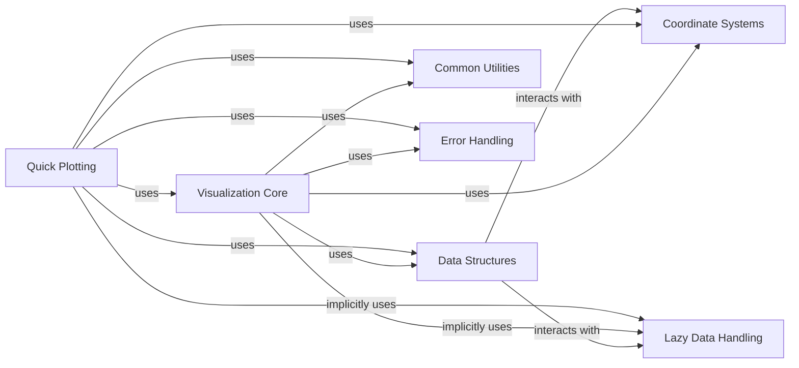

## Details

The `Visualization` component in Iris provides a robust and user-friendly interface for plotting and visualizing scientific data encapsulated within `Cube` objects. It acts as an abstraction layer over external plotting libraries like Matplotlib and Cartopy, ensuring that the geospatial and temporal context of the data is correctly interpreted and rendered. This component is fundamental to a scientific computing library as it allows users to quickly and accurately inspect and present their data, which is a critical step in data analysis and communication.

### Visualization Core
This module provides the foundational, low-level plotting functions. It directly interfaces with Matplotlib to draw various plot types (e.g., line plots, contours, pcolormesh) using Iris `Cube` and `Coord` objects as input. It handles the translation of Iris's data model into Matplotlib's plotting primitives.

**Related Classes/Methods**:

- <a href="https://github.com/SciTools/iris/blob/main/lib/iris/plot.py#L1603-L1653" target="_blank" rel="noopener noreferrer">`iris.plot` (1603:1653)</a>

### Quick Plotting
Building upon `iris.plot`, this module offers high-level, opinionated plotting functions that automate common visualization tasks such as adding titles, axis labels, and colorbars. It simplifies the plotting process for users by intelligently inferring plot characteristics from the `Cube`'s metadata.

**Related Classes/Methods**:

- <a href="https://github.com/SciTools/iris/blob/main/lib/iris/quickplot.py#L1-L100" target="_blank" rel="noopener noreferrer">`iris.quickplot` (1:100)</a>

### Data Structures
These modules define the core `Cube` and `Coord` objects, which are the central data structures in Iris. The `Cube` encapsulates multi-dimensional data along with its rich metadata (names, units, attributes, coordinate systems), while `Coord` objects represent the dimensions and auxiliary coordinates.

**Related Classes/Methods**:

- <a href="https://github.com/SciTools/iris/blob/main/lib/iris/cube.py#L1-L100" target="_blank" rel="noopener noreferrer">`iris.cube` (1:100)</a>
- <a href="https://github.com/SciTools/iris/blob/main/lib/iris/coords.py#L1-L100" target="_blank" rel="noopener noreferrer">`iris.coords` (1:100)</a>

### Coordinate Systems
This component defines various geographical and projected coordinate systems (e.g., `GeogCS`, `RotatedGeogCS`, `Mercator`). It enables Iris to correctly interpret and transform spatial data, which is essential for accurate mapping and visualization of geospatial datasets.

**Related Classes/Methods**:

- <a href="https://github.com/SciTools/iris/blob/main/lib/iris/coord_systems.py#L1-L100" target="_blank" rel="noopener noreferrer">`iris.coord_systems` (1:100)</a>

### Common Utilities
This component provides a collection of general-purpose utility functions and configuration settings used throughout the Iris library. In the context of visualization, this includes helpers for unit symbol selection, plot definition retrieval, and other common operations that support the plotting process.

**Related Classes/Methods**:

- <a href="https://github.com/SciTools/iris/blob/main/lib/iris/util.py#L1-L100" target="_blank" rel="noopener noreferrer">`iris.util` (1:100)</a>
- <a href="https://github.com/SciTools/iris/blob/main/lib/iris/config.py#L1-L100" target="_blank" rel="noopener noreferrer">`iris.config` (1:100)</a>

### Error Handling
This module defines custom exception classes used across Iris to provide specific and informative error messages. For visualization, this means clearer feedback to users when plotting operations encounter issues (e.g., invalid arguments, incompatible data).

**Related Classes/Methods**:

- <a href="https://github.com/SciTools/iris/blob/main/lib/iris/exceptions.py#L1-L100" target="_blank" rel="noopener noreferrer">`iris.exceptions` (1:100)</a>

### Lazy Data Handling
This component manages the lazy loading and computation of data, primarily through integration with Dask. It allows Iris to work efficiently with large datasets by deferring data loading and computation until absolutely necessary, optimizing memory usage and performance.

**Related Classes/Methods**:

- <a href="https://github.com/SciTools/iris/blob/main/lib/iris/_lazy_data.py#L1-L100" target="_blank" rel="noopener noreferrer">`iris._lazy_data` (1:100)</a>

### [FAQ](https://github.com/CodeBoarding/GeneratedOnBoardings/tree/main?tab=readme-ov-file#faq)