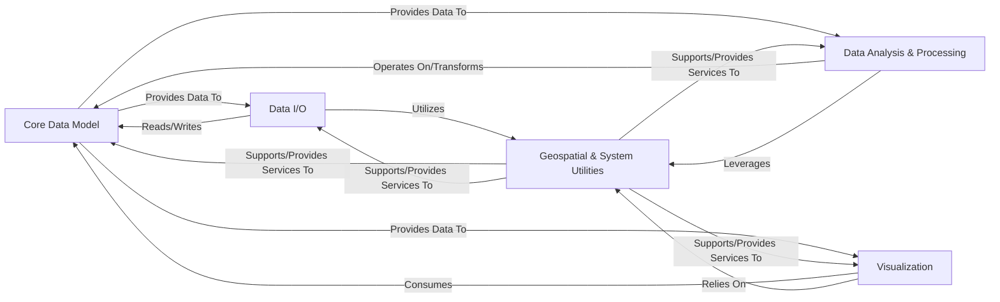

## Details

The `iris` project, a scientific computing library for Earth science data, exhibits a clear layered and data-centric architecture. Its five core components manage data representation, input/output, analysis, visualization, and foundational utilities, promoting modularity, maintainability, and extensibility.

### Core Data Model [[Expand]](./Core_Data_Model.md)
This is the foundational component of Iris, defining the canonical representation of scientific data. It encompasses n-dimensional data arrays, their associated metadata, and various types of coordinates (dimensional, auxiliary, cell methods) that describe the data's physical context. It also includes the representation of unstructured meshes, which are an extension of the core data model for handling irregular grids.

**Related Classes/Methods**:

- <a href="https://github.com/SciTools/iris/blob/main/lib/iris/cube.py#L1-L1" target="_blank" rel="noopener noreferrer">`iris.cube` (1:1)</a>
- <a href="https://github.com/SciTools/iris/blob/main/lib/iris/coords.py#L1-L1" target="_blank" rel="noopener noreferrer">`iris.coords` (1:1)</a>
- `iris.mesh` (1:1)

### Data I/O [[Expand]](./Data_I_O.md)
This component is responsible for the seamless exchange of scientific data between external file formats (e.g., NetCDF, PP) and the internal Core Data Model (Iris Cubes). It handles the parsing of various file formats into Iris's in-memory representation and the serialization of Iris Cubes back into these formats.

**Related Classes/Methods**:

- <a href="https://github.com/SciTools/iris/blob/main/lib/iris/loading.py#L1-L1" target="_blank" rel="noopener noreferrer">`iris.loading` (1:1)</a>
- `iris.io` (1:1)
- `iris.fileformats` (1:1)

### Data Analysis & Processing
This component provides a comprehensive suite of algorithms and tools for performing scientific analysis and manipulation on the Core Data Model. It includes functionalities for aggregation (e.g., mean, sum), interpolation, regridding data to different grids, mathematical operations, and the creation of derived auxiliary coordinates (e.g., hybrid height).

**Related Classes/Methods**:

- `iris.analysis` (1:1)
- <a href="https://github.com/SciTools/iris/blob/main/lib/iris/aux_factory.py#L1-L1" target="_blank" rel="noopener noreferrer">`iris.aux_factory` (1:1)</a>
- <a href="https://github.com/SciTools/iris/blob/main/lib/iris/_concatenate.py#L1-L1" target="_blank" rel="noopener noreferrer">`iris._concatenate` (1:1)</a>
- <a href="https://github.com/SciTools/iris/blob/main/lib/iris/_merge.py#L1-L1" target="_blank" rel="noopener noreferrer">`iris._merge` (1:1)</a>

### Visualization [[Expand]](./Visualization.md)
This component offers functionalities for plotting and visualizing scientific data contained within Iris Cubes. It acts as an abstraction layer over external plotting libraries (such as Matplotlib and Cartopy), providing Iris-specific plotting methods that understand and correctly render the geospatial and temporal context of the data.

**Related Classes/Methods**:

- <a href="https://github.com/SciTools/iris/blob/main/lib/iris/plot.py#L1603-L1653" target="_blank" rel="noopener noreferrer">`iris.plot` (1603:1653)</a>
- <a href="https://github.com/SciTools/iris/blob/main/lib/iris/quickplot.py#L1-L1" target="_blank" rel="noopener noreferrer">`iris.quickplot` (1:1)</a>

### Geospatial & System Utilities [[Expand]](./Geospatial_System_Utilities.md)
This component provides foundational services and contextual information across the entire library. This includes definitions of various geographical and projected coordinate systems, general-purpose helper functions, common base classes, metadata management, lazy data handling mechanisms, and global configuration settings. It underpins the functionality of other components.

**Related Classes/Methods**:

- <a href="https://github.com/SciTools/iris/blob/main/lib/iris/coord_systems.py#L1-L1" target="_blank" rel="noopener noreferrer">`iris.coord_systems` (1:1)</a>
- <a href="https://github.com/SciTools/iris/blob/main/lib/iris/util.py#L1-L1" target="_blank" rel="noopener noreferrer">`iris.util` (1:1)</a>
- `iris.common` (1:1)
- <a href="https://github.com/SciTools/iris/blob/main/lib/iris/_lazy_data.py#L1-L1" target="_blank" rel="noopener noreferrer">`iris._lazy_data` (1:1)</a>
- <a href="https://github.com/SciTools/iris/blob/main/lib/iris/config.py#L1-L1" target="_blank" rel="noopener noreferrer">`iris.config` (1:1)</a>
- <a href="https://github.com/SciTools/iris/blob/main/lib/iris/exceptions.py#L1-L1" target="_blank" rel="noopener noreferrer">`iris.exceptions` (1:1)</a>
- <a href="https://github.com/SciTools/iris/blob/main/lib/iris/warnings.py#L1-L1" target="_blank" rel="noopener noreferrer">`iris.warnings` (1:1)</a>

### [FAQ](https://github.com/CodeBoarding/GeneratedOnBoardings/tree/main?tab=readme-ov-file#faq)