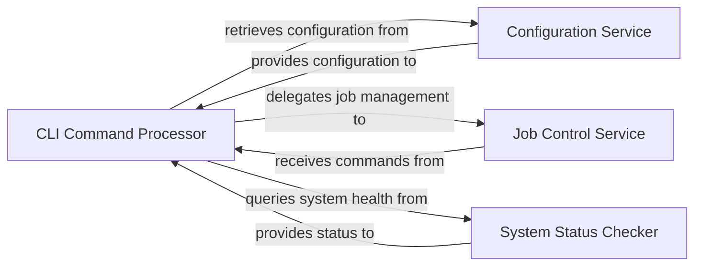

## Details

The `CLI Interface` subsystem serves as the primary user-facing component for managing the distributed data ingest and synchronization framework. It acts as the control plane, allowing users to initiate, configure, and monitor jobs.

### CLI Command Processor
This is the core user-facing component. It parses command-line arguments, validates inputs, and dispatches commands (e.g., `start`, `stop`, `watch`, `list`) to manage ingest and synchronization jobs. It orchestrates initial setup checks and retrieves necessary configurations.

**Related Classes/Methods**:

- <a href="https://github.com/irods/irods_capability_automated_ingest/blob/main/irods_capability_automated_ingest/irods_sync.py" target="_blank" rel="noopener noreferrer">`irods_capability_automated_ingest.irods_sync`</a>
- <a href="https://github.com/irods/irods_capability_automated_ingest/blob/main/irods_capability_automated_ingest/irods_sync.py" target="_blank" rel="noopener noreferrer">`irods_capability_automated_ingest.irods_sync:add_arguments`</a>
- <a href="https://github.com/irods/irods_capability_automated_ingest/blob/main/irods_capability_automated_ingest/irods_sync.py" target="_blank" rel="noopener noreferrer">`irods_capability_automated_ingest.irods_sync:character_map_argument_error`</a>
- <a href="https://github.com/irods/irods_capability_automated_ingest/blob/main/irods_capability_automated_ingest/irods_sync.py" target="_blank" rel="noopener noreferrer">`irods_capability_automated_ingest.irods_sync:handle_start`</a>
- <a href="https://github.com/irods/irods_capability_automated_ingest/blob/main/irods_capability_automated_ingest/irods_sync.py" target="_blank" rel="noopener noreferrer">`irods_capability_automated_ingest.irods_sync:handle_stop`</a>
- <a href="https://github.com/irods/irods_capability_automated_ingest/blob/main/irods_capability_automated_ingest/irods_sync.py" target="_blank" rel="noopener noreferrer">`irods_capability_automated_ingest.irods_sync:handle_watch`</a>
- <a href="https://github.com/irods/irods_capability_automated_ingest/blob/main/irods_capability_automated_ingest/irods_sync.py" target="_blank" rel="noopener noreferrer">`irods_capability_automated_ingest.irods_sync:handle_list`</a>
- <a href="https://github.com/irods/irods_capability_automated_ingest/blob/main/irods_capability_automated_ingest/irods_sync.py" target="_blank" rel="noopener noreferrer">`irods_capability_automated_ingest.irods_sync:main`</a>

### Configuration Service
Provides system-wide configuration parameters to the `CLI Command Processor`. It centralizes the storage and retrieval of settings required for the operation of ingest and synchronization jobs.

**Related Classes/Methods**:

- <a href="https://github.com/irods/irods_capability_automated_ingest/blob/main/irods_capability_automated_ingest/irods_sync.py#L8-L27" target="_blank" rel="noopener noreferrer">`irods_capability_automated_ingest.irods_sync.get_config`:8-27</a>

### Job Control Service
Manages the lifecycle of synchronization jobs, including initiating, stopping, and listing their current status. It acts as an interface for the `CLI Command Processor` to interact with the underlying job execution mechanisms.

**Related Classes/Methods**:

- <a href="https://github.com/irods/irods_capability_automated_ingest/blob/main/irods_capability_automated_ingest/irods_sync.py#L167-L201" target="_blank" rel="noopener noreferrer">`irods_capability_automated_ingest.irods_sync.handle_start`:167-201</a>
- <a href="https://github.com/irods/irods_capability_automated_ingest/blob/main/irods_capability_automated_ingest/irods_sync.py#L204-L206" target="_blank" rel="noopener noreferrer">`irods_capability_automated_ingest.irods_sync.handle_stop`:204-206</a>
- <a href="https://github.com/irods/irods_capability_automated_ingest/blob/main/irods_capability_automated_ingest/irods_sync.py#L213-L216" target="_blank" rel="noopener noreferrer">`irods_capability_automated_ingest.irods_sync.handle_list`:213-216</a>
- <a href="https://github.com/irods/irods_capability_automated_ingest/blob/main/irods_capability_automated_ingest/irods_sync.py#L209-L210" target="_blank" rel="noopener noreferrer">`irods_capability_automated_ingest.irods_sync.handle_watch`:209-210</a>

### System Status Checker
Verifies the operational status and setup of critical external dependencies, such as the event handling mechanisms and the Celery message broker. It provides diagnostic information to the `CLI Command Processor` for user feedback.

**Related Classes/Methods**:

- <a href="https://github.com/irods/irods_capability_automated_ingest/blob/main/irods_capability_automated_ingest/irods_sync.py#L58-L82" target="_blank" rel="noopener noreferrer">`irods_capability_automated_ingest.irods_sync.check_event_handler`:58-82</a>
- <a href="https://github.com/irods/irods_capability_automated_ingest/blob/main/irods_capability_automated_ingest/irods_sync.py#L30-L44" target="_blank" rel="noopener noreferrer">`irods_capability_automated_ingest.irods_sync.get_celery_broker_info`:30-44</a>

### [FAQ](https://github.com/CodeBoarding/GeneratedOnBoardings/tree/main?tab=readme-ov-file#faq)