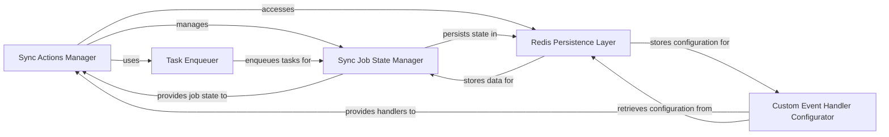

## Details

The automated ingest system is structured around a core set of components designed for managing and executing synchronization jobs. The `Sync Actions Manager` serves as the primary control interface, orchestrating the lifecycle of ingest and synchronization tasks. It delegates job-specific state management to the `Sync Job State Manager`, which meticulously tracks the progress and status of individual jobs. For task distribution, the `Task Enqueuer` is responsible for populating work queues, enabling scalable and distributed processing. Dynamic customization of synchronization logic is facilitated by the `Custom Event Handler Configurator`, which provides and manages event-driven behaviors. All persistent data, including job states, metrics, and configurations, are handled by the `Redis Persistence Layer`, a robust and retry-enabled interface that ensures data durability and availability across the distributed system.

### Sync Actions Manager
This component serves as the main API for managing synchronization jobs. It is responsible for initiating, stopping, listing, and monitoring the overall lifecycle of ingest and synchronization tasks. It acts as the orchestrator's primary control plane.

**Related Classes/Methods**:

- <a href="https://github.com/irods/irods_capability_automated_ingest/blob/main/irods_capability_automated_ingest/sync_actions.py" target="_blank" rel="noopener noreferrer">`irods_capability_automated_ingest.sync_actions`</a>

### Sync Job State Manager
Manages the complete state of individual synchronization jobs. This includes tracking tasks, counts, failures, and providing methods for state transitions (e.g., `done`, `cleanup`, `stop`). It acts as the authoritative data model for a job's current status.

**Related Classes/Methods**:

- <a href="https://github.com/irods/irods_capability_automated_ingest/blob/main/irods_capability_automated_ingest/sync_job.py" target="_blank" rel="noopener noreferrer">`irods_capability_automated_ingest.sync_job`</a>

### Task Enqueuer
Provides the core mechanism to add new tasks to a synchronization job. This component is responsible for populating the work queue, enabling distributed processing by making tasks available for worker nodes.

**Related Classes/Methods**:

- <a href="https://github.com/irods/irods_capability_automated_ingest/blob/main/irods_capability_automated_ingest/utils.py" target="_blank" rel="noopener noreferrer">`irods_capability_automated_ingest.utils`</a>

### Custom Event Handler Configurator
Manages the configuration and properties of custom event handlers. It abstracts their attributes and facilitates their retrieval from persistent storage, enabling dynamic, event-driven logic execution within the synchronization process.

**Related Classes/Methods**:

- <a href="https://github.com/irods/irods_capability_automated_ingest/blob/main/irods_capability_automated_ingest/custom_event_handler.py" target="_blank" rel="noopener noreferrer">`irods_capability_automated_ingest.custom_event_handler`</a>

### Redis Persistence Layer
Provides a robust, retry-enabled interface for interacting with a key-value store (Redis). It manages Redis connections and connection pools, and offers a set of specialized key handlers with built-in retry mechanisms for various data types (e.g., incremental counters, JSON objects, lists). This component serves as the primary persistence layer for job states, metrics, and configurations, ensuring data durability and availability across the distributed system.

**Related Classes/Methods**:

- <a href="https://github.com/irods/irods_capability_automated_ingest/blob/main/irods_capability_automated_ingest/redis_key.py" target="_blank" rel="noopener noreferrer">`irods_capability_automated_ingest.redis_key`</a>
- <a href="https://github.com/irods/irods_capability_automated_ingest/blob/main/irods_capability_automated_ingest/redis_utils.py" target="_blank" rel="noopener noreferrer">`irods_capability_automated_ingest.redis_utils`</a>

### [FAQ](https://github.com/CodeBoarding/GeneratedOnBoardings/tree/main?tab=readme-ov-file#faq)