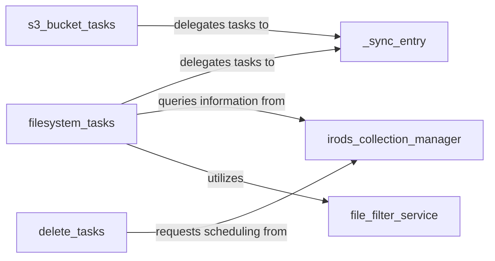

## Details

The `irods_capability_automated_ingest` project is designed to automate data ingest and synchronization into iRODS from various sources. The core of the system revolves around three primary task orchestrators: `filesystem_tasks`, `s3_bucket_tasks`, and `delete_tasks`. These orchestrators delegate their specific operations to the `_sync_entry` component, which provides the fundamental synchronization logic. The `irods_collection_manager` acts as the central interface for all iRODS-related operations, including collection management, data object handling, and deletion scheduling. To ensure data integrity and proper processing, the `file_filter_service` applies filtering rules and defines operational modes, guiding how data is handled during synchronization and deletion. This architecture ensures a modular and extensible system for automated data management within iRODS.

### filesystem_tasks
Orchestrates and executes data ingest and synchronization operations from local filesystems to iRODS, including path-based, directory-based, and file-based synchronization.

**Related Classes/Methods**:

- <a href="https://github.com/irods/irods_capability_automated_ingest/blob/main/irods_capability_automated_ingest/tasks/filesystem_tasks.py" target="_blank" rel="noopener noreferrer">`irods_capability_automated_ingest.tasks.filesystem_tasks`</a>

### s3_bucket_tasks
Manages and executes data ingest and synchronization operations from S3 buckets to iRODS, specifically for directories and files within S3.

**Related Classes/Methods**:

- <a href="https://github.com/irods/irods_capability_automated_ingest/blob/main/irods_capability_automated_ingest/tasks/s3_bucket_tasks.py" target="_blank" rel="noopener noreferrer">`irods_capability_automated_ingest.tasks.s3_bucket_tasks`</a>

### delete_tasks
Manages the process of deleting collections and data objects within iRODS, ensuring proper scheduling for removal.

**Related Classes/Methods**:

- <a href="https://github.com/irods/irods_capability_automated_ingest/blob/main/irods_capability_automated_ingest/tasks/delete_tasks.py" target="_blank" rel="noopener noreferrer">`irods_capability_automated_ingest.tasks.delete_tasks`</a>

### _sync_entry
Provides low-level, atomic synchronization logic, abstracting the actual data transfer and metadata updates. It handles the initiation and monitoring of synchronization jobs, delegating to specific task types (filesystem or S3) and managing event handlers.

**Related Classes/Methods**:

- <a href="https://github.com/irods/irods_capability_automated_ingest/blob/main/irods_capability_automated_ingest/sync_actions.py" target="_blank" rel="noopener noreferrer">`irods_capability_automated_ingest.sync_actions`</a>

### irods_collection_manager
Manages iRODS collections and data objects, handling queries for existing content, creating new collections, and scheduling deletions based on defined modes. It provides an interface for interacting with the iRODS session.

**Related Classes/Methods**:

- <a href="https://github.com/irods/irods_capability_automated_ingest/blob/main/irods_capability_automated_ingest/irods/irods_utils.py" target="_blank" rel="noopener noreferrer">`irods_capability_automated_ingest.irods.irods_utils`</a>

### file_filter_service
Applies filtering rules and defines operational modes to ensure only relevant data is processed during synchronization and deletion. It determines the compatibility of delete modes with various operations.

**Related Classes/Methods**:

- <a href="https://github.com/irods/irods_capability_automated_ingest/blob/main/irods_capability_automated_ingest/utils.py" target="_blank" rel="noopener noreferrer">`irods_capability_automated_ingest.utils`</a>

### [FAQ](https://github.com/CodeBoarding/GeneratedOnBoardings/tree/main?tab=readme-ov-file#faq)