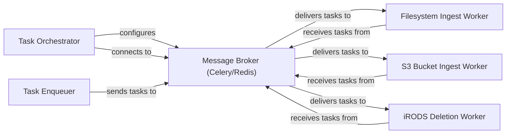

## Details

The `Message Broker (Celery/Redis)` subsystem is central to the asynchronous and distributed nature of the data ingest and synchronization framework. It acts as the backbone for reliable task distribution and execution, decoupling task producers from consumers.

### Message Broker (Celery/Redis) [[Expand]](./Message_Broker_Celery_Redis_.md)
An external, distributed message queue system (Celery with Redis as the backend) responsible for asynchronous task queuing, distribution, and reliable execution. It decouples task producers from consumers, enabling scalable and fault-tolerant operations.

**Related Classes/Methods**:

- <a href="https://github.com/irods/irods_capability_automated_ingest/blob/main/irods_capability_automated_ingest/celery.py" target="_blank" rel="noopener noreferrer">`irods_capability_automated_ingest.celery`</a>

### Task Orchestrator
Initializes and manages the Celery application, acting as the central hub for task distribution and providing broker connection details. It's the primary component within the application that configures and connects to the `Message Broker`.

**Related Classes/Methods**:

- <a href="https://github.com/irods/irods_capability_automated_ingest/blob/main/irods_capability_automated_ingest/celery.py" target="_blank" rel="noopener noreferrer">`irods_capability_automated_ingest.celery`</a>
- <a href="https://github.com/irods/irods_capability_automated_ingest/blob/main/irods_capability_automated_ingest/irods_sync.py#L30-L44" target="_blank" rel="noopener noreferrer">`irods_capability_automated_ingest.irods_sync.get_celery_broker_info`:30-44</a>

### Task Enqueuer
Provides a utility to add tasks to the Celery message queue, linking various synchronization and deletion tasks to the broker and associating them with specific jobs. It's the component responsible for sending tasks to the `Message Broker`.

**Related Classes/Methods**:

- <a href="https://github.com/irods/irods_capability_automated_ingest/blob/main/irods_capability_automated_ingest/utils.py#L57-L78" target="_blank" rel="noopener noreferrer">`irods_capability_automated_ingest.utils.enqueue_task`:57-78</a>

### Filesystem Ingest Worker
Executes tasks related to synchronizing local filesystem paths with iRODS, consuming tasks from the `Message Broker`.

**Related Classes/Methods**:

- <a href="https://github.com/irods/irods_capability_automated_ingest/blob/main/irods_capability_automated_ingest/tasks/filesystem_tasks.py" target="_blank" rel="noopener noreferrer">`irods_capability_automated_ingest.tasks.filesystem_tasks.*`</a>

### S3 Bucket Ingest Worker
Executes tasks for synchronizing S3 bucket contents with iRODS, consuming tasks from the `Message Broker`.

**Related Classes/Methods**:

- <a href="https://github.com/irods/irods_capability_automated_ingest/blob/main/irods_capability_automated_ingest/tasks/s3_bucket_tasks.py" target="_blank" rel="noopener noreferrer">`irods_capability_automated_ingest.tasks.s3_bucket_tasks.*`</a>

### iRODS Deletion Worker
Manages and executes tasks for scheduling and performing deletions of collections and data objects within iRODS, consuming tasks from the `Message Broker`.

**Related Classes/Methods**:

- <a href="https://github.com/irods/irods_capability_automated_ingest/blob/main/irods_capability_automated_ingest/tasks/delete_tasks.py" target="_blank" rel="noopener noreferrer">`irods_capability_automated_ingest.tasks.delete_tasks.*`</a>

### [FAQ](https://github.com/CodeBoarding/GeneratedOnBoardings/tree/main?tab=readme-ov-file#faq)