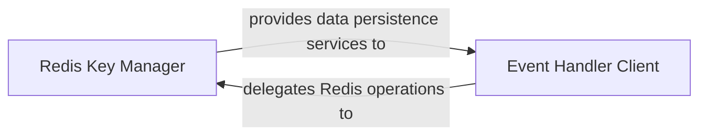

## Details

The `irods_capability_automated_ingest` project utilizes Redis for managing event-driven state and configurations. The `Redis Key Manager` (`irods_capability_automated_ingest.redis_key`) serves as the core abstraction for all Redis interactions, handling key construction, CRUD operations, and retry mechanisms. The `Event Handler Client` (`irods_capability_automated_ingest.custom_event_handler.custom_event_handler`) is a key consumer of these services. It dynamically loads and executes custom event handlers, persisting their configurations and state in Redis via the `Redis Key Manager`. This architecture allows for flexible and stateful event processing within the distributed data ingest and synchronization framework.

### Redis Key Manager
This is the foundational component of the Redis Persistence Layer. It provides a robust and abstracted interface for all Redis operations, including dynamic key construction, data manipulation (CRUD for strings, lists, counters), and ensuring operational reliability through a retry mechanism. It acts as the single point of contact for other components needing to interact with Redis, centralizing data access logic.

**Related Classes/Methods**:

- <a href="https://github.com/irods/irods_capability_automated_ingest/blob/main/irods_capability_automated_ingest/redis_key.py" target="_blank" rel="noopener noreferrer">`irods_capability_automated_ingest.redis_key`</a>

### Event Handler Client
This component acts as a consumer of the `Redis Key Manager`'s services. Its primary responsibility is to store and retrieve data related to custom events generated within the distributed data ingest and synchronization framework. It leverages the `Redis Key Manager` to persist event-specific state, enabling event-driven architecture and stateful processing. The `custom_event_handler` class dynamically loads and executes event-specific modules, using `redis_key_handle` (from `redis_key`) to manage the persistence of event handler configurations in Redis.

**Related Classes/Methods**:

- <a href="https://github.com/irods/irods_capability_automated_ingest/blob/main/irods_capability_automated_ingest/custom_event_handler.py#L9-L119" target="_blank" rel="noopener noreferrer">`irods_capability_automated_ingest.custom_event_handler.custom_event_handler`:9-119</a>

### [FAQ](https://github.com/CodeBoarding/GeneratedOnBoardings/tree/main?tab=readme-ov-file#faq)