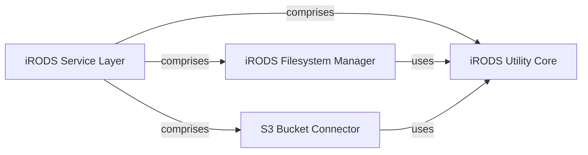

## Details

The `iRODS Service Layer` acts as the primary interface for all interactions with the iRODS data management system, providing a unified and abstracted access point. This layer is composed of three central components: the `iRODS Filesystem Manager`, the `S3 Bucket Connector`, and the `iRODS Utility Core`. The `iRODS Filesystem Manager` is responsible for managing the lifecycle of files and directories originating from local filesystems within iRODS, handling operations such as registration, upload, appending data, and synchronization. Concurrently, the `S3 Bucket Connector` facilitates robust data transfer and synchronization between S3 buckets and iRODS, employing various upload strategies. Both the `iRODS Filesystem Manager` and the `S3 Bucket Connector` rely on the `iRODS Utility Core`, which provides essential low-level utility functions for interacting with the iRODS system, ensuring foundational support for higher-level operations. This architecture ensures a clear separation of concerns, with specialized components handling distinct data sources while leveraging a common utility set for core iRODS interactions.

### iRODS Service Layer [[Expand]](./iRODS_Service_Layer.md)
The overarching abstraction and subsystem boundary for all direct interactions with the iRODS data management system. It provides a unified and abstracted interface for all interactions with iRODS.

**Related Classes/Methods**:

- <a href="https://github.com/irods/irods_capability_automated_ingest/blob/main/irods_capability_automated_ingest/irods/filesystem.py#L33-L74" target="_blank" rel="noopener noreferrer">`irods_capability_automated_ingest.irods.filesystem.register_file`:33-74</a>
- <a href="https://github.com/irods/irods_capability_automated_ingest/blob/main/irods_capability_automated_ingest/irods/filesystem.py#L77-L115" target="_blank" rel="noopener noreferrer">`irods_capability_automated_ingest.irods.filesystem.upload_file`:77-115</a>
- <a href="https://github.com/irods/irods_capability_automated_ingest/blob/main/irods_capability_automated_ingest/irods/filesystem.py#L12-L30" target="_blank" rel="noopener noreferrer">`irods_capability_automated_ingest.irods.filesystem.append_to_data_object`:12-30</a>
- <a href="https://github.com/irods/irods_capability_automated_ingest/blob/main/irods_capability_automated_ingest/irods/filesystem.py#L122-L165" target="_blank" rel="noopener noreferrer">`irods_capability_automated_ingest.irods.filesystem.sync_file`:122-165</a>
- <a href="https://github.com/irods/irods_capability_automated_ingest/blob/main/irods_capability_automated_ingest/irods/filesystem.py#L168-L254" target="_blank" rel="noopener noreferrer">`irods_capability_automated_ingest.irods.filesystem.update_metadata`:168-254</a>
- <a href="https://github.com/irods/irods_capability_automated_ingest/blob/main/irods_capability_automated_ingest/irods/s3_bucket.py#L16-L95" target="_blank" rel="noopener noreferrer">`irods_capability_automated_ingest.irods.s3_bucket.parallel_upload_from_S3`:16-95</a>
- <a href="https://github.com/irods/irods_capability_automated_ingest/blob/main/irods_capability_automated_ingest/irods/s3_bucket.py#L137-L229" target="_blank" rel="noopener noreferrer">`irods_capability_automated_ingest.irods.s3_bucket.single_stream_upload_from_S3`:137-229</a>
- <a href="https://github.com/irods/irods_capability_automated_ingest/blob/main/irods_capability_automated_ingest/irods/s3_bucket.py#L276-L380" target="_blank" rel="noopener noreferrer">`irods_capability_automated_ingest.irods.s3_bucket._upload_file`:276-380</a>
- <a href="https://github.com/irods/irods_capability_automated_ingest/blob/main/irods_capability_automated_ingest/irods/irods_utils.py#L52-L133" target="_blank" rel="noopener noreferrer">`irods_capability_automated_ingest.irods.irods_utils.irods_session`:52-133</a>
- <a href="https://github.com/irods/irods_capability_automated_ingest/blob/main/irods_capability_automated_ingest/irods/irods_utils.py#L203-L238" target="_blank" rel="noopener noreferrer">`irods_capability_automated_ingest.irods.irods_utils.annotate_metadata_for_special_data_objs`:203-238</a>
- <a href="https://github.com/irods/irods_capability_automated_ingest/blob/main/irods_capability_automated_ingest/irods/irods_utils.py#L241-L254" target="_blank" rel="noopener noreferrer">`irods_capability_automated_ingest.irods.irods_utils.size`:241-254</a>
- <a href="https://github.com/irods/irods_capability_automated_ingest/blob/main/irods_capability_automated_ingest/irods/irods_utils.py#L143-L161" target="_blank" rel="noopener noreferrer">`irods_capability_automated_ingest.irods.irods_utils.child_of`:143-161</a>

### iRODS Filesystem Manager
Manages the lifecycle of files and directories within the iRODS environment, specifically for data originating from local filesystems. This includes operations like registration, upload, appending data, and comprehensive synchronization of both data and metadata.

**Related Classes/Methods**:

- <a href="https://github.com/irods/irods_capability_automated_ingest/blob/main/irods_capability_automated_ingest/irods/filesystem.py#L33-L74" target="_blank" rel="noopener noreferrer">`irods_capability_automated_ingest.irods.filesystem.register_file`:33-74</a>
- <a href="https://github.com/irods/irods_capability_automated_ingest/blob/main/irods_capability_automated_ingest/irods/filesystem.py#L77-L115" target="_blank" rel="noopener noreferrer">`irods_capability_automated_ingest.irods.filesystem.upload_file`:77-115</a>
- <a href="https://github.com/irods/irods_capability_automated_ingest/blob/main/irods_capability_automated_ingest/irods/filesystem.py#L12-L30" target="_blank" rel="noopener noreferrer">`irods_capability_automated_ingest.irods.filesystem.append_to_data_object`:12-30</a>
- <a href="https://github.com/irods/irods_capability_automated_ingest/blob/main/irods_capability_automated_ingest/irods/filesystem.py#L122-L165" target="_blank" rel="noopener noreferrer">`irods_capability_automated_ingest.irods.filesystem.sync_file`:122-165</a>
- <a href="https://github.com/irods/irods_capability_automated_ingest/blob/main/irods_capability_automated_ingest/irods/filesystem.py#L168-L254" target="_blank" rel="noopener noreferrer">`irods_capability_automated_ingest.irods.filesystem.update_metadata`:168-254</a>

### S3 Bucket Connector
Facilitates robust interaction with S3 buckets to transfer and synchronize data with iRODS. It handles various upload strategies to optimize data transfer from cloud storage.

**Related Classes/Methods**:

- <a href="https://github.com/irods/irods_capability_automated_ingest/blob/main/irods_capability_automated_ingest/irods/s3_bucket.py#L16-L95" target="_blank" rel="noopener noreferrer">`irods_capability_automated_ingest.irods.s3_bucket.parallel_upload_from_S3`:16-95</a>
- <a href="https://github.com/irods/irods_capability_automated_ingest/blob/main/irods_capability_automated_ingest/irods/s3_bucket.py#L137-L229" target="_blank" rel="noopener noreferrer">`irods_capability_automated_ingest.irods.s3_bucket.single_stream_upload_from_S3`:137-229</a>
- <a href="https://github.com/irods/irods_capability_automated_ingest/blob/main/irods_capability_automated_ingest/irods/s3_bucket.py#L276-L380" target="_blank" rel="noopener noreferrer">`irods_capability_automated_ingest.irods.s3_bucket._upload_file`:276-380</a>

### iRODS Utility Core
Provides a foundational set of low-level, generic utility functions for interacting with the iRODS system. This component serves as a critical dependency for higher-level components within the `iRODS Service Layer`.

**Related Classes/Methods**:

- <a href="https://github.com/irods/irods_capability_automated_ingest/blob/main/irods_capability_automated_ingest/irods/irods_utils.py#L52-L133" target="_blank" rel="noopener noreferrer">`irods_capability_automated_ingest.irods.irods_utils.irods_session`:52-133</a>
- <a href="https://github.com/irods/irods_capability_automated_ingest/blob/main/irods_capability_automated_ingest/irods/irods_utils.py#L203-L238" target="_blank" rel="noopener noreferrer">`irods_capability_automated_ingest.irods.irods_utils.annotate_metadata_for_special_data_objs`:203-238</a>
- <a href="https://github.com/irods/irods_capability_automated_ingest/blob/main/irods_capability_automated_ingest/irods/irods_utils.py#L241-L254" target="_blank" rel="noopener noreferrer">`irods_capability_automated_ingest.irods.irods_utils.size`:241-254</a>
- <a href="https://github.com/irods/irods_capability_automated_ingest/blob/main/irods_capability_automated_ingest/irods/irods_utils.py#L143-L161" target="_blank" rel="noopener noreferrer">`irods_capability_automated_ingest.irods.irods_utils.child_of`:143-161</a>

### [FAQ](https://github.com/CodeBoarding/GeneratedOnBoardings/tree/main?tab=readme-ov-file#faq)