```mermaid
graph LR
    CLI_Interface["CLI Interface"]
    Ingest_Orchestrator["Ingest Orchestrator"]
    Message_Broker_Celery_Redis_["Message Broker (Celery/Redis)"]
    Ingest_Sync_Workers["Ingest/Sync Workers"]
    iRODS_Service_Layer["iRODS Service Layer"]
    Persistence_Layer_Redis_["Persistence Layer (Redis)"]
    CLI_Interface -- "initiates" --> Ingest_Orchestrator
    Ingest_Orchestrator -- "manages job state via" --> Persistence_Layer_Redis_
    Ingest_Orchestrator -- "enqueues tasks to" --> Message_Broker_Celery_Redis_
    Message_Broker_Celery_Redis_ -- "distributes tasks to" --> Ingest_Sync_Workers
    Ingest_Sync_Workers -- "performs operations via" --> iRODS_Service_Layer
    Ingest_Sync_Workers -- "reports status to" --> Ingest_Orchestrator
    click CLI_Interface href "https://github.com/CodeBoarding/GeneratedOnBoardings/blob/main/irods_capability_automated_ingest/CLI_Interface.md" "Details"
    click Ingest_Orchestrator href "https://github.com/CodeBoarding/GeneratedOnBoardings/blob/main/irods_capability_automated_ingest/Ingest_Orchestrator.md" "Details"
    click Message_Broker_Celery_Redis_ href "https://github.com/CodeBoarding/GeneratedOnBoardings/blob/main/irods_capability_automated_ingest/Message_Broker_Celery_Redis_.md" "Details"
    click Ingest_Sync_Workers href "https://github.com/CodeBoarding/GeneratedOnBoardings/blob/main/irods_capability_automated_ingest/Ingest_Sync_Workers.md" "Details"
    click iRODS_Service_Layer href "https://github.com/CodeBoarding/GeneratedOnBoardings/blob/main/irods_capability_automated_ingest/iRODS_Service_Layer.md" "Details"
    click Persistence_Layer_Redis_ href "https://github.com/CodeBoarding/GeneratedOnBoardings/blob/main/irods_capability_automated_ingest/Persistence_Layer_Redis_.md" "Details"
```

## Details

The `irods_capability_automated_ingest` system is designed as a distributed, asynchronous data ingest and synchronization framework. Users interact with the system via the **CLI Interface**, which sends commands to the **Ingest Orchestrator**. The Orchestrator is the central intelligence, managing job states through the **Persistence Layer (Redis)** and delegating work by enqueuing tasks to the **Message Broker (Celery/Redis)**. A pool of **Ingest/Sync Workers** retrieves these tasks from the Message Broker and executes the actual data transfer or deletion operations, interacting with the iRODS data management system through the **iRODS Service Layer**. This architecture ensures scalability, reliability, and extensibility, allowing for various data sources and custom event handling throughout the synchronization process.

### CLI Interface [[Expand]](./CLI_Interface.md)
The user-facing command-line tool for initiating, configuring, and monitoring data ingest and synchronization jobs.

**Related Classes/Methods**:

- <a href="https://github.com/irods/irods_capability_automated_ingest/blob/main/irods_capability_automated_ingest/irods_sync.py" target="_blank" rel="noopener noreferrer">`irods_capability_automated_ingest.irods_sync`</a>

### Ingest Orchestrator [[Expand]](./Ingest_Orchestrator.md)
The central control component managing the entire lifecycle of data ingest and synchronization jobs.

**Related Classes/Methods**:

- <a href="https://github.com/irods/irods_capability_automated_ingest/blob/main/irods_capability_automated_ingest/sync_actions.py" target="_blank" rel="noopener noreferrer">`irods_capability_automated_ingest.sync_actions`</a>
- <a href="https://github.com/irods/irods_capability_automated_ingest/blob/main/irods_capability_automated_ingest/sync_job.py" target="_blank" rel="noopener noreferrer">`irods_capability_automated_ingest.sync_job`</a>
- <a href="https://github.com/irods/irods_capability_automated_ingest/blob/main/irods_capability_automated_ingest/utils.py" target="_blank" rel="noopener noreferrer">`irods_capability_automated_ingest.utils`</a>
- <a href="https://github.com/irods/irods_capability_automated_ingest/blob/main/irods_capability_automated_ingest/custom_event_handler.py" target="_blank" rel="noopener noreferrer">`irods_capability_automated_ingest.custom_event_handler`</a>

### Message Broker (Celery/Redis) [[Expand]](./Message_Broker_Celery_Redis_.md)
An external, distributed message queue system for asynchronous communication and reliable task distribution.

**Related Classes/Methods**:

- <a href="https://github.com/irods/irods_capability_automated_ingest/blob/main/irods_capability_automated_ingest/celery.py" target="_blank" rel="noopener noreferrer">`irods_capability_automated_ingest.celery`</a>

### Ingest/Sync Workers [[Expand]](./Ingest_Sync_Workers.md)
A pool of distributed worker processes that consume tasks from the Message Broker and execute data synchronization and ingest operations.

**Related Classes/Methods**:

- <a href="https://github.com/irods/irods_capability_automated_ingest/blob/main/irods_capability_automated_ingest/tasks/filesystem_tasks.py" target="_blank" rel="noopener noreferrer">`irods_capability_automated_ingest.tasks.filesystem_tasks`</a>
- <a href="https://github.com/irods/irods_capability_automated_ingest/blob/main/irods_capability_automated_ingest/tasks/s3_bucket_tasks.py" target="_blank" rel="noopener noreferrer">`irods_capability_automated_ingest.tasks.s3_bucket_tasks`</a>
- <a href="https://github.com/irods/irods_capability_automated_ingest/blob/main/irods_capability_automated_ingest/tasks/delete_tasks.py" target="_blank" rel="noopener noreferrer">`irods_capability_automated_ingest.tasks.delete_tasks`</a>

### iRODS Service Layer [[Expand]](./iRODS_Service_Layer.md)
Provides a unified and abstracted interface for all interactions with the iRODS data management system.

**Related Classes/Methods**:

- <a href="https://github.com/irods/irods_capability_automated_ingest/blob/main/irods_capability_automated_ingest/irods/filesystem.py" target="_blank" rel="noopener noreferrer">`irods_capability_automated_ingest.irods.filesystem`</a>
- <a href="https://github.com/irods/irods_capability_automated_ingest/blob/main/irods_capability_automated_ingest/irods/s3_bucket.py" target="_blank" rel="noopener noreferrer">`irods_capability_automated_ingest.irods.s3_bucket`</a>
- <a href="https://github.com/irods/irods_capability_automated_ingest/blob/main/irods_capability_automated_ingest/irods/irods_utils.py" target="_blank" rel="noopener noreferrer">`irods_capability_automated_ingest.irods.irods_utils`</a>

### Persistence Layer (Redis) [[Expand]](./Persistence_Layer_Redis_.md)
Utilizes Redis as a fast, in-memory key-value store for persisting application state, particularly for job management.

**Related Classes/Methods**:

- <a href="https://github.com/irods/irods_capability_automated_ingest/blob/main/irods_capability_automated_ingest/redis_key.py" target="_blank" rel="noopener noreferrer">`irods_capability_automated_ingest.redis_key`</a>

### [FAQ](https://github.com/CodeBoarding/GeneratedOnBoardings/tree/main?tab=readme-ov-file#faq)