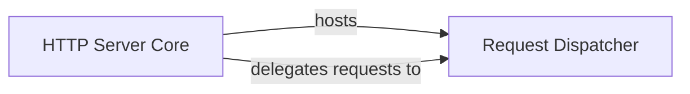

## Details

The itchatmp project's server subsystem is designed with a clear separation of concerns, distinguishing between network interaction and application-specific logic. The HTTP Server Core acts as the foundational layer, establishing and managing the HTTP connection with the WeChat platform. It is responsible for hosting the Request Dispatcher, which encapsulates the application's routing and request handling rules. All incoming requests are initially received by the HTTP Server Core, which then efficiently delegates them to the Request Dispatcher for processing and subsequent routing to the relevant internal components, ensuring a streamlined and organized flow of WeChat message interactions.

### HTTP Server Core
The itchatmp.server.Server serves as the foundational entry point, responsible for initializing and running the underlying Tornado web server and listening for all incoming HTTP requests originating from the WeChat platform.

**Related Classes/Methods**:

- <a href="https://github.com/littlecodersh/itchatmp/blob/master/itchatmp/server.py" target="_blank" rel="noopener noreferrer">`itchatmp.server.Server`</a>

### Request Dispatcher
The Request Dispatcher then takes over, applying its defined routing logic and URL patterns to direct the request to the appropriate internal handlers within the application, thereby managing the flow and processing of WeChat messages.

**Related Classes/Methods**:

- <a href="https://github.com/littlecodersh/itchatmp/blob/master/itchatmp/controllers/application.py#L4-L12" target="_blank" rel="noopener noreferrer">`itchatmp.controllers.application.Application`:4-12</a>

### [FAQ](https://github.com/CodeBoarding/GeneratedOnBoardings/tree/main?tab=readme-ov-file#faq)