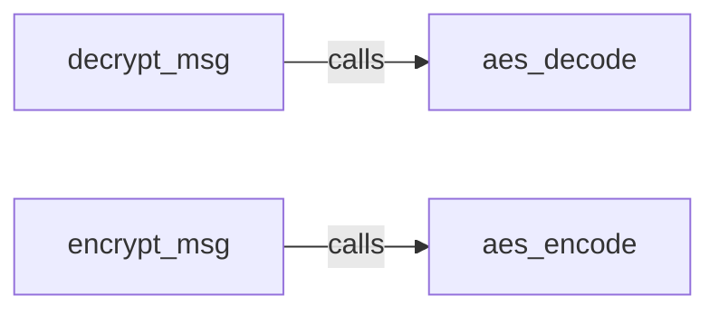

## Details

This subsystem is dedicated to ensuring the confidentiality and integrity of messages exchanged with the WeChat platform by handling their encryption and decryption. It acts as a critical security layer within the `itchatmp` project, abstracting the complexities of cryptographic operations.

### decrypt_msg
Serves as the high-level entry point for decrypting incoming messages from the WeChat platform. It orchestrates the entire decryption process, including any necessary pre-processing, validation, and delegation of the core cryptographic operation. This component is crucial for the "Inbound Flow" of messages, ensuring they are securely transformed from their encrypted state.

**Related Classes/Methods**:

- <a href="https://github.com/littlecodersh/itchatmp/blob/master/itchatmp/views/crypto.py#L31-L57" target="_blank" rel="noopener noreferrer">`decrypt_msg`:31-57</a>

### encrypt_msg
Acts as the high-level entry point for encrypting outgoing messages before they are dispatched to the WeChat platform. It manages the encryption flow, preparing the message content for cryptographic transformation. This component is vital for the "Outbound Flow" of messages, securing data before transmission.

**Related Classes/Methods**:

- <a href="https://github.com/littlecodersh/itchatmp/blob/master/itchatmp/views/crypto.py#L59-L83" target="_blank" rel="noopener noreferrer">`encrypt_msg`:59-83</a>

### aes_decode
Executes the low-level AES decryption algorithm. This component is solely focused on the cryptographic transformation of encrypted message content back into plaintext. It represents the core cryptographic primitive for decryption within the subsystem.

**Related Classes/Methods**:

- <a href="https://github.com/littlecodersh/itchatmp/blob/master/itchatmp/views/crypto.py#L14-L17" target="_blank" rel="noopener noreferrer">`aes_decode`:14-17</a>

### aes_encode
Executes the low-level AES encryption algorithm. This component is responsible for the cryptographic transformation of plaintext message content into an encrypted format suitable for secure transmission. It represents the core cryptographic primitive for encryption within the subsystem.

**Related Classes/Methods**:

- <a href="https://github.com/littlecodersh/itchatmp/blob/master/itchatmp/views/crypto.py#L10-L13" target="_blank" rel="noopener noreferrer">`aes_encode`:10-13</a>

### [FAQ](https://github.com/CodeBoarding/GeneratedOnBoardings/tree/main?tab=readme-ov-file#faq)