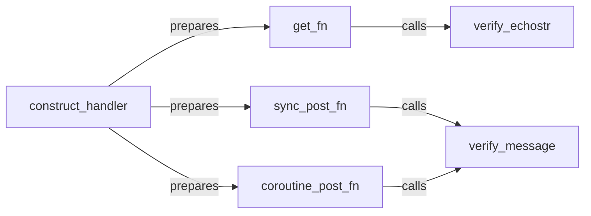

## Details

The `itchatmp` message handling subsystem provides a flexible and secure framework for processing WeChat interactions. At its core, the `construct_handler` component dynamically sets up the necessary HTTP request handlers. It prepares `get_fn` for handling GET requests, which then utilizes `verify_echostr` for initial server validation. For POST requests, `construct_handler` prepares either `sync_post_fn` (synchronous) or `coroutine_post_fn` (asynchronous), both of which rely on `verify_message` to ensure the authenticity and integrity of incoming messages before further processing. This architecture ensures robust message reception, validation, and dispatch, adapting to both synchronous and asynchronous operational modes.

### construct_handler
Dynamically configures and prepares the core HTTP message handling infrastructure. It sets up the specific functions (`get_fn`, `sync_post_fn`, `coroutine_post_fn`) that will process incoming HTTP requests from WeChat.

**Related Classes/Methods**:

- <a href="https://github.com/littlecodersh/itchatmp/blob/master/itchatmp/components/register.py#L180-L240" target="_blank" rel="noopener noreferrer">`construct_handler`:180-240</a>

### get_fn
Handles incoming WeChat GET requests, primarily for server validation. It calls `verify_echostr` to confirm the server's authenticity by validating the `echostr` parameter.

**Related Classes/Methods**:

- <a href="https://github.com/littlecodersh/itchatmp/blob/master/itchatmp/components/register.py" target="_blank" rel="noopener noreferrer">`get_fn`</a>

### sync_post_fn
Serves as the synchronous entry point for processing incoming WeChat POST messages. It manages the flow of message validation, parsing, and reply generation, ultimately dispatching to appropriate message handlers after calling `verify_message`.

**Related Classes/Methods**:

- <a href="https://github.com/littlecodersh/itchatmp/blob/master/itchatmp/components/register.py#L39-L61" target="_blank" rel="noopener noreferrer">`sync_post_fn`:39-61</a>

### coroutine_post_fn
Serves as the asynchronous entry point for processing incoming WeChat POST messages. It handles message validation, parsing, and reply generation in a non-blocking manner, leveraging Tornado's asynchronous capabilities for efficient concurrency, and calls `verify_message`.

**Related Classes/Methods**:

- <a href="https://github.com/littlecodersh/itchatmp/blob/master/itchatmp/components/register.py#L62-L85" target="_blank" rel="noopener noreferrer">`coroutine_post_fn`:62-85</a>

### verify_message
A critical security component responsible for authenticating and ensuring the integrity of all incoming WeChat messages by validating their signatures and other parameters (e.g., timestamp, nonce).

**Related Classes/Methods**:

- <a href="https://github.com/littlecodersh/itchatmp/blob/master/itchatmp/components/register.py#L114-L129" target="_blank" rel="noopener noreferrer">`verify_message`:114-129</a>

### verify_echostr
Dedicated to handling the initial WeChat server validation handshake. It verifies the `echostr` parameter in GET requests to confirm the server's authenticity to WeChat.

**Related Classes/Methods**:

- <a href="https://github.com/littlecodersh/itchatmp/blob/master/itchatmp/components/register.py#L97-L112" target="_blank" rel="noopener noreferrer">`verify_echostr`:97-112</a>

### [FAQ](https://github.com/CodeBoarding/GeneratedOnBoardings/tree/main?tab=readme-ov-file#faq)