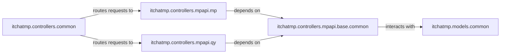

## Details

The itchatmp controllers subsystem provides a robust and modular architecture for interacting with WeChat APIs. It is anchored by itchatmp.controllers.mpapi.base.common, which manages essential foundational services like access token handling and WeChat server IP list maintenance, persisting this vital data via itchatmp.models.common. Building on this foundation, itchatmp.controllers.mpapi.mp and itchatmp.controllers.mpapi.qy serve as specialized clients, each dedicated to comprehensive API interactions for WeChat Official Accounts and Enterprise Accounts, respectively. itchatmp.controllers.common acts as the primary entry point and intelligent dispatching layer, dynamically routing incoming API requests to the correct specialized client, thereby ensuring a streamlined and adaptable interface for diverse WeChat API operations.

### itchatmp.controllers.common
Primarily a routing and dispatching layer, acting as a central dispatcher and managing request flow. It is the primary entry point and intelligent dispatching layer for incoming API requests.

**Related Classes/Methods**: _None_

### itchatmp.controllers.mpapi.base.common
Manages essential foundational services like access token handling and WeChat server IP list maintenance, providing core infrastructure for the subsystem.

**Related Classes/Methods**: _None_

### itchatmp.models.common
Provides persistent storage for critical operational data, specifically for access tokens and server IP lists.

**Related Classes/Methods**: _None_

### itchatmp.controllers.mpapi.mp
A specialized API client dedicated to comprehensive API interactions for WeChat Official Accounts.

**Related Classes/Methods**: _None_

### itchatmp.controllers.mpapi.qy
A specialized API client dedicated to comprehensive API interactions for WeChat Enterprise Accounts.

**Related Classes/Methods**: _None_

### [FAQ](https://github.com/CodeBoarding/GeneratedOnBoardings/tree/main?tab=readme-ov-file#faq)