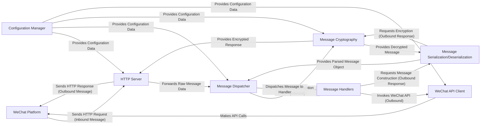

## Details

The `itchatmp` framework facilitates interaction with the WeChat Platform by providing a robust architecture for handling inbound messages and managing outbound communications. At its core, the `HTTP Server` acts as the gateway, receiving messages from the `WeChat Platform` and passing them to the `Message Dispatcher`. The `Message Dispatcher` orchestrates the initial processing, including cryptographic operations handled by `Message Cryptography` and data transformation by `Message Serialization/Deserialization`, before routing messages to user-defined `Message Handlers`. These handlers embody the application's business logic, capable of generating responses or initiating API calls through the `WeChat API Client`. All operations are underpinned by the `Configuration Manager`, which centralizes essential settings. This design ensures a clear, modular flow for processing WeChat interactions.

### WeChat Platform
Represents the external WeChat platform, acting as the source of inbound messages and the destination for outbound messages and API calls. This is an external entity and does not have internal source code within the project.

**Related Classes/Methods**: _None_

### HTTP Server [[Expand]](./HTTP_Server.md)
The entry and exit point for all WeChat interactions, built on Tornado. It listens for incoming HTTP requests from WeChat and sends back responses.

**Related Classes/Methods**:

- <a href="https://github.com/littlecodersh/itchatmp/blob/master/itchatmp/server.py" target="_blank" rel="noopener noreferrer">`itchatmp.server.py`</a>
- <a href="https://github.com/littlecodersh/itchatmp/blob/master/itchatmp/controllers/application.py" target="_blank" rel="noopener noreferrer">`itchatmp.controllers.application.py`</a>

### Message Dispatcher [[Expand]](./Message_Dispatcher.md)
Orchestrates the processing of inbound messages, verifies signatures, and dispatches parsed messages to appropriate Message Handlers.

**Related Classes/Methods**:

- <a href="https://github.com/littlecodersh/itchatmp/blob/master/itchatmp/components/register.py" target="_blank" rel="noopener noreferrer">`itchatmp.components.register.py`</a>

### Message Handlers
Placeholder for user-implemented functions that define the application's business logic in response to different WeChat message types. The mechanism for registering these handlers is defined within the Message Dispatcher component.

**Related Classes/Methods**:

- <a href="https://github.com/littlecodersh/itchatmp/blob/master/itchatmp/components/register.py#L272-L288" target="_blank" rel="noopener noreferrer">`itchatmp.components.register.msg_register`:272-288</a>

### WeChat API Client [[Expand]](./WeChat_API_Client.md)
Provides a unified interface for interacting with various WeChat APIs (Official Account, Enterprise Account, Common APIs), handling access token management, API request construction, and response parsing.

**Related Classes/Methods**:

- <a href="https://github.com/littlecodersh/itchatmp/blob/master/itchatmp/controllers/mpapi/mp" target="_blank" rel="noopener noreferrer">`itchatmp.controllers.mpapi.mp`</a>
- <a href="https://github.com/littlecodersh/itchatmp/blob/master/itchatmp/controllers/mpapi/qy" target="_blank" rel="noopener noreferrer">`itchatmp.controllers.mpapi.qy`</a>
- <a href="https://github.com/littlecodersh/itchatmp/blob/master/itchatmp/controllers/common.py" target="_blank" rel="noopener noreferrer">`itchatmp.controllers.common.py`</a>

### Message Cryptography [[Expand]](./Message_Cryptography.md)
Ensures secure communication by handling the encryption and decryption of messages exchanged with the WeChat platform.

**Related Classes/Methods**:

- <a href="https://github.com/littlecodersh/itchatmp/blob/master/itchatmp/views/crypto.py" target="_blank" rel="noopener noreferrer">`itchatmp.views.crypto.py`</a>

### Message Serialization/Deserialization
Transforms raw message data (XML/JSON) into structured Python objects for internal processing and converts Python objects back into the required format for outbound responses.

**Related Classes/Methods**:

- <a href="https://github.com/littlecodersh/itchatmp/blob/master/itchatmp/views/msgconstruct.py" target="_blank" rel="noopener noreferrer">`itchatmp.views.msgconstruct.py`</a>

### Configuration Manager
Manages application-wide settings and credentials required for WeChat integration.

**Related Classes/Methods**:

- <a href="https://github.com/littlecodersh/itchatmp/blob/master/itchatmp/config.py" target="_blank" rel="noopener noreferrer">`itchatmp.config.py`</a>

### [FAQ](https://github.com/CodeBoarding/GeneratedOnBoardings/tree/main?tab=readme-ov-file#faq)