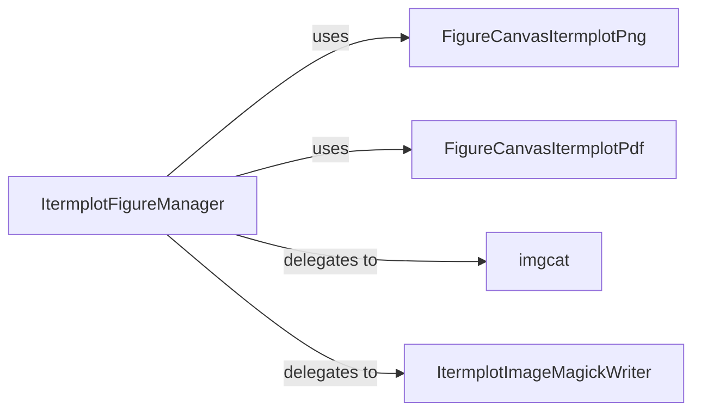

## Details

The `itermplot` subsystem primarily facilitates the display of Matplotlib plots within the iTerm2 terminal. The central orchestrator is `ItermplotFigureManager`, which manages the overall plot display process, deciding whether to render a static image or an animation. For static image display, `ItermplotFigureManager` delegates to either `FigureCanvasItermplotPng` or `FigureCanvasItermplotPdf` to render the plot into an image buffer, which is then passed to the `imgcat` utility for direct display in iTerm2. For animated plots, `ItermplotFigureManager` utilizes `ItermplotImageMagickWriter` to process and convert image frames into an animated format (e.g., GIF), which is then also displayed via `imgcat`. This architecture effectively separates the concerns of plot rendering, image processing, and iTerm2 integration.

### ItermplotFigureManager
Acts as the primary coordinator for displaying plots. It determines whether to render a static image or an animation based on plot characteristics or configuration, and manages the display loop for animated sequences. This component embodies the "Backend/Library" aspect, serving as the main entry point for plot display.

**Related Classes/Methods**:

- <a href="https://github.com/daleroberts/itermplot/blob/master/itermplot/__init__.py#L279-L300" target="_blank" rel="noopener noreferrer">`ItermplotFigureManager:show`:279-300</a>
- <a href="https://github.com/daleroberts/itermplot/blob/master/itermplot/__init__.py#L259-L277" target="_blank" rel="noopener noreferrer">`ItermplotFigureManager:animate`:259-277</a>

### FigureCanvasItermplotPng
Integrates directly with Matplotlib's rendering pipeline for PNG output. Its responsibility is to capture the rendered plot output as a PNG image buffer from Matplotlib and make it available for subsequent display operations. This component functions as a "Plugin" or "Adapter" for Matplotlib's Agg backend.

**Related Classes/Methods**:

- <a href="https://github.com/daleroberts/itermplot/blob/master/itermplot/__init__.py#L236-L243" target="_blank" rel="noopener noreferrer">`FigureCanvasItermplotPng`:236-243</a>

### FigureCanvasItermplotPdf
Integrates directly with Matplotlib's rendering pipeline for PDF output. Its responsibility is to capture the rendered plot output as a PDF image buffer from Matplotlib and make it available for subsequent display operations. This component functions as a "Plugin" or "Adapter" for Matplotlib's PDF backend.

**Related Classes/Methods**:

- <a href="https://github.com/daleroberts/itermplot/blob/master/itermplot/__init__.py#L226-L233" target="_blank" rel="noopener noreferrer">`FigureCanvasItermplotPdf`:226-233</a>

### imgcat
A utility component specifically designed to handle the direct display of a single static image within the iTerm2 terminal. It achieves this by sending the appropriate iTerm2 escape codes. This is a specialized "iTerm2 Integration Module" utility.

**Related Classes/Methods**:

- <a href="https://github.com/daleroberts/itermplot/blob/master/itermplot/__init__.py#L86-L127" target="_blank" rel="noopener noreferrer">`imgcat`:86-127</a>

### ItermplotImageMagickWriter
Responsible for processing and preparing image data, particularly for animated sequences. This involves tasks such as format conversions (e.g., to GIF) or optimizations using the ImageMagick library. This component aligns with the "Image Processing/Conversion Module" pattern.

**Related Classes/Methods**:

- <a href="https://github.com/daleroberts/itermplot/blob/master/itermplot/__init__.py#L246-L252" target="_blank" rel="noopener noreferrer">`ItermplotImageMagickWriter`:246-252</a>

### [FAQ](https://github.com/CodeBoarding/GeneratedOnBoardings/tree/main?tab=readme-ov-file#faq)