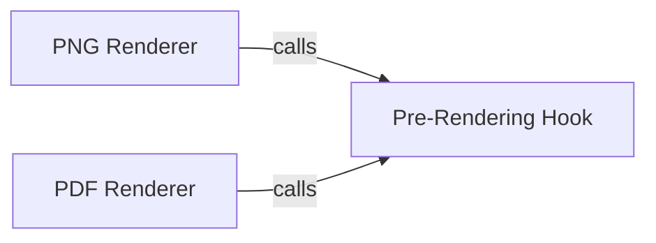

## Details

The `Image Rendering & Output` subsystem is responsible for taking a Matplotlib figure, preparing it for output, and rendering it into various standard image or document formats (e.g., PNG, PDF) for subsequent display or processing, specifically within the iTerm2 environment. Its core functionality revolves around the `ItermplotCanvasMixin` and its methods that handle the final stage of plot visualization.

### PNG Renderer
This component is responsible for converting the current Matplotlib figure into a Portable Network Graphics (PNG) image format. It acts as a specific output adapter for PNG, a common image format for terminal display.

**Related Classes/Methods**:

- <a href="https://github.com/daleroberts/itermplot/blob/master/itermplot/__init__.py" target="_blank" rel="noopener noreferrer">`ItermplotCanvasMixin.print_png`</a>

### PDF Renderer
This component handles the conversion of the Matplotlib figure into a Portable Document Format (PDF) document. It serves as an alternative output adapter, providing a vector-based format option.

**Related Classes/Methods**:

- <a href="https://github.com/daleroberts/itermplot/blob/master/itermplot/__init__.py" target="_blank" rel="noopener noreferrer">`ItermplotCanvasMixin.print_pdf`</a>

### Pre-Rendering Hook
This component provides a common pre-processing step executed immediately before any specific image or document rendering takes place. It ensures that the Matplotlib canvas is in the correct state or has necessary adjustments applied, acting as a crucial preparation layer for the rendering process.

**Related Classes/Methods**:

- <a href="https://github.com/daleroberts/itermplot/blob/master/itermplot/__init__.py" target="_blank" rel="noopener noreferrer">`ItermplotCanvasMixin.before_print`</a>

### [FAQ](https://github.com/CodeBoarding/GeneratedOnBoardings/tree/main?tab=readme-ov-file#faq)