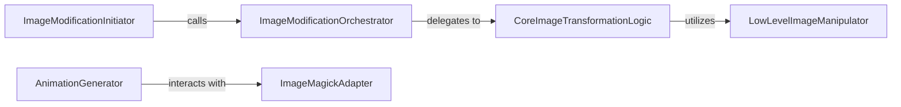

## Details

The Image Transformation & Animation subsystem is responsible for post-rendering image modifications (e.g., color inversion) and the orchestration of animation generation, often leveraging external tools like ImageMagick. Its boundaries are defined by the functions and classes that directly handle image data manipulation, transformation, and animation output.

### ImageModificationInitiator
Acts as the primary entry point within the Matplotlib backend for initiating post-rendering image modifications, specifically for operations like color inversion. It triggers the image transformation workflow.

**Related Classes/Methods**:

- <a href="https://github.com/daleroberts/itermplot/blob/master/itermplot/__init__.py" target="_blank" rel="noopener noreferrer">`ItermplotFigureCanvasAgg.reverse`</a>

### ImageModificationOrchestrator
Orchestrates various image modification operations. It abstracts the specific transformation logic and delegates the actual processing to lower-level functions, acting as a control point for different image adjustments.

**Related Classes/Methods**:

- <a href="https://github.com/daleroberts/itermplot/blob/master/itermplot/__init__.py#L168-L189" target="_blank" rel="noopener noreferrer">`modify`:168-189</a>

### CoreImageTransformationLogic
Encapsulates the core algorithms and detailed logic for image/video reversal and general transformations. This component performs the heavy lifting of processing image data.

**Related Classes/Methods**:

- <a href="https://github.com/daleroberts/itermplot/blob/master/itermplot/__init__.py#L60-L83" target="_blank" rel="noopener noreferrer">`revvideo`:60-83</a>

### LowLevelImageManipulator
A foundational utility function that performs fundamental, often pixel-level or color-channel, image manipulations. It serves as a building block for more complex transformations.

**Related Classes/Methods**:

- <a href="https://github.com/daleroberts/itermplot/blob/master/itermplot/__init__.py#L64-L73" target="_blank" rel="noopener noreferrer">`rev`:64-73</a>

### AnimationGenerator
Manages the end-to-end process of generating animated outputs from a sequence of images. It orchestrates the collection of individual frames and their subsequent conversion into an animation format.

**Related Classes/Methods**:

- <a href="https://github.com/daleroberts/itermplot/blob/master/itermplot/__init__.py#L259-L277" target="_blank" rel="noopener noreferrer">`animate`:259-277</a>

### ImageMagickAdapter
Acts as an Adapter component, providing a standardized interface for interacting with the external ImageMagick utility. It handles the conversion and saving of animated outputs by translating internal requests into ImageMagick commands.

**Related Classes/Methods**:

- <a href="https://github.com/daleroberts/itermplot/blob/master/itermplot/__init__.py#L246-L252" target="_blank" rel="noopener noreferrer">`ItermplotImageMagickWriter`:246-252</a>

### [FAQ](https://github.com/CodeBoarding/GeneratedOnBoardings/tree/main?tab=readme-ov-file#faq)