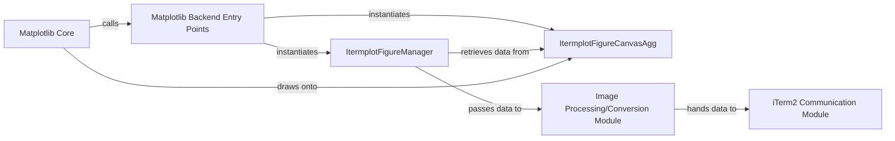

## Details

The itermplot subsystem acts as a custom Matplotlib backend, enabling plots to be displayed directly within the iTerm2 terminal. The process begins with Matplotlib Backend Entry Points which are invoked by Matplotlib Core to create a new figure manager and canvas. The ItermplotFigureManager orchestrates the plot's lifecycle, interacting with ItermplotFigureCanvasAgg to render the plot. Once rendered, the ItermplotFigureManager passes the plot data to the Image Processing/Conversion Module for necessary format adjustments. Finally, the iTerm2 Communication Module takes the processed image data and sends it to iTerm2 using specific escape codes for display. This architecture allows Matplotlib to leverage iTerm2's image display capabilities, providing a seamless plotting experience within the terminal environment.

### Matplotlib Backend Entry Points
These functions (new_figure_manager, new_figure_manager_given_figure) are the primary interface for Matplotlib to initiate the creation of a new figure manager and canvas. They adhere to Matplotlib's backend API, setting up the itermplot-specific components required for rendering.

**Related Classes/Methods**:

- <a href="https://github.com/daleroberts/itermplot/blob/master/itermplot/__init__.py#L146-L149" target="_blank" rel="noopener noreferrer">`new_figure_manager`:146-149</a>
- <a href="https://github.com/daleroberts/itermplot/blob/master/itermplot/__init__.py#L152-L155" target="_blank" rel="noopener noreferrer">`new_figure_manager_given_figure`:152-155</a>

### ItermplotFigureManager
This is the core component responsible for managing the Matplotlib figure's lifecycle within the itermplot context. It extends Matplotlib's FigureManagerBase and orchestrates the entire process of drawing, converting, and displaying the plot in iTerm2.

**Related Classes/Methods**:

- <a href="https://github.com/daleroberts/itermplot/blob/master/itermplot/__init__.py#L255-L300" target="_blank" rel="noopener noreferrer">`ItermplotFigureManager`:255-300</a>

### ItermplotFigureCanvasAgg
This class serves as the itermplot-specific drawing surface, implementing Matplotlib's FigureCanvas using the Agg backend. It's where Matplotlib renders its plots in memory before they are processed for terminal display.

**Related Classes/Methods**:

- <a href="https://github.com/daleroberts/itermplot/blob/master/itermplot/__init__.py#L236-L243" target="_blank" rel="noopener noreferrer">`FigureCanvasItermplotPng`:236-243</a>

### Matplotlib Core
Represents the external, core rendering engine of Matplotlib. It interacts with the itermplot backend by requesting new figure managers and drawing plot elements onto the provided canvas.

**Related Classes/Methods**: _None_

### Image Processing/Conversion Module
This module handles the necessary image format conversions (e.g., from Matplotlib's internal representation to PNG) and potentially other image manipulations required before the plot can be sent to iTerm2. This functionality is primarily handled by ItermplotFigureCanvasAgg's print_png method and ItermplotImageMagickWriter.

**Related Classes/Methods**:

- <a href="https://github.com/daleroberts/itermplot/blob/master/itermplot/__init__.py#L246-L252" target="_blank" rel="noopener noreferrer">`ItermplotImageMagickWriter`:246-252</a>

### iTerm2 Communication Module
Responsible for the low-level communication with iTerm2, specifically generating and sending the iTerm2 escape codes that embed and display images directly within the terminal. This is primarily handled by the imgcat function.

**Related Classes/Methods**:

- <a href="https://github.com/daleroberts/itermplot/blob/master/itermplot/__init__.py#L86-L127" target="_blank" rel="noopener noreferrer">`imgcat`:86-127</a>

### [FAQ](https://github.com/CodeBoarding/GeneratedOnBoardings/tree/main?tab=readme-ov-file#faq)