```mermaid
graph LR
    Matplotlib_Backend_Core["Matplotlib Backend Core"]
    Image_Rendering_Output["Image Rendering & Output"]
    Image_Transformation_Animation["Image Transformation & Animation"]
    iTerm2_Display_Protocol["iTerm2 Display Protocol"]
    Display_Orchestration["Display Orchestration"]
    Configuration_Environment_Handler["Configuration & Environment Handler"]
    Matplotlib_Backend_Core -- "triggers" --> Image_Rendering_Output
    Image_Rendering_Output -- "provides data to" --> Display_Orchestration
    Display_Orchestration -- "requests from" --> Image_Transformation_Animation
    Image_Transformation_Animation -- "provides data to" --> Display_Orchestration
    Display_Orchestration -- "sends data to" --> iTerm2_Display_Protocol
    Configuration_Environment_Handler -- "influences" --> Matplotlib_Backend_Core
    Configuration_Environment_Handler -- "influences" --> Image_Rendering_Output
    Configuration_Environment_Handler -- "influences" --> Image_Transformation_Animation
    Configuration_Environment_Handler -- "influences" --> iTerm2_Display_Protocol
    Configuration_Environment_Handler -- "influences" --> Display_Orchestration
    click Matplotlib_Backend_Core href "https://github.com/CodeBoarding/GeneratedOnBoardings/blob/main/itermplot/Matplotlib_Backend_Core.md" "Details"
    click Image_Rendering_Output href "https://github.com/CodeBoarding/GeneratedOnBoardings/blob/main/itermplot/Image_Rendering_Output.md" "Details"
    click Image_Transformation_Animation href "https://github.com/CodeBoarding/GeneratedOnBoardings/blob/main/itermplot/Image_Transformation_Animation.md" "Details"
    click Display_Orchestration href "https://github.com/CodeBoarding/GeneratedOnBoardings/blob/main/itermplot/Display_Orchestration.md" "Details"
```

## Details

The `itermplot` project functions as a specialized Matplotlib backend for iTerm2. The `Configuration & Environment Handler` initializes the system by reading environment variables, which dictate various operational settings. The `Matplotlib Backend Core` then leverages these settings to register itself and manage the creation of figure managers and canvases, effectively integrating with Matplotlib's rendering pipeline. Once a figure is ready, the `Image Rendering & Output` component processes it into a standard image format. This rendered image data is then passed to the `Display Orchestration` component, which decides whether to display a static image or an animation. For animations or specific image modifications, `Display Orchestration` interacts with the `Image Transformation & Animation` component. Finally, all visual output is channeled through the `iTerm2 Display Protocol`, which encodes the image data into iTerm2-specific escape codes for display in the terminal. This architecture ensures a clear flow from configuration and plot generation to image processing and iTerm2-specific display.

### Matplotlib Backend Core [[Expand]](./Matplotlib_Backend_Core.md)
Registers `itermplot` as a Matplotlib backend, managing the creation of new figure managers and canvases to direct Matplotlib's rendering pipeline.

**Related Classes/Methods**:

- <a href="https://github.com/daleroberts/itermplot/blob/master/itermplot/__init__.py#L146-L149" target="_blank" rel="noopener noreferrer">`new_figure_manager`:146-149</a>
- <a href="https://github.com/daleroberts/itermplot/blob/master/itermplot/__init__.py#L152-L155" target="_blank" rel="noopener noreferrer">`new_figure_manager_given_figure`:152-155</a>
- <a href="https://github.com/daleroberts/itermplot/blob/master/itermplot/__init__.py" target="_blank" rel="noopener noreferrer">`ItermplotFigureCanvasAgg`</a>

### Image Rendering & Output [[Expand]](./Image_Rendering_Output.md)
Responsible for taking a Matplotlib figure and rendering it into a standard image format (e.g., PNG, PDF) before further processing.

**Related Classes/Methods**:

- <a href="https://github.com/daleroberts/itermplot/blob/master/itermplot/__init__.py" target="_blank" rel="noopener noreferrer">`ItermplotCanvasMixin.print_png`</a>
- <a href="https://github.com/daleroberts/itermplot/blob/master/itermplot/__init__.py" target="_blank" rel="noopener noreferrer">`ItermplotCanvasMixin.print_pdf`</a>
- <a href="https://github.com/daleroberts/itermplot/blob/master/itermplot/__init__.py" target="_blank" rel="noopener noreferrer">`ItermplotCanvasMixin.before_print`</a>

### Image Transformation & Animation [[Expand]](./Image_Transformation_Animation.md)
Handles post-rendering image modifications (e.g., color inversion) and orchestrates animation generation, often leveraging external tools like ImageMagick.

**Related Classes/Methods**:

- <a href="https://github.com/daleroberts/itermplot/blob/master/itermplot/__init__.py" target="_blank" rel="noopener noreferrer">`ItermplotFigureCanvasAgg.reverse`</a>
- <a href="https://github.com/daleroberts/itermplot/blob/master/itermplot/__init__.py#L60-L83" target="_blank" rel="noopener noreferrer">`revvideo`:60-83</a>
- <a href="https://github.com/daleroberts/itermplot/blob/master/itermplot/__init__.py#L246-L252" target="_blank" rel="noopener noreferrer">`ItermplotImageMagickWriter`:246-252</a>
- <a href="https://github.com/daleroberts/itermplot/blob/master/itermplot/__init__.py#L168-L189" target="_blank" rel="noopener noreferrer">`modify`:168-189</a>

### iTerm2 Display Protocol
Encapsulates the logic for encoding image data into iTerm2-specific escape codes (`imgcat` protocol) and writing them to standard output for display.

**Related Classes/Methods**:

- <a href="https://github.com/daleroberts/itermplot/blob/master/itermplot/__init__.py#L86-L127" target="_blank" rel="noopener noreferrer">`imgcat`:86-127</a>

### Display Orchestration [[Expand]](./Display_Orchestration.md)
Acts as the high-level coordinator for displaying plots, determining whether to show a static image or an animation, and managing the display loop.

**Related Classes/Methods**:

- <a href="https://github.com/daleroberts/itermplot/blob/master/itermplot/__init__.py" target="_blank" rel="noopener noreferrer">`ItermplotFigureCanvasAgg.show`</a>
- <a href="https://github.com/daleroberts/itermplot/blob/master/itermplot/__init__.py" target="_blank" rel="noopener noreferrer">`ItermplotFigureCanvasAgg.animate`</a>

### Configuration & Environment Handler
Manages the project's operational settings by reading environment variables, influencing various aspects of plot display and behavior.

**Related Classes/Methods**:

- <a href="https://github.com/daleroberts/itermplot/blob/master/itermplot/__init__.py#L36-L43" target="_blank" rel="noopener noreferrer">`itermplot/__init__.py`:36-43</a>

### [FAQ](https://github.com/CodeBoarding/GeneratedOnBoardings/tree/main?tab=readme-ov-file#faq)