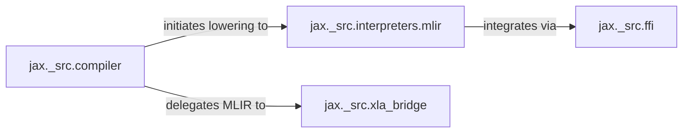

## Details

This subsystem is responsible for the entire compilation pipeline within JAX, transforming JAX's intermediate representation (Jaxpr) into optimized, hardware-specific MLIR/HLO code, and interfacing with the XLA (Accelerated Linear Algebra) compiler for backend selection, compilation, and execution on target devices. It embodies JAX's "Compiler-based Optimization" and "XLA Integration Layer" architectural patterns.

### jax._src.compiler
Acts as the orchestrator for the JAX compilation workflow. It manages the caching of compiled executables, resolves compilation strategies, and directs the lowering of JAX's intermediate representation (Jaxpr) through various stages, ultimately delegating to backend-specific compilation. This component is fundamental for JAX's "Performance and Scalability" bias.

**Related Classes/Methods**:

- <a href="https://github.com/jax-ml/jax/blob/main/jax/_src/compiler.py" target="_blank" rel="noopener noreferrer">`jax._src.compiler`</a>

### jax._src.interpreters.mlir
This component is the core engine for transforming JAX's high-level intermediate representation (Jaxpr) into MLIR (Multi-Level Intermediate Representation). It applies a series of lowering rules and optimizations, preparing the computational graph for efficient execution across diverse hardware. It's crucial for the "Layered Abstraction" and "Data Flow Emphasis" architectural biases.

**Related Classes/Methods**:

- <a href="https://github.com/jax-ml/jax/blob/main/jax/_src/interpreters/mlir.py" target="_blank" rel="noopener noreferrer">`jax._src.interpreters.mlir`</a>

### jax._src.xla_bridge
Serves as the direct interface to the XLA compiler and various hardware backends (CPUs, GPUs, TPUs). It handles device discovery, backend selection, and the final compilation and loading of MLIR/HLO modules onto the chosen target device for execution. This component directly supports the "Hardware Agnostic Core" and "XLA Integration Layer" expected components.

**Related Classes/Methods**:

- <a href="https://github.com/jax-ml/jax/blob/main/jax/_src/xla_bridge.py" target="_blank" rel="noopener noreferrer">`jax._src.xla_bridge`</a>

### jax._src.ffi
Provides the mechanism for integrating custom operations implemented in external languages (e.g., C++, CUDA) directly into the JAX compilation pipeline. It defines how these foreign function calls are represented within JAX's intermediate representations and how they are handled during the lowering process to MLIR. This component contributes to the "Extensible System" architectural pattern.

**Related Classes/Methods**:

- <a href="https://github.com/jax-ml/jax/blob/main/jax/_src/ffi.py" target="_blank" rel="noopener noreferrer">`jax._src.ffi`</a>

### [FAQ](https://github.com/CodeBoarding/GeneratedOnBoardings/tree/main?tab=readme-ov-file#faq)