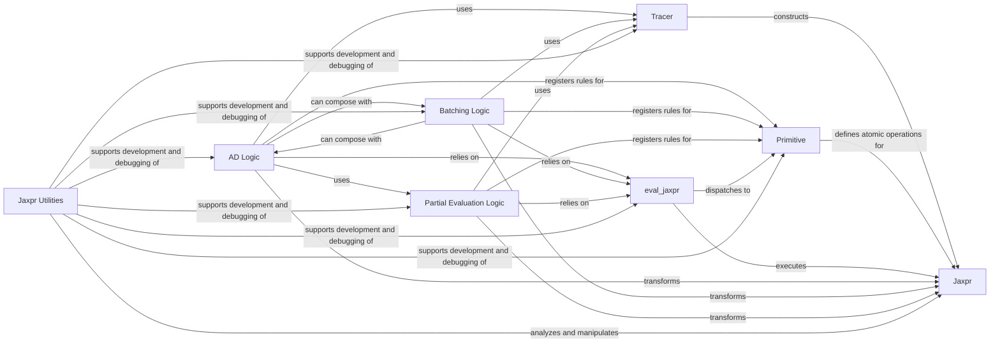

## Details

The `Core Tracing & Transformation Engine` subsystem is the foundational layer in JAX responsible for capturing Python functions into JAX's intermediate representation (Jaxpr), managing abstract values, and applying core functional transformations like automatic differentiation, vectorization, and partial evaluation by manipulating Jaxpr graphs. Its boundaries are primarily defined by the `jax._src.core`, `jax._src.jaxpr_util`, `jax._src.interpreters.ad`, and `jax._src.interpreters.batching` modules.

### Jaxpr
The core intermediate representation (IR) of JAX. It captures the static, functional program graph of Python computations. All JAX transformations operate on or produce Jaxpr instances. It is the central data structure that represents the computation to be traced and transformed.

**Related Classes/Methods**:

- <a href="https://github.com/jax-ml/jax/blob/main/jax/_src/core.py" target="_blank" rel="noopener noreferrer">`jax._src.core.Jaxpr`</a>

### Tracer
Represents a symbolic value during the tracing process. Tracers record operations applied to them, which are then used to construct the Jaxpr. Each transformation often introduces its own Tracer subclass (e.g., JVPTracer, BatchTracer) to embed transformation-specific information. It is the mechanism for capturing Python operations into the Jaxpr graph and carrying context-specific information during transformations.

**Related Classes/Methods**:

- <a href="https://github.com/jax-ml/jax/blob/main/jax/_src/core.py" target="_blank" rel="noopener noreferrer">`jax._src.core.Tracer`</a>

### Primitive
Represents an atomic, fundamental operation in JAX's computation graph. Primitives define behaviors (implementations, abstract evaluations, JVP rules, batching rules) for different JAX transformations. It defines the atomic operations that form the Jaxpr and provides the hooks for how these operations behave under various transformations.

**Related Classes/Methods**:

- <a href="https://github.com/jax-ml/jax/blob/main/jax/_src/core.py" target="_blank" rel="noopener noreferrer">`jax._src.core.Primitive`</a>

### eval_jaxpr
The core interpreter responsible for executing a Jaxpr, simulating the computation defined by the graph. It is the execution engine for Jaxprs, used both for direct interpretation and as a building block within transformations.

**Related Classes/Methods**:

- <a href="https://github.com/jax-ml/jax/blob/main/jax/_src/core.py#L702-L727" target="_blank" rel="noopener noreferrer">`jax._src.core.eval_jaxpr`:702-727</a>

### AD Logic
Implements forward-mode (JVP) and reverse-mode (VJP) automatic differentiation by transforming the computation graph to compute derivatives. It is a key transformation engine that manipulates Jaxprs and Primitive rules to enable automatic differentiation.

**Related Classes/Methods**:

- <a href="https://github.com/jax-ml/jax/blob/main/jax/_src/interpreters/ad.py" target="_blank" rel="noopener noreferrer">`jax._src.interpreters.ad`</a>

### Batching Logic
Implements automatic vectorization (vmap) by transforming the computation graph to operate on batched inputs. It is another core transformation engine that modifies Jaxprs and Primitive rules for efficient batch processing.

**Related Classes/Methods**:

- <a href="https://github.com/jax-ml/jax/blob/main/jax/_src/interpreters/batching.py" target="_blank" rel="noopener noreferrer">`jax._src.interpreters.batching`</a>

### Partial Evaluation Logic
Separates a computation into static (known) and dynamic (unknown) parts, generating a new Jaxpr for the dynamic portion. This is crucial for JIT compilation and optimizing computations with static arguments. It is a transformation engine that optimizes Jaxprs by specializing them based on known inputs.

**Related Classes/Methods**:

- <a href="https://github.com/jax-ml/jax/blob/main/jax/_src/interpreters/partial_eval.py" target="_blank" rel="noopener noreferrer">`jax._src.interpreters.partial_eval`</a>

### Jaxpr Utilities
Provides tools for analyzing, manipulating, and pretty-printing Jaxpr instances. It supports the development and debugging of Jaxpr-based transformations.

**Related Classes/Methods**:

- <a href="https://github.com/jax-ml/jax/blob/main/jax/_src/jaxpr_util.py" target="_blank" rel="noopener noreferrer">`jax._src.jaxpr_util`</a>

### [FAQ](https://github.com/CodeBoarding/GeneratedOnBoardings/tree/main?tab=readme-ov-file#faq)