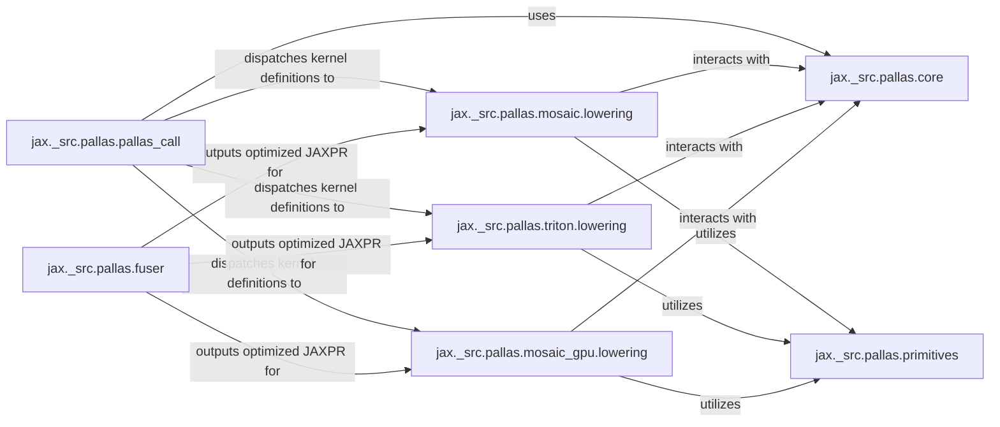

## Details

The Pallas subsystem in JAX provides a framework for defining and executing custom kernels on various hardware backends. The `pallas_call` component serves as the user-facing API, allowing users to define kernels using JAX primitives. These kernel definitions rely on the core abstractions provided by `pallas.core`, which defines grid and block mappings for computation. Low-level operations within the kernels are handled by `pallas.primitives`, offering hardware-agnostic functionalities like atomic memory access. Depending on the target hardware (TPU or GPU), `pallas_call` dispatches the kernel to specific lowering components: `mosaic.lowering` for TPUs, and `triton.lowering` or `mosaic_gpu.lowering` for NVIDIA GPUs. These lowering components translate the JAX intermediate representation (JAXPR) into backend-specific intermediate representations (MLIR for Mosaic, Triton IR for Triton), utilizing the core Pallas concepts and primitives. The `pallas.fuser` component further optimizes these kernels by fusing operations, improving overall performance before they are passed to the lowering backends. This architecture ensures a flexible and efficient pathway from high-level kernel definitions to optimized hardware execution.

### jax._src.pallas.pallas_call
Serves as the primary high-level Python API (decorator/function) for users to define and invoke custom Pallas kernels. It orchestrates the overall execution flow by binding the `pallas_call_p` primitive, which then dispatches the kernel definition to the appropriate backend-specific lowering components. It also handles abstract evaluation, JVP rules, and batching.

**Related Classes/Methods**: _None_

### jax._src.pallas.core
Defines the foundational concepts for custom kernel development, including `GridMapping` and `BlockMapping`, which are crucial for mapping logical computations to physical hardware resources. It also defines `MemorySpace` and `ShapedArrayWithMemorySpace`, acting as the core abstraction layer for Pallas.

**Related Classes/Methods**: _None_

### jax._src.pallas.primitives
Provides a set of low-level, hardware-agnostic primitives for operations like explicit memory access (e.g., `atomic_xchg`, `atomic_add`) and synchronization within Pallas kernels. These primitives are utilized by the backend-specific lowering processes and interact with `pallas_core` for grid information.

**Related Classes/Methods**: _None_

### jax._src.pallas.mosaic.lowering
Translates the JAXPR (JAX intermediate representation) generated from Pallas kernels into Mosaic-specific MLIR (Multi-Level Intermediate Representation) for execution on Google TPUs. It manages the lowering context and rules, handling control flow, memory operations, and TPU-specific optimizations by consuming Pallas core concepts and primitives.

**Related Classes/Methods**: _None_

### jax._src.pallas.triton.lowering
Translates JAXPR from Pallas kernels into Triton IR (Intermediate Representation) for efficient execution on NVIDIA GPUs. This component defines lowering rules, processes the grid for Triton launch, and focuses on GPU-specific arithmetic and memory operations by utilizing Pallas core concepts and primitives.

**Related Classes/Methods**: _None_

### jax._src.pallas.mosaic_gpu.lowering
Provides GPU-specific lowering rules and resource estimation for Mosaic, including memory allocation and barrier management tailored for NVIDIA GPUs. It bridges Mosaic's capabilities to GPU hardware by consuming Pallas core concepts and primitives.

**Related Classes/Methods**: _None_

### jax._src.pallas.fuser
Optimizes Pallas kernels by fusing multiple operations into a single, more efficient kernel. This reduces overheads associated with launching multiple small kernels and improves overall performance.

**Related Classes/Methods**: _None_

### [FAQ](https://github.com/CodeBoarding/GeneratedOnBoardings/tree/main?tab=readme-ov-file#faq)