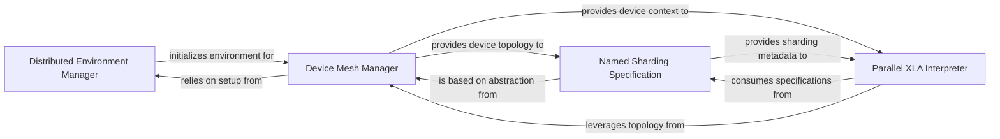

## Details

The Distributed Execution & Device Management subsystem in JAX is responsible for orchestrating the execution of JAX programs across multiple devices and hosts. It handles data partitioning, sharding, collective operations, and parallel execution strategies, while managing the physical and logical arrangement of devices. Its core functionality is encapsulated within the `jax._src.mesh`, `jax._src.named_sharding`, `jax._src.interpreters.pxla`, and `jax._src.distributed` modules.

### Distributed Environment Manager
This component serves as the foundational layer for distributed JAX operations. It is responsible for initializing and tearing down the distributed runtime environment across multiple hosts and devices, ensuring the underlying communication infrastructure is properly configured. This aligns with the `Distributed Computing/Data Parallelism` pattern by setting up the distributed context.

**Related Classes/Methods**:

- <a href="https://github.com/jax-ml/jax/blob/main/jax/_src/distributed.py" target="_blank" rel="noopener noreferrer">`jax._src.distributed`</a>

### Device Mesh Manager
This component defines and manages the logical and physical topology of devices (CPUs, GPUs, TPUs) by organizing them into a "mesh" structure. It provides a high-level, named abstraction over the physical hardware, which is crucial for efficient resource allocation and data placement in a distributed setting. This component is fundamental to the `Device Management & Sharding` aspect of the architecture.

**Related Classes/Methods**:

- <a href="https://github.com/jax-ml/jax/blob/main/jax/_src/mesh.py" target="_blank" rel="noopener noreferrer">`jax._src.mesh`</a>

### Named Sharding Specification
This component specifies how JAX arrays are partitioned and replicated across devices within a `Mesh` using named axes. It validates these specifications and translates them into a format that the XLA compiler can consume for distributed execution. This component directly embodies the `Data Flow Emphasis` pattern by dictating how data is distributed across the device mesh.

**Related Classes/Methods**:

- <a href="https://github.com/jax-ml/jax/blob/main/jax/_src/named_sharding.py" target="_blank" rel="noopener noreferrer">`jax._src.named_sharding`</a>

### Parallel XLA Interpreter
As the core engine for parallel execution, this component handles data sharding, orchestrates collective operations (`pjit`, `pmap`, `shard_map`), and manages the compilation of JAX programs to XLA HLO for execution on distributed devices. It is central to the `Compiler-based Optimization` and `Distributed Computing/Data Parallelism` patterns, acting as the bridge between JAX's high-level operations and the low-level XLA execution on distributed hardware.

**Related Classes/Methods**:

- <a href="https://github.com/jax-ml/jax/blob/main/jax/_src/interpreters/pxla.py" target="_blank" rel="noopener noreferrer">`jax._src.interpreters.pxla`</a>

### [FAQ](https://github.com/CodeBoarding/GeneratedOnBoardings/tree/main?tab=readme-ov-file#faq)