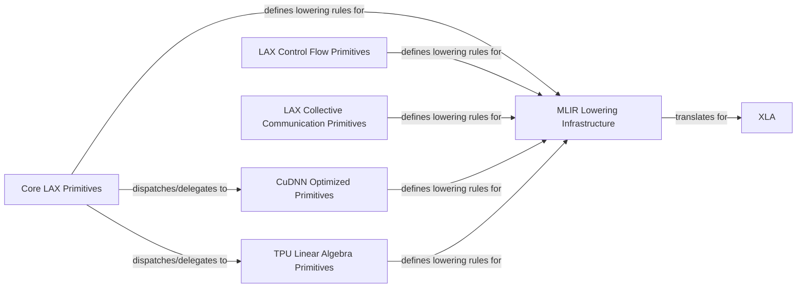

## Details

The JAX LAX (Linear Algebra eXchange) subsystem provides a foundational set of primitive operations for numerical computation, designed for high-performance execution on various hardware accelerators. It encompasses core mathematical operations, control flow constructs, and collective communication primitives, alongside hardware-specific optimizations for CuDNN and TPUs. A central `MLIR Lowering Infrastructure` translates these high-level JAX operations into MLIR (Multi-Level Intermediate Representation), which is then consumed by the XLA compiler for further optimization and execution on target hardware. This architecture ensures flexibility, extensibility, and efficient compilation of JAX programs.

### Core LAX Primitives
This component provides the fundamental, hardware-agnostic mathematical and array manipulation operations (e.g., element-wise operations, reductions, convolutions, linear algebra, slicing, scatter). It defines the core JVP, transpose, and batching rules essential for automatic differentiation and `vmap`.

**Related Classes/Methods**:

- <a href="https://github.com/jax-ml/jax/blob/main/jax/_src/lax/lax.py" target="_blank" rel="noopener noreferrer">`jax._src.lax.lax`</a>
- <a href="https://github.com/jax-ml/jax/blob/main/jax/_src/lax/convolution.py" target="_blank" rel="noopener noreferrer">`jax._src.lax.convolution`</a>
- <a href="https://github.com/jax-ml/jax/blob/main/jax/_src/lax/linalg.py" target="_blank" rel="noopener noreferrer">`jax._src.lax.linalg`</a>
- <a href="https://github.com/jax-ml/jax/blob/main/jax/_src/lax/slicing.py" target="_blank" rel="noopener noreferrer">`jax._src.lax.slicing`</a>

### LAX Control Flow Primitives
Implements primitives for structured control flow within JAX programs, such as `scan`, `while_loop`, `cond`, and `switch`. These enable efficient compilation of iterative algorithms and conditional logic.

**Related Classes/Methods**:

- <a href="https://github.com/jax-ml/jax/blob/main/jax/_src/lax/control_flow/loops.py" target="_blank" rel="noopener noreferrer">`jax._src.lax.control_flow.loops`</a>
- <a href="https://github.com/jax-ml/jax/blob/main/jax/_src/lax/control_flow/conditionals.py" target="_blank" rel="noopener noreferrer">`jax._src.lax.control_flow.conditionals`</a>

### LAX Collective Communication Primitives
Provides primitives for parallel collective operations (e.g., `psum`, `pmean`, `all_to_all`) crucial for distributed computation and data parallelism across multiple devices.

**Related Classes/Methods**:

- <a href="https://github.com/jax-ml/jax/blob/main/jax/_src/lax/parallel.py" target="_blank" rel="noopener noreferrer">`jax._src.lax.parallel`</a>

### CuDNN Optimized Primitives
Offers highly optimized, hardware-specific kernels leveraging NVIDIA's CuDNN library, such as fused attention. These primitives provide significant performance gains on NVIDIA GPUs.

**Related Classes/Methods**:

- <a href="https://github.com/jax-ml/jax/blob/main/jax/_src/cudnn/fused_attention_stablehlo.py" target="_blank" rel="noopener noreferrer">`jax._src.cudnn.fused_attention_stablehlo`</a>

### TPU Linear Algebra Primitives
Implements specialized linear algebra algorithms (e.g., QDWH decomposition, eigenvalue decomposition for Hermitian matrices) optimized specifically for Google's TPU hardware.

**Related Classes/Methods**:

- <a href="https://github.com/jax-ml/jax/blob/main/jax/_src/tpu/linalg/qdwh.py" target="_blank" rel="noopener noreferrer">`jax._src.tpu.linalg.qdwh`</a>
- <a href="https://github.com/jax-ml/jax/blob/main/jax/_src/tpu/linalg/eigh.py" target="_blank" rel="noopener noreferrer">`jax._src.tpu.linalg.eigh`</a>

### MLIR Lowering Infrastructure
This infrastructure is responsible for translating the high-level JAX operations (defined by the various LAX primitives and hardware-optimized components) into MLIR (Multi-Level Intermediate Representation), which is then consumed by XLA for compilation.

**Related Classes/Methods**:

- <a href="https://github.com/jax-ml/jax/blob/main/jax/_src/interpreters/mlir.py" target="_blank" rel="noopener noreferrer">`jax._src.interpreters.mlir`</a>

### XLA
XLA (Accelerated Linear Algebra) is a domain-specific compiler for linear algebra that optimizes JAX computations for various hardware accelerators (GPUs, TPUs, CPUs). It consumes the MLIR representation generated by the `MLIR Lowering Infrastructure`.

**Related Classes/Methods**: _None_

### [FAQ](https://github.com/CodeBoarding/GeneratedOnBoardings/tree/main?tab=readme-ov-file#faq)