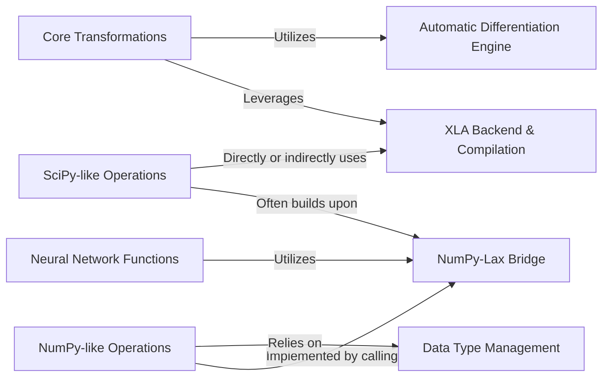

## Details

The JAX architecture is centered around its **Core Transformations**, which enable just-in-time compilation, automatic differentiation, vectorization, and parallelization of Python functions. These transformations heavily **leverage** the **XLA Backend & Compilation** component, responsible for compiling and optimizing operations for various hardware accelerators and dispatching them for execution. The **Automatic Differentiation Engine** is a core utility **utilized** by the transformation system to enable gradient computations. High-level numerical operations, including **NumPy-like Operations**, **SciPy-like Operations**, and **Neural Network Functions**, are built on top of JAX's core. The **NumPy-Lax Bridge** plays a crucial role by **translating** these high-level array operations into JAX's internal `lax` primitives, which are then processed by the XLA backend. All operations **rely on** the **Data Type Management** component for consistent and efficient handling of numerical data types across the system.

### Core Transformations
This component provides the fundamental JAX transformations such as `jit` (just-in-time compilation), `grad` (automatic differentiation), `vmap` (vectorization), and `pmap` (parallelization). It acts as the orchestrator for applying these transformations to user-defined functions.

**Related Classes/Methods**:

- <a href="https://github.com/jax-ml/jax/blob/main/jax/_src/api.py" target="_blank" rel="noopener noreferrer">`jax._src.api`</a>

### NumPy-like Operations
Offers a JAX-compatible implementation of a large subset of NumPy's array creation, manipulation, and mathematical functions, enabling users familiar with NumPy to seamlessly leverage JAX's capabilities.

**Related Classes/Methods**:

- <a href="https://github.com/jax-ml/jax/blob/main/jax/_src/numpy" target="_blank" rel="noopener noreferrer">`jax._src.numpy`</a>

### SciPy-like Operations
Extends JAX's functionalities to include scientific computing functions found in SciPy, covering areas like linear algebra, optimization, and special functions, adapted for JAX's tracing and compilation model.

**Related Classes/Methods**:

- <a href="https://github.com/jax-ml/jax/blob/main/jax/_src/scipy" target="_blank" rel="noopener noreferrer">`jax._src.scipy`</a>

### Neural Network Functions
Provides common building blocks for neural networks, including activation functions, attention mechanisms, and weight initializers, optimized for JAX's high-performance execution.

**Related Classes/Methods**:

- <a href="https://github.com/jax-ml/jax/blob/main/jax/_src/nn" target="_blank" rel="noopener noreferrer">`jax._src.nn`</a>

### XLA Backend & Compilation
This component is responsible for JIT compilation, managing parallel execution, handling low-level interactions with XLA (Accelerated Linear Algebra), and dispatching compiled operations to various hardware accelerators (CPU, GPU, TPU).

**Related Classes/Methods**:

- <a href="https://github.com/jax-ml/jax/blob/main/jax/_src/compiler.py" target="_blank" rel="noopener noreferrer">`jax._src.compiler`</a>
- <a href="https://github.com/jax-ml/jax/blob/main/jax/_src/dispatch.py" target="_blank" rel="noopener noreferrer">`jax._src.dispatch`</a>
- <a href="https://github.com/jax-ml/jax/blob/main/jax/_src/xla_bridge.py" target="_blank" rel="noopener noreferrer">`jax._src.xla_bridge`</a>
- <a href="https://github.com/jax-ml/jax/blob/main/jax/_src/lax" target="_blank" rel="noopener noreferrer">`jax._src.lax`</a>
- <a href="https://github.com/jax-ml/jax/blob/main/jax/_src/core.py" target="_blank" rel="noopener noreferrer">`jax._src.core`</a>

### Automatic Differentiation Engine
This component encapsulates the core mechanisms for automatic differentiation, enabling JAX to compute gradients of numerical functions efficiently.

**Related Classes/Methods**:

- <a href="https://github.com/jax-ml/jax/blob/main/jax/_src/ad_util.py" target="_blank" rel="noopener noreferrer">`jax._src.ad_util`</a>
- <a href="https://github.com/jax-ml/jax/blob/main/jax/_src/custom_derivatives.py" target="_blank" rel="noopener noreferrer">`jax._src.custom_derivatives`</a>
- <a href="https://github.com/jax-ml/jax/blob/main/jax/_src/api.py" target="_blank" rel="noopener noreferrer">`jax._src.api`</a>

### NumPy-Lax Bridge
This component serves as an intermediary, translating high-level NumPy operations into JAX's internal `lax` primitives. This translation is crucial for enabling these operations to be traced, optimized, and compiled by the XLA backend.

**Related Classes/Methods**:

- <a href="https://github.com/jax-ml/jax/blob/main/jax/_src/numpy" target="_blank" rel="noopener noreferrer">`jax._src.numpy`</a>
- <a href="https://github.com/jax-ml/jax/blob/main/jax/_src/lax" target="_blank" rel="noopener noreferrer">`jax._src.lax`</a>

### Data Type Management
This component is responsible for the consistent and efficient handling of data types across all JAX operations, ensuring compatibility and optimal performance on different hardware.

**Related Classes/Methods**:

- <a href="https://github.com/jax-ml/jax/blob/main/jax/_src/dtypes.py" target="_blank" rel="noopener noreferrer">`jax._src.dtypes`</a>

### [FAQ](https://github.com/CodeBoarding/GeneratedOnBoardings/tree/main?tab=readme-ov-file#faq)