```mermaid
graph LR
    User_Facing_API["User-Facing API"]
    Core_Tracing_Transformation_Engine["Core Tracing & Transformation Engine"]
    Low_Level_Primitives_Operations["Low-Level Primitives & Operations"]
    Compiler_XLA_Backend["Compiler & XLA Backend"]
    Distributed_Execution_Device_Management["Distributed Execution & Device Management"]
    Custom_Kernel_Development["Custom Kernel Development"]
    User_Facing_API -- "Initiates computation requests and function transformations." --> Core_Tracing_Transformation_Engine
    Core_Tracing_Transformation_Engine -- "Generates Jaxpr graphs composed of primitive operations." --> Low_Level_Primitives_Operations
    Core_Tracing_Transformation_Engine -- "Sends transformed Jaxpr for compilation." --> Compiler_XLA_Backend
    Low_Level_Primitives_Operations -- "Provides primitive lowering rules." --> Compiler_XLA_Backend
    Custom_Kernel_Development -- "Submits custom kernel MLIR/HLO." --> Compiler_XLA_Backend
    Compiler_XLA_Backend -- "Sends compiled executable for distributed execution." --> Distributed_Execution_Device_Management
    Distributed_Execution_Device_Management -- "Provides device topology and sharding configuration." --> Compiler_XLA_Backend
    Compiler_XLA_Backend -- "Returns computation results." --> User_Facing_API
    click User_Facing_API href "https://github.com/CodeBoarding/GeneratedOnBoardings/blob/main/jax/User_Facing_API.md" "Details"
    click Core_Tracing_Transformation_Engine href "https://github.com/CodeBoarding/GeneratedOnBoardings/blob/main/jax/Core_Tracing_Transformation_Engine.md" "Details"
    click Low_Level_Primitives_Operations href "https://github.com/CodeBoarding/GeneratedOnBoardings/blob/main/jax/Low_Level_Primitives_Operations.md" "Details"
    click Compiler_XLA_Backend href "https://github.com/CodeBoarding/GeneratedOnBoardings/blob/main/jax/Compiler_XLA_Backend.md" "Details"
    click Distributed_Execution_Device_Management href "https://github.com/CodeBoarding/GeneratedOnBoardings/blob/main/jax/Distributed_Execution_Device_Management.md" "Details"
    click Custom_Kernel_Development href "https://github.com/CodeBoarding/GeneratedOnBoardings/blob/main/jax/Custom_Kernel_Development.md" "Details"
```

## Details

The JAX architecture is designed for high-performance numerical computing, enabling automatic differentiation and JIT compilation for various hardware accelerators. The system is structured around a clear data flow, starting from the `User-Facing API` where computations are defined using familiar NumPy/SciPy-like functions. These high-level operations are then captured and transformed into an intermediate representation (Jaxpr) by the `Core Tracing & Transformation Engine`. This engine is responsible for applying core functional transformations like automatic differentiation and vectorization. The transformed Jaxpr graphs are composed of fundamental `Low-Level Primitives & Operations`, which are hardware-agnostic mathematical and array manipulation building blocks. These primitives, along with highly optimized hardware-specific operations, are then passed to the `Compiler & XLA Backend`. This component converts the Jaxpr into optimized, hardware-specific MLIR/HLO code, leveraging the XLA compiler for efficient execution on target devices. For distributed execution, the `Distributed Execution & Device Management` component orchestrates the program across multiple devices and hosts, handling data partitioning, sharding, collective operations, and parallel execution strategies. This component also provides device topology and sharding configurations to the `Compiler & XLA Backend`. Finally, for specialized computations, the `Custom Kernel Development` component allows users to define highly optimized custom kernels, which are then submitted to the `Compiler & XLA Backend` for integration and execution. The compiled results are ultimately returned to the `User-Facing API`. This modular design ensures a clear separation of concerns, facilitating both efficient computation and flexible extension.

### User-Facing API [[Expand]](./User_Facing_API.md)
The primary interface for JAX users, providing familiar NumPy/SciPy-like functions and core JAX transformations (`jit`, `grad`, `vmap`, `pmap`). It serves as the entry entry point for defining and transforming numerical computations.

**Related Classes/Methods**:

- <a href="https://github.com/jax-ml/jax/blob/main/jax/_src/api.py" target="_blank" rel="noopener noreferrer">`jax._src.api`</a>
- <a href="https://github.com/jax-ml/jax/blob/main/jax/_src/numpy" target="_blank" rel="noopener noreferrer">`jax._src.numpy`</a>
- <a href="https://github.com/jax-ml/jax/blob/main/jax/_src/scipy" target="_blank" rel="noopener noreferrer">`jax._src.scipy`</a>
- <a href="https://github.com/jax-ml/jax/blob/main/jax/_src/nn" target="_blank" rel="noopener noreferrer">`jax._src.nn`</a>

### Core Tracing & Transformation Engine [[Expand]](./Core_Tracing_Transformation_Engine.md)
The foundational layer responsible for capturing Python functions into JAX's intermediate representation (Jaxpr), managing abstract values, and applying core functional transformations like automatic differentiation, vectorization, and partial evaluation by manipulating Jaxpr graphs.

**Related Classes/Methods**:

- <a href="https://github.com/jax-ml/jax/blob/main/jax/_src/core.py" target="_blank" rel="noopener noreferrer">`jax._src.core`</a>
- <a href="https://github.com/jax-ml/jax/blob/main/jax/_src/jaxpr_util.py" target="_blank" rel="noopener noreferrer">`jax._src.jaxpr_util`</a>
- <a href="https://github.com/jax-ml/jax/blob/main/jax/_src/interpreters/ad.py" target="_blank" rel="noopener noreferrer">`jax._src.interpreters.ad`</a>
- <a href="https://github.com/jax-ml/jax/blob/main/jax/_src/interpreters/batching.py" target="_blank" rel="noopener noreferrer">`jax._src.interpreters.batching`</a>

### Low-Level Primitives & Operations [[Expand]](./Low_Level_Primitives_Operations.md)
A collection of fundamental, hardware-agnostic mathematical and array manipulation operations (LAX primitives) that form the building blocks of Jaxpr, alongside highly optimized, hardware-specific operations (e.g., CuDNN, TPU linear algebra routines) that leverage specialized hardware capabilities.

**Related Classes/Methods**:

- <a href="https://github.com/jax-ml/jax/blob/main/jax/_src/lax" target="_blank" rel="noopener noreferrer">`jax._src.lax`</a>
- <a href="https://github.com/jax-ml/jax/blob/main/jax/_src/cudnn" target="_blank" rel="noopener noreferrer">`jax._src.cudnn`</a>
- <a href="https://github.com/jax-ml/jax/blob/main/jax/_src/tpu/linalg" target="_blank" rel="noopener noreferrer">`jax._src.tpu.linalg`</a>

### Compiler & XLA Backend [[Expand]](./Compiler_XLA_Backend.md)
Manages the conversion of JAX's intermediate representation (Jaxpr) into optimized, hardware-specific MLIR/HLO code, and interfaces with the XLA (Accelerated Linear Algebra) compiler for backend selection, compilation, and execution on target devices.

**Related Classes/Methods**:

- <a href="https://github.com/jax-ml/jax/blob/main/jax/_src/compiler.py" target="_blank" rel="noopener noreferrer">`jax._src.compiler`</a>
- <a href="https://github.com/jax-ml/jax/blob/main/jax/_src/interpreters/mlir.py" target="_blank" rel="noopener noreferrer">`jax._src.interpreters.mlir`</a>
- <a href="https://github.com/jax-ml/jax/blob/main/jax/_src/xla_bridge.py" target="_blank" rel="noopener noreferrer">`jax._src.xla_bridge`</a>
- <a href="https://github.com/jax-ml/jax/blob/main/jax/_src/ffi.py" target="_blank" rel="noopener noreferrer">`jax._src.ffi`</a>

### Distributed Execution & Device Management [[Expand]](./Distributed_Execution_Device_Management.md)
Orchestrates the execution of JAX programs across multiple devices and hosts, handling data partitioning, sharding, collective operations, and parallel execution strategies (`pjit`, `pmap`, `shard_map`), while managing the physical and logical arrangement of devices (CPUs, GPUs, TPUs).

**Related Classes/Methods**:

- <a href="https://github.com/jax-ml/jax/blob/main/jax/_src/mesh.py" target="_blank" rel="noopener noreferrer">`jax._src.mesh`</a>
- <a href="https://github.com/jax-ml/jax/blob/main/jax/_src/named_sharding.py" target="_blank" rel="noopener noreferrer">`jax._src.named_sharding`</a>
- <a href="https://github.com/jax-ml/jax/blob/main/jax/_src/interpreters/pxla.py" target="_blank" rel="noopener noreferrer">`jax._src.interpreters.pxla`</a>
- <a href="https://github.com/jax-ml/jax/blob/main/jax/_src/distributed.py" target="_blank" rel="noopener noreferrer">`jax._src.distributed`</a>

### Custom Kernel Development [[Expand]](./Custom_Kernel_Development.md)
Provides high-level Python APIs (Pallas) and very low-level primitives (Mosaic, Triton) for writing custom, highly optimized JAX kernels, allowing users to define computations with explicit memory access patterns and hardware-specific optimizations for various accelerators (TPUs, NVIDIA GPUs).

**Related Classes/Methods**:

- <a href="https://github.com/jax-ml/jax/blob/main/jax/_src/pallas" target="_blank" rel="noopener noreferrer">`jax._src.pallas`</a>
- <a href="https://github.com/jax-ml/jax/blob/main/jax/experimental/pallas" target="_blank" rel="noopener noreferrer">`jax.experimental.pallas`</a>
- <a href="https://github.com/jax-ml/jax/blob/main/jax/experimental/mosaic" target="_blank" rel="noopener noreferrer">`jax.experimental.mosaic`</a>
- <a href="https://github.com/jax-ml/jax/blob/main/jax/experimental/triton/" target="_blank" rel="noopener noreferrer">`jax.experimental.triton`</a>

### [FAQ](https://github.com/CodeBoarding/GeneratedOnBoardings/tree/main?tab=readme-ov-file#faq)