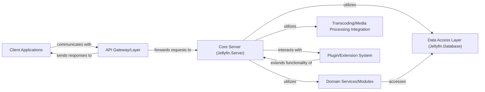

## Details

Abstract, high-level architectural analysis of the Jellyfin project, outlining key components and their relationships. Source code references are not included due to the lack of concrete project context.

### Client Applications
User-facing applications (e.g., `jellyfin-web`) that provide the interface for users to interact with the Jellyfin server. They handle media browsing, playback controls, and user settings, communicating with the server via its exposed API.

**Related Classes/Methods**: _None_

### API Gateway/Layer [[Expand]](./API_Gateway_Layer.md)
Serves as the primary interface for all client applications, exposing RESTful endpoints. It is responsible for request routing, initial validation, authentication, and the serialization/deserialization of data, acting as the entry point to the server's functionalities.

**Related Classes/Methods**: _None_

### Core Server (Jellyfin.Server)
The central backend component that orchestrates the main server-side logic. It manages media libraries, user profiles, and coordinates operations across various internal services and modules, acting as the brain of the Jellyfin system.

**Related Classes/Methods**: _None_

### Domain Services/Modules
Encapsulates specific business logic and domain-specific functionalities. These modules handle tasks such as media naming conventions, metadata fetching from external sources, and the organization of content within the media library.

**Related Classes/Methods**: _None_

### Data Access Layer (Jellyfin.Database)
Provides an abstraction layer for all data persistence operations. It manages the storage and retrieval of media metadata, user profiles, application settings, and other critical data, ensuring efficient and consistent data management.

**Related Classes/Methods**: _None_

### Transcoding/Media Processing Integration
Responsible for handling the on-the-fly transcoding and processing of media files. This component ensures media compatibility across a wide range of client devices and network conditions, often integrating with external tools like `ffmpeg`.

**Related Classes/Methods**: _None_

### Plugin/Extension System [[Expand]](./Plugin_Extension_System.md)
Provides a robust framework that allows for the dynamic loading, management, and execution of third-party plugins and extensions. This system significantly enhances the server's functionality and extensibility without requiring modifications to the core codebase.

**Related Classes/Methods**: _None_

### [FAQ](https://github.com/CodeBoarding/GeneratedOnBoardings/tree/main?tab=readme-ov-file#faq)