```mermaid
graph LR
    API_Layer_Authentication_Authorization_Endpoints_["API Layer (Authentication & Authorization Endpoints)"]
    Core_Server_User_Management_Logic_["Core Server (User Management Logic)"]
    Data_Access_Layer_User_Data_Persistence_["Data Access Layer (User Data Persistence)"]
    Authentication_User_Management_Orchestrator_Logical_Service_["Authentication & User Management Orchestrator (Logical Service)"]
    API_Layer_Authentication_Authorization_Endpoints_ -- "forwards requests to" --> Core_Server_User_Management_Logic_
    Core_Server_User_Management_Logic_ -- "sends responses to" --> API_Layer_Authentication_Authorization_Endpoints_
    Core_Server_User_Management_Logic_ -- "Data Query/Retrieval" --> Data_Access_Layer_User_Data_Persistence_
    Core_Server_User_Management_Logic_ -- "Data Persistence/Storage" --> Data_Access_Layer_User_Data_Persistence_
    Authentication_User_Management_Orchestrator_Logical_Service_ -- "directs requests to" --> API_Layer_Authentication_Authorization_Endpoints_
    Authentication_User_Management_Orchestrator_Logical_Service_ -- "coordinates with" --> Core_Server_User_Management_Logic_
```

## Details

Analysis of a C# project, with abstract components and relationships provided due to tool limitations for C# source code.

### API Layer (Authentication & Authorization Endpoints)
This component serves as the primary entry point for all user-related interactions, specifically handling initial authentication requests (e.g., login, session creation) and performing authorization checks on subsequent API calls. It validates credentials and ensures users have the necessary permissions before granting access to server resources.

**Related Classes/Methods**: _None_

### Core Server (User Management Logic)
This central component manages active user sessions, maintains user state, and enforces business logic related to user management, such as user creation, deletion, password changes, and profile updates. It coordinates the retrieval and storage of user profiles, settings, and preferences by interacting with the Data Access Layer.

**Related Classes/Methods**: _None_

### Data Access Layer (User Data Persistence)
Responsible for the persistent storage and retrieval of all user-related information, including user profiles, settings, preferences, and hashed credentials. It ensures data integrity and provides an abstraction layer for the Core Server to interact with the underlying database.

**Related Classes/Methods**: _None_

### Authentication & User Management Orchestrator (Logical Service)
This is a logical service that orchestrates the overall flow of user authentication, session management, authorization, and the management of user profiles and preferences. It leverages and coordinates the functionalities provided by the API Layer, Core Server, and Data Access Layer to deliver comprehensive user management capabilities. It does not have dedicated source files but represents the cohesive functionality provided by the interaction of the other components.

**Related Classes/Methods**: _None_

### [FAQ](https://github.com/CodeBoarding/GeneratedOnBoardings/tree/main?tab=readme-ov-file#faq)