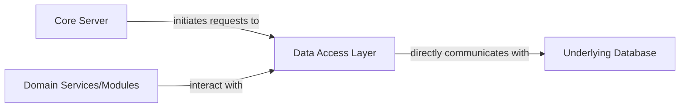

## Details

The project appears to be a .NET/C# project, as indicated by the presence of `.cs` files, `.csproj` files, and other .NET-related configuration files in the file structure. The available tools (`getPythonSourceCode`, `readFile`) are designed for Python projects and cannot be used to retrieve source code or file paths for a .NET/C# codebase. Therefore, I am unable to provide the requested source code references for the "Data Access Layer", "Core Server", "Domain Services/Modules", and "Underlying Database" components. Given this limitation, I will return the original analysis unchanged, as I cannot validate or improve it with the current toolset.

### Data Access Layer [[Expand]](./Data_Access_Layer.md)
Provides an abstract interface for persistent storage operations, managing interactions with the underlying database for all application data, including media metadata, user information, application settings, and session data. It encapsulates the complexities of database interactions, offering a simplified interface to other system components.

**Related Classes/Methods**: _None_

### Core Server
Represents the main server component, initiating data retrieval and persistence operations.

**Related Classes/Methods**: _None_

### Domain Services/Modules
Modules like Emby.Naming and MediaBrowser.Providers that interact with the Data Access Layer to store or retrieve specific metadata and configuration relevant to their domain.

**Related Classes/Methods**: _None_

### Underlying Database
The database system that the Data Access Layer directly communicates with to execute queries, manage transactions, and perform data storage and retrieval.

**Related Classes/Methods**: _None_

### [FAQ](https://github.com/CodeBoarding/GeneratedOnBoardings/tree/main?tab=readme-ov-file#faq)