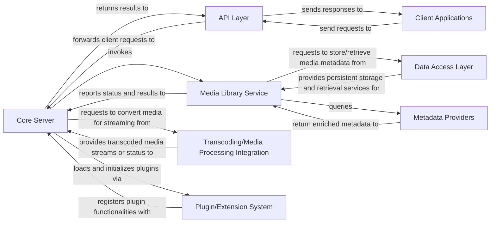

## Details

Architectural analysis of a media server system, focusing on component structure and interactions.

### Core Server
The central application server responsible for orchestrating all backend operations, managing user sessions, and coordinating between various domain services. It acts as the core runtime environment for the entire system.

**Related Classes/Methods**:

- `Jellyfin.Server` (1:1)

### API Layer
Provides a RESTful interface for client applications to interact with the Core Server's functionalities, including media library access, user management, and streaming.

**Related Classes/Methods**:

- `Jellyfin.Api` (1:1)

### Client Applications
User-facing applications (e.g., web, mobile, desktop) that consume the API Layer to provide a rich user experience for browsing, managing, and streaming media.

**Related Classes/Methods**:

- `jellyfin-web` (1:1)

### Media Library Service [[Expand]](./Media_Library_Service.md)
Encapsulates the core business logic for managing the media library. This includes scanning file systems for new media, organizing content based on metadata, retrieving and enriching metadata from external providers, and maintaining the internal media catalog. It is a specialized `Domain Service/Module`.

**Related Classes/Methods**:

- `MediaBrowser.Controller.Library` (1:1)

### Data Access Layer [[Expand]](./Data_Access_Layer.md)
Manages all interactions with the underlying persistent storage (database), providing an abstraction for storing and retrieving media metadata, user profiles, and application settings.

**Related Classes/Methods**:

- `Jellyfin.Database` (1:1)

### Metadata Providers
A set of specialized services or modules responsible for fetching rich metadata (e.g., movie details, TV show information, cover art) from various online sources (e.g., IMDb, TheTVDB) to enrich the media catalog.

**Related Classes/Methods**:

- `MediaBrowser.Providers` (1:1)

### Transcoding/Media Processing Integration
Handles the on-the-fly conversion of media files into formats suitable for streaming to various client devices, often integrating with external tools like `ffmpeg`.

**Related Classes/Methods**:

- `Jellyfin.Transcoding` (1:1)

### Plugin/Extension System [[Expand]](./Plugin_Extension_System.md)
Provides a framework for loading and managing third-party plugins and extensions, allowing for custom features, additional metadata sources, or new media processing capabilities.

**Related Classes/Methods**:

- `Jellyfin.Plugin.Base` (1:1)

### [FAQ](https://github.com/CodeBoarding/GeneratedOnBoardings/tree/main?tab=readme-ov-file#faq)