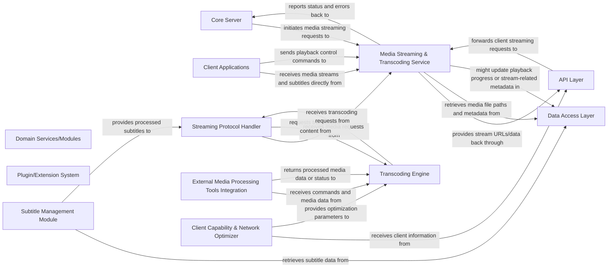

## Details

Abstract Components Overview

### Core Server
The central application logic, coordinating various services and managing overall system state.

**Related Classes/Methods**: _None_

### Data Access Layer [[Expand]](./Data_Access_Layer.md)
Handles all interactions with the underlying database for media metadata, user profiles, and application settings.

**Related Classes/Methods**: _None_

### Domain Services/Modules
Encapsulate business logic related to media organization, metadata fetching, and content management.

**Related Classes/Methods**: _None_

### API Layer
Provides a standardized interface for client applications to interact with the server, handling requests and responses.

**Related Classes/Methods**: _None_

### Client Applications
User-facing applications responsible for media browsing, playback, and system configuration.

**Related Classes/Methods**: _None_

### Plugin/Extension System [[Expand]](./Plugin_Extension_System.md)
Allows for dynamic loading and integration of third-party functionalities and services.

**Related Classes/Methods**: _None_

### Media Streaming & Transcoding Service [[Expand]](./Media_Streaming_Transcoding_Service.md)
Facilitates media playback by handling streaming protocols, performing on-the-fly transcoding to ensure compatibility with various client devices, and delivering subtitles. It optimizes media delivery based on client capabilities and network conditions, integrating with external tools like ffmpeg for efficient media processing.

**Related Classes/Methods**: _None_

### Streaming Protocol Handler
Manages the delivery of media streams using various protocols (e.g., HLS, DASH). It handles segmenting media, managing client connections, and ensuring smooth playback.

**Related Classes/Methods**: _None_

### Transcoding Engine
Orchestrates the real-time conversion of media files into formats compatible with client devices. It determines the optimal transcoding profile based on client capabilities and network conditions.

**Related Classes/Methods**: _None_

### External Media Processing Tools Integration
Provides an abstraction layer for interacting with external command-line media processing tools like `ffmpeg`. It handles process execution, input/output redirection, and error handling for these tools.

**Related Classes/Methods**: _None_

### Subtitle Management Module
Responsible for extracting, converting, and embedding or delivering subtitles alongside the media stream. It ensures subtitle compatibility and synchronization.

**Related Classes/Methods**: _None_

### Client Capability & Network Optimizer
Analyzes client device profiles (e.g., supported codecs, resolutions, bandwidth) and current network conditions to dynamically adjust streaming and transcoding parameters for optimal user experience.

**Related Classes/Methods**: _None_

### [FAQ](https://github.com/CodeBoarding/GeneratedOnBoardings/tree/main?tab=readme-ov-file#faq)