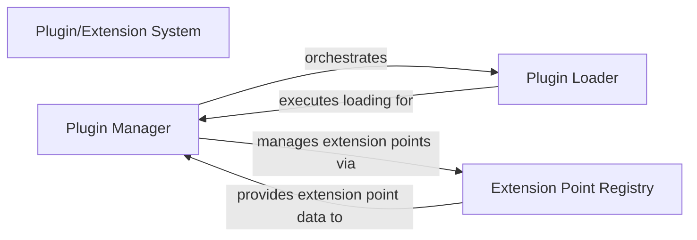

## Details

One paragraph explaining the functionality which is represented by this graph. What the main flow is and what is its purpose.

### Plugin/Extension System [[Expand]](./Plugin_Extension_System.md)
Manages the discovery, loading, execution, and lifecycle of third-party plugins and extensions. This system allows for modular feature additions and integrations, enhancing the server's capabilities without modifying its core codebase. It embodies the Microkernel/Plugin Architectural pattern, central to the project's extensibility goals.

**Related Classes/Methods**: _None_

### Plugin Manager
The central orchestrator of the plugin system. It is responsible for initiating plugin discovery, coordinating their loading, and managing their lifecycle (activation, deactivation, updates). It acts as the primary interface for the Core Server to interact with the plugin ecosystem.

**Related Classes/Methods**: _None_

### Plugin Loader
Handles the technical aspects of locating, verifying, and loading plugin assemblies or code into the application's runtime environment. It ensures plugins are correctly initialized and ready for execution, often involving dependency resolution and security checks.

**Related Classes/Methods**: _None_

### Extension Point Registry
A centralized repository that defines and manages the interfaces, abstract classes, or specific hooks that the Core Server exposes for plugins to extend or implement. It enables loose coupling between the core system and its extensions, allowing plugins to discover and utilize predefined integration points.

**Related Classes/Methods**: _None_

### [FAQ](https://github.com/CodeBoarding/GeneratedOnBoardings/tree/main?tab=readme-ov-file#faq)