```mermaid
graph LR
    API_Gateway_Layer["API Gateway/Layer"]
    Authentication_User_Management_Service["Authentication & User Management Service"]
    Media_Library_Service["Media Library Service"]
    Media_Streaming_Transcoding_Service["Media Streaming & Transcoding Service"]
    Data_Access_Layer["Data Access Layer"]
    Plugin_Extension_System["Plugin/Extension System"]
    API_Gateway_Layer -- "routes requests to" --> Authentication_User_Management_Service
    API_Gateway_Layer -- "routes requests to" --> Media_Library_Service
    API_Gateway_Layer -- "routes requests to" --> Media_Streaming_Transcoding_Service
    Authentication_User_Management_Service -- "interacts with" --> Data_Access_Layer
    Authentication_User_Management_Service -- "authenticates/authorizes requests for" --> API_Gateway_Layer
    Media_Library_Service -- "interacts with" --> Data_Access_Layer
    Media_Library_Service -- "triggers" --> Media_Streaming_Transcoding_Service
    Media_Streaming_Transcoding_Service -- "interacts with" --> Data_Access_Layer
    Media_Streaming_Transcoding_Service -- "relies on" --> Media_Library_Service
    Data_Access_Layer -- "provides persistence for" --> Authentication_User_Management_Service
    Data_Access_Layer -- "provides persistence for" --> Media_Library_Service
    Data_Access_Layer -- "provides persistence for" --> Media_Streaming_Transcoding_Service
    Plugin_Extension_System -- "extends functionality of" --> Media_Library_Service
    Plugin_Extension_System -- "extends functionality of" --> Media_Streaming_Transcoding_Service
    click API_Gateway_Layer href "https://github.com/CodeBoarding/GeneratedOnBoardings/blob/main/jellyfin/API_Gateway_Layer.md" "Details"
    click Authentication_User_Management_Service href "https://github.com/CodeBoarding/GeneratedOnBoardings/blob/main/jellyfin/Authentication_User_Management_Service.md" "Details"
    click Media_Library_Service href "https://github.com/CodeBoarding/GeneratedOnBoardings/blob/main/jellyfin/Media_Library_Service.md" "Details"
    click Media_Streaming_Transcoding_Service href "https://github.com/CodeBoarding/GeneratedOnBoardings/blob/main/jellyfin/Media_Streaming_Transcoding_Service.md" "Details"
    click Data_Access_Layer href "https://github.com/CodeBoarding/GeneratedOnBoardings/blob/main/jellyfin/Data_Access_Layer.md" "Details"
    click Plugin_Extension_System href "https://github.com/CodeBoarding/GeneratedOnBoardings/blob/main/jellyfin/Plugin_Extension_System.md" "Details"
```

## Details

This analysis provides a high-level architectural overview of the system, identifying logical components and their responsibilities. The components are conceptual architectural elements, and specific source code references are not provided as they are not directly actionable at this level of abstraction.

### API Gateway/Layer [[Expand]](./API_Gateway_Layer.md)
Serves as the primary interface for client applications, exposing RESTful endpoints to interact with the server's functionalities. It handles request routing, initial validation, and serialization/deserialization of data.

**Related Classes/Methods**: _None_

### Authentication & User Management Service [[Expand]](./Authentication_User_Management_Service.md)
Manages user authentication (login, session management) and authorization (permission checks) for accessing server resources and media content. It also handles user profiles, settings, preferences, and potentially user creation/deletion, storing and retrieving user-specific configurations.

**Related Classes/Methods**: _None_

### Media Library Service [[Expand]](./Media_Library_Service.md)
Manages the media library, including scanning for new media, organizing content, retrieving and enriching metadata (e.g., from online providers), and maintaining the media catalog.

**Related Classes/Methods**: _None_

### Media Streaming & Transcoding Service [[Expand]](./Media_Streaming_Transcoding_Service.md)
Facilitates media playback by handling streaming protocols, performing on-the-fly transcoding to ensure compatibility with various client devices, and delivering subtitles. It optimizes media delivery based on client capabilities and network conditions.

**Related Classes/Methods**: _None_

### Data Access Layer [[Expand]](./Data_Access_Layer.md)
Provides an abstract interface for persistent storage operations, managing interactions with the underlying database for all application data (media metadata, user information, application settings, session data).

**Related Classes/Methods**: _None_

### Plugin/Extension System [[Expand]](./Plugin_Extension_System.md)
Manages the discovery, loading, execution, and lifecycle of third-party plugins and extensions. This system allows for modular feature additions and integrations, enhancing the server's capabilities without modifying its core codebase.

**Related Classes/Methods**: _None_

### [FAQ](https://github.com/CodeBoarding/GeneratedOnBoardings/tree/main?tab=readme-ov-file#faq)