```mermaid
graph LR
    jiant_scripts_download_data_runscript["jiant.scripts.download_data.runscript"]
    jiant_scripts_download_data_dl_datasets_files_tasks["jiant.scripts.download_data.dl_datasets.files_tasks"]
    jiant_tasks_lib_get_examples_methods["jiant.tasks.lib.get_examples_methods"]
    jiant_proj_main_preprocessing["jiant.proj.main.preprocessing"]
    jiant_tasks_lib_tokenize_methods["jiant.tasks.lib.tokenize_methods"]
    jiant_tasks_lib_featurize_methods["jiant.tasks.lib.featurize_methods"]
    jiant_proj_main_tokenize_and_cache["jiant.proj.main.tokenize_and_cache"]
    jiant_shared_caching["jiant.shared.caching"]
    jiant_scripts_download_data_runscript -- "delegates to" --> jiant_scripts_download_data_dl_datasets_files_tasks
    jiant_scripts_download_data_dl_datasets_files_tasks -- "provides raw data to" --> jiant_tasks_lib_get_examples_methods
    jiant_tasks_lib_get_examples_methods -- "provides Example objects to" --> jiant_proj_main_preprocessing
    jiant_proj_main_preprocessing -- "calls" --> jiant_tasks_lib_tokenize_methods
    jiant_proj_main_preprocessing -- "calls" --> jiant_tasks_lib_featurize_methods
    jiant_proj_main_preprocessing -- "provides processed data to" --> jiant_proj_main_tokenize_and_cache
    jiant_proj_main_tokenize_and_cache -- "utilizes" --> jiant_shared_caching
```

## Details

The `jiant` data processing subsystem orchestrates the flow from raw data acquisition to cached, model-ready datasets. The process begins with `jiant.scripts.download_data.runscript` initiating data downloads, delegating to `jiant.scripts.download_data.dl_datasets.files_tasks` for managing dataset retrieval. Raw data is then passed to `jiant.tasks.lib.get_examples_methods`, which converts it into standardized `Example` objects. These `Example` objects are consumed by `jiant.proj.main.preprocessing`, the central transformation component, which applies core preprocessing steps and coordinates task-specific tokenization and featurization by calling `jiant.tasks.lib.tokenize_methods` and `jiant.tasks.lib.featurize_methods` respectively. Finally, the fully processed data is provided to `jiant.proj.main.tokenize_and_cache`, which is responsible for orchestrating the efficient caching of these datasets, leveraging `jiant.shared.caching` for persistent storage and retrieval. This structured pipeline ensures data integrity and optimizes access for subsequent model training and evaluation.

### jiant.scripts.download_data.runscript
Serves as the command-line interface and primary entry point for initiating the data download process. It orchestrates the initial data acquisition phase.

**Related Classes/Methods**:

- <a href="https://github.com/nyu-mll/jiant/blob/master/jiant/scripts/download_data/runscript.py" target="_blank" rel="noopener noreferrer">`jiant.scripts.download_data.runscript`</a>

### jiant.scripts.download_data.dl_datasets.files_tasks
Manages the download and initial parsing for a wide range of general NLP datasets, acting as the core data source provider.

**Related Classes/Methods**:

- <a href="https://github.com/nyu-mll/jiant/blob/master/jiant/scripts/download_data/dl_datasets/files_tasks.py" target="_blank" rel="noopener noreferrer">`jiant.scripts.download_data.dl_datasets.files_tasks`</a>

### jiant.tasks.lib.get_examples_methods
Provides task-specific methods for reading raw dataset files and converting their content into standardized `Example` objects, which are the first structured representation of the data. These methods are distributed across various task-specific files within the `jiant.tasks.lib` directory.

**Related Classes/Methods**:

- <a href="https://github.com/nyu-mll/jiant/blob/master/jiant/tasks/lib/" target="_blank" rel="noopener noreferrer">`jiant.tasks.lib.get_examples_methods`</a>

### jiant.proj.main.preprocessing
Implements core data preprocessing steps (e.g., smart truncation) and transforms `Example` objects into a model-ready dataset format by coordinating task-specific tokenization and featurization.

**Related Classes/Methods**:

- <a href="https://github.com/nyu-mll/jiant/blob/master/jiant/proj/main/preprocessing.py" target="_blank" rel="noopener noreferrer">`jiant.proj.main.preprocessing`</a>

### jiant.tasks.lib.tokenize_methods
Contains task-specific methods that transform raw text within `Example` objects into tokenized representations using a pre-trained tokenizer, a crucial step for NLP models. These methods are distributed across various task-specific files within the `jiant.tasks.lib` directory.

**Related Classes/Methods**:

- <a href="https://github.com/nyu-mll/jiant/blob/master/jiant/tasks/lib/" target="_blank" rel="noopener noreferrer">`jiant.tasks.lib.tokenize_methods`</a>

### jiant.tasks.lib.featurize_methods
Provides task-specific methods that convert tokenized examples into numerical features suitable for direct input to a neural network model, completing the data transformation. These methods are distributed across various task-specific files within the `jiant.tasks.lib` directory.

**Related Classes/Methods**:

- <a href="https://github.com/nyu-mll/jiant/blob/master/jiant/tasks/lib/" target="_blank" rel="noopener noreferrer">`jiant.tasks.lib.featurize_methods`</a>

### jiant.proj.main.tokenize_and_cache
Orchestrates the caching of tokenized and featurized data, ensuring efficient storage and retrieval of processed datasets for subsequent model training and evaluation.

**Related Classes/Methods**:

- <a href="https://github.com/nyu-mll/jiant/blob/master/jiant/proj/main/tokenize_and_cache.py" target="_blank" rel="noopener noreferrer">`jiant.proj.main.tokenize_and_cache`</a>

### jiant.shared.caching
Offers the foundational infrastructure for chunked data storage, retrieval, and management, ensuring efficient and persistent storage of processed datasets.

**Related Classes/Methods**:

- <a href="https://github.com/nyu-mll/jiant/blob/master/jiant/shared/caching.py" target="_blank" rel="noopener noreferrer">`jiant.shared.caching`</a>

### [FAQ](https://github.com/CodeBoarding/GeneratedOnBoardings/tree/main?tab=readme-ov-file#faq)